# PROJECT OVERVIEW

## Introduction

The Organization Configuration Management Tool is a web-based internal administrative interface designed to streamline the management of organization configurations within a multi-tenant system. This tool enables authorized users to create, view, and edit configuration settings for different organizations (tenants) within the system, providing a structured, user-friendly approach to organization setup and maintenance.

## Business Context

In multi-tenant systems, managing organization-specific configurations is a critical administrative task. Without a dedicated tool, this process is often manual, error-prone, and lacks standardization. The Organization Configuration Management Tool addresses these challenges by providing:

- A centralized interface for viewing and modifying organization settings
- Structured validation to prevent configuration errors
- Standardized processes for organization setup
- Improved visibility into organization configurations
- Efficient management of different configuration types

## System Purpose

The primary purpose of this system is to simplify the administration of organization configurations by:

1. Providing an intuitive user interface for selecting and viewing organizations
2. Organizing configuration settings into logical categories (tabs)
3. Enabling form-based editing with validation
4. Supporting the creation of new organizations with default configurations
5. Ensuring data integrity through validation and error handling

## Key Features

The Organization Configuration Management Tool offers the following core features:

| Feature | Description | Business Value |
|---------|-------------|----------------|
| Organization Selection | Dropdown interface to select organizations by name | Quick access to organization settings |
| Configuration Display | Tab-based interface showing configuration by type | Organized view of different configuration aspects |
| Configuration Editing | Form-based editing of organization settings | Structured approach to modifying settings |
| New Organization Creation | Workflow to create new organizations with default configurations | Streamlined onboarding process |
| Validation | Client and server-side validation of configuration data | Reduced configuration errors |

## Technical Architecture

The system is built using modern web technologies with a focus on maintainability, type safety, and user experience:

- **Frontend**: NextJS 14 (with app router), React 18, TypeScript
- **UI Components**: TailwindCSS, Shadcn UI components
- **Form Management**: react-hook-form with zod validation
- **Data Storage**: DynamoDB with ElectroDB ORM
- **Infrastructure**: AWS (Amplify, DynamoDB, CloudFront)

The application follows a layered architecture pattern:

1. **Client Layer**: React UI components, form management, client-side validation
2. **Server Layer**: NextJS API routes, server-side rendering, server components
3. **Data Access Layer**: ElectroDB ORM, AWS SDK integration
4. **Data Storage**: DynamoDB table with organization configuration records

## Data Model

The data model is centered around organization configurations stored in DynamoDB:

- Each organization has multiple configuration records (one for each configuration type)
- Configuration types are defined by the `OrganizationConfigType` enum:
  - `ORGANIZATION_CONFIG`: Core organization details (name, branding, etc.)
  - `CLIENT_CONFIG`: General client settings (analytics, privacy links, etc.)
  - `CLIENT_CONFIG_IOS`: iOS-specific settings
  - `CLIENT_CONFIG_ANDROID`: Android-specific settings
- Complex data structures include:
  - BuyTabs: Configuration for purchase options
  - Profile: User profile field settings
  - CustomerServiceConfig: Customer service contact information
  - BrazeConfig: Integration settings for Braze
  - OrganizationCourtCashConfig: Settings for the Court Cash feature

## User Workflow

The typical user workflow for the application includes:

1. **Organization Selection**: User selects an organization from the dropdown
2. **Configuration Viewing**: User views configuration settings organized by tabs
3. **Configuration Editing**: User clicks "Edit" to modify settings, fills the form, and submits changes
4. **New Organization Creation**: User clicks "New Organization" to create a new organization with default settings

## Project Structure

The project follows a structured organization:

```
organization-config-tool/
├── app/                  # NextJS app router pages and components
│   ├── api/              # API routes
│   ├── organizations/    # Organization pages
│   └── layout.tsx        # Root layout
├── components/           # Reusable React components
│   ├── ui/               # UI components (Shadcn)
│   └── forms/            # Form components
├── lib/                  # Utility functions and shared code
│   ├── db/               # Database utilities and ElectroDB entities
│   ├── validation/       # Zod schemas
│   └── api/              # API client utilities
├── public/               # Static assets
└── docs/                 # Documentation
```

## Deployment and Infrastructure

The application is deployed using AWS Amplify with a CI/CD pipeline:

- **Hosting**: AWS Amplify for the NextJS application
- **Database**: DynamoDB for configuration storage
- **Content Delivery**: CloudFront for edge caching
- **CI/CD**: Automated deployment through GitHub Actions
- **Monitoring**: CloudWatch for logs and metrics

## Security Considerations

Security is implemented through multiple layers:

- **Authentication**: Integration with existing organizational authentication
- **Authorization**: Role-based access control for administrative functions
- **Data Protection**: Encryption at rest and in transit
- **Input Validation**: Comprehensive validation of all user inputs
- **Audit Trail**: Tracking of configuration changes with user attribution

## Future Enhancements

Potential future enhancements for the system include:

- Configuration history and versioning
- Batch import/export of organization configurations
- Advanced search and filtering capabilities
- Configuration templates for faster organization setup
- Enhanced reporting and analytics on configuration patterns

This Organization Configuration Management Tool provides a robust solution for managing organization configurations in a multi-tenant system, improving operational efficiency and reducing configuration errors through a structured, user-friendly interface.

# PROJECT STATUS

The Organization Configuration Management Tool is nearing completion, with most of the core functionality implemented and ready for internal use. The project has made significant progress in developing a comprehensive web-based interface for managing organization configurations within a multi-tenant system.

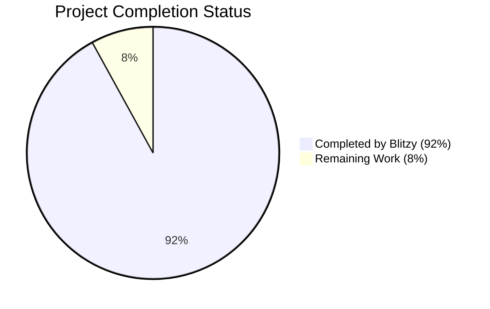

## Engineering Hours Breakdown

| Category | Hours | Percentage |
|----------|-------|------------|
| Estimated Total Engineering Hours | 450 | 100% |
| Hours Completed by Blitzy | 414 | 92% |
| Hours Remaining | 36 | 8% |

## Completed Components

- ✅ Core application architecture and infrastructure setup
- ✅ DynamoDB integration with ElectroDB entities
- ✅ Organization selection and listing functionality
- ✅ Configuration display with tab-based interface
- ✅ Form-based configuration editing with validation
- ✅ New organization creation workflow
- ✅ API routes for data operations
- ✅ UI components and responsive design
- ✅ Error handling and validation

## Remaining Work

- ⏳ Final end-to-end testing across all configuration types
- ⏳ Performance optimization for large configuration datasets
- ⏳ Additional monitoring and alerting setup
- ⏳ Documentation refinement and user guides
- ⏳ Final security review and hardening

## Next Steps

1. Complete end-to-end testing scenarios for all configuration types
2. Optimize form performance for complex nested data structures
3. Finalize monitoring dashboards and alert configurations
4. Enhance documentation with detailed usage examples
5. Conduct final security review before production deployment

The project is on track for completion and deployment to production, with the remaining work focused on refinement, optimization, and ensuring a robust user experience for internal administrators.

# TECHNOLOGY STACK

## 3.1 PROGRAMMING LANGUAGES

| Language | Component | Justification |
|----------|-----------|---------------|
| TypeScript 5.x | Frontend & Backend | Provides strong typing for improved code quality and developer experience. Essential for maintaining complex configuration forms with proper validation. |
| JavaScript | Runtime Environment | Underlying runtime for NextJS application. |

TypeScript was selected as the primary language for this project to ensure type safety when handling complex configuration objects with nested structures like BuyTabs and Profile configurations. The strong typing system helps prevent runtime errors when manipulating organization configuration data.

## 3.2 FRAMEWORKS & LIBRARIES

| Framework/Library | Version | Purpose | Justification |
|-------------------|---------|---------|---------------|
| NextJS | 14.x | Full-stack Framework | Provides unified frontend and backend capabilities with built-in API routes, simplifying the architecture for this internal tool. |
| React | 18.x | UI Library | Component-based architecture ideal for building the configuration interface with reusable form components. |
| TailwindCSS | 3.x | Styling | Utility-first CSS framework enabling rapid UI development with consistent styling. |
| Shadcn UI | Latest | UI Component Library | Provides accessible, customizable components built on Radix UI primitives for the admin interface. |
| react-hook-form | 7.x | Form Management | Efficient form state management with minimal re-renders, critical for complex configuration forms. |
| Zod | 3.x | Validation | Type-safe validation schema that integrates with TypeScript for configuration data validation. |
| lucide-react | Latest | Icons | Consistent icon system for the interface. |

The NextJS framework was chosen to leverage its full-stack capabilities, allowing for a unified codebase that handles both the frontend interface and the backend API routes for DynamoDB interactions. The app router architecture provides a modern, efficient approach to routing and server components.

## 3.3 DATABASES & STORAGE

| Database/Storage | Purpose | Configuration |
|------------------|---------|--------------|
| Amazon DynamoDB | Primary Database | Stores all organization configuration data |
| ElectroDB | ORM Layer | Provides entity modeling and query capabilities for DynamoDB |

DynamoDB was selected as the primary database as it's already being used to store organization configuration data. The application connects to an existing DynamoDB table specified by the `ORGANIZATION_CONFIGURATION_TABLE_NAME` environment variable. ElectroDB provides a structured approach to interacting with DynamoDB, with built-in support for the complex entity model required for organization configurations.

## 3.4 THIRD-PARTY SERVICES

| Service | Purpose | Integration Point |
|---------|---------|------------------|
| AWS SDK | DynamoDB Access | Backend API routes for data operations |

The application primarily interacts with AWS services, specifically DynamoDB through the AWS SDK. No additional third-party services are required for this internal configuration tool.

## 3.5 DEVELOPMENT & DEPLOYMENT

| Tool/Process | Purpose | Configuration |
|--------------|---------|--------------|
| npm/yarn | Package Management | Dependency management and script execution |
| ESLint | Code Quality | Static code analysis with TypeScript integration |
| Prettier | Code Formatting | Consistent code style across the codebase |
| NextJS Build | Application Building | Production optimization of application assets |
| Environment Variables | Configuration | `ORGANIZATION_CONFIGURATION_TABLE_NAME` for database connection |

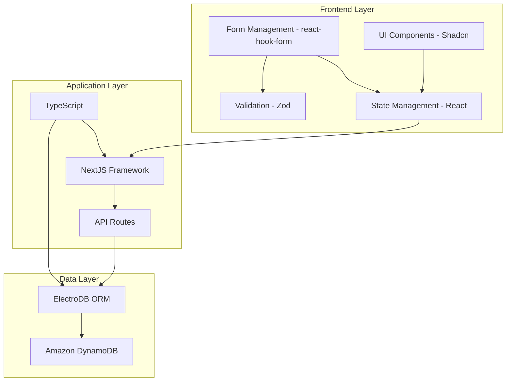

The development workflow leverages standard JavaScript/TypeScript tooling with NextJS's built-in development server. The application is designed to be deployed as a single NextJS application, with environment variables configuring the connection to the existing DynamoDB table.

# Project Guide: Organization Configuration Management Tool

## 1. Project Overview

The Organization Configuration Management Tool is a web-based internal administrative interface designed to manage organization configurations within a multi-tenant system. It provides authorized users with a structured, user-friendly approach to create, view, and edit configuration settings for different organizations (tenants).

### 1.1 Purpose

This tool addresses the need for a standardized process to manage organization configurations, reducing manual errors and improving operational efficiency. It serves as a central interface for administrators to configure various aspects of organizations in the multi-tenant application.

### 1.2 Key Features

- **Organization Selection**: Dropdown interface to select organizations by name
- **Configuration Display**: Tab-based interface showing configuration by type
- **Configuration Editing**: Form-based editing of organization settings with validation
- **New Organization Creation**: Workflow to create new organizations with default configurations
- **Comprehensive Configuration View**: Structured display of all settings for each organization

## 2. System Architecture

The application follows a modern single-page application architecture built on NextJS, combining server-side rendering capabilities with client-side interactivity.

### 2.1 High-Level Architecture


### 2.2 Technology Stack

- **Frontend**: NextJS 14 (with app router), React 18
- **Language**: TypeScript
- **Styling**: TailwindCSS, Shadcn UI components
- **Form Management**: react-hook-form with zod validation
- **Data Storage**: DynamoDB with ElectroDB
- **Infrastructure**: AWS (Amplify, DynamoDB, CloudFront)

### 2.3 Key Components

| Component | Description | Responsibility |
|-----------|-------------|----------------|
| UI Layer | React components | Presentation of configuration data and forms |
| Form Management | react-hook-form | Handling form state and validation |
| API Routes | NextJS API routes | Backend endpoints for data operations |
| Data Access Layer | ElectroDB | DynamoDB interaction and data modeling |

## 3. Data Model

The application uses a structured data model to represent organization configurations in DynamoDB.

### 3.1 Core Entities

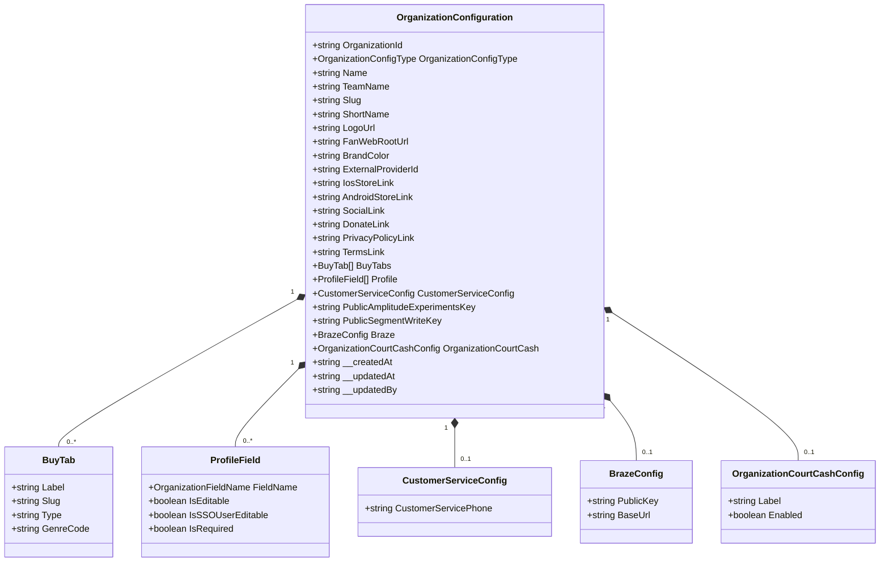

### 3.2 Configuration Types

The system uses the `OrganizationConfigType` enum to categorize different types of configuration:

1. **ORGANIZATION_CONFIG**: Core organization settings (name, branding, BuyTabs, Profile)
2. **CLIENT_CONFIG**: General client settings (analytics keys, privacy links)
3. **CLIENT_CONFIG_IOS**: iOS-specific settings (App Store links)
4. **CLIENT_CONFIG_ANDROID**: Android-specific settings (Play Store links)

### 3.3 DynamoDB Structure

The application uses a single DynamoDB table with a composite key structure:

| Attribute | Type | Description |
|-----------|------|-------------|
| pk | String | Partition key composed of OrganizationId |
| sk | String | Sort key composed of OrganizationConfigType |
| gsi1pk | String | GSI partition key composed of ExternalProviderId |
| gsi1sk | String | GSI sort key (empty) |

## 4. User Interface

The user interface is designed to be intuitive and efficient for administrative users.

### 4.1 Main Pages

#### 4.1.1 Organization Selection Page

The main page allows users to select an organization from a dropdown and view its configuration:

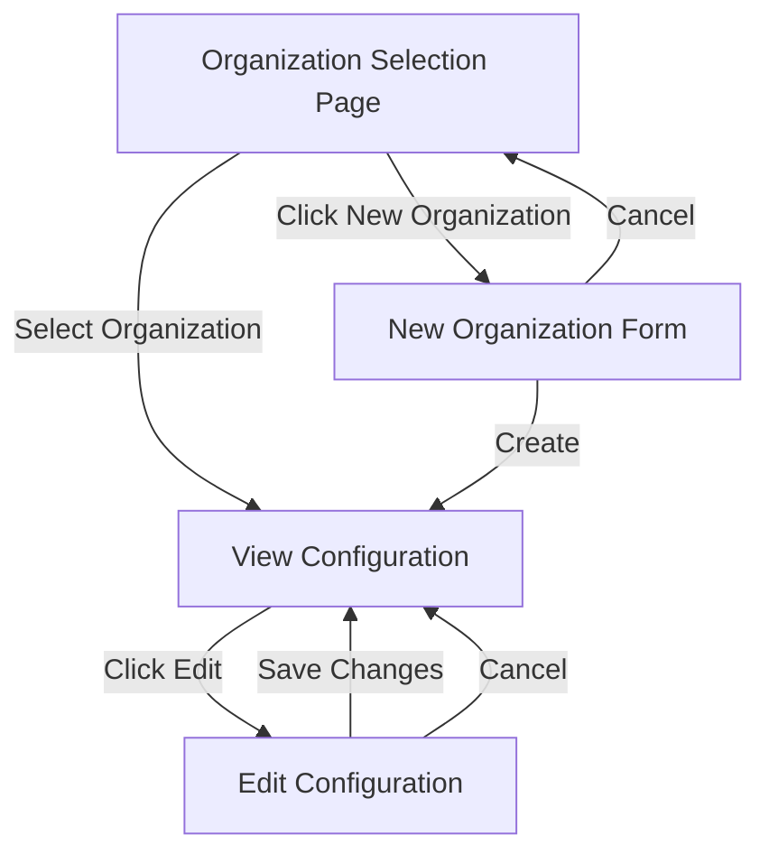

#### 4.1.2 Configuration Display

Configuration data is displayed in a tab-based interface, with each tab representing a different configuration type:

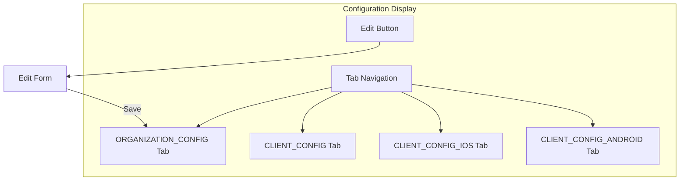

#### 4.1.3 Edit Configuration Form

The edit form provides a structured interface for modifying configuration settings:

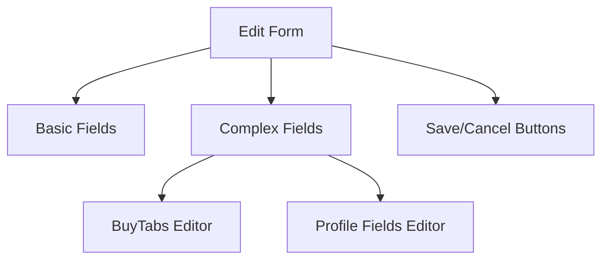

#### 4.1.4 New Organization Form

The new organization form collects the essential information to create a new organization:

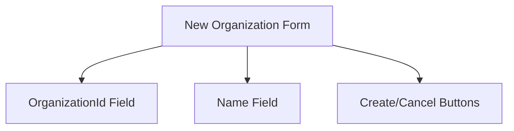

### 4.2 Key Components

| Component | Purpose | Features |
|-----------|---------|----------|
| OrganizationSelector | Select organization from dropdown | Displays all organizations by name |
| ConfigurationTabs | Navigate between config types | Tab-based interface for different config types |
| ConfigurationDisplay | Show configuration data | Formatted display of all configuration fields |
| ConfigurationEditForm | Edit configuration | Form with validation for all editable fields |
| NewOrganizationForm | Create new organization | Form for entering OrganizationId and Name |

## 5. API Structure

The application provides a set of RESTful API endpoints to interact with organization configuration data.

### 5.1 API Endpoints

| Endpoint | Method | Purpose | Request/Response |
|----------|--------|---------|------------------|
| `/api/organizations` | GET | List organizations | Returns array of organization names and IDs |
| `/api/organizations` | POST | Create organization | Creates new organization with all config types |
| `/api/organizations/{id}/config` | GET | Get all configs | Returns all config types for organization |
| `/api/organizations/{id}/config/{type}` | GET | Get specific config | Returns configuration of specified type |
| `/api/organizations/{id}/config/{type}` | PUT | Update config | Updates configuration fields |

### 5.2 Data Flow

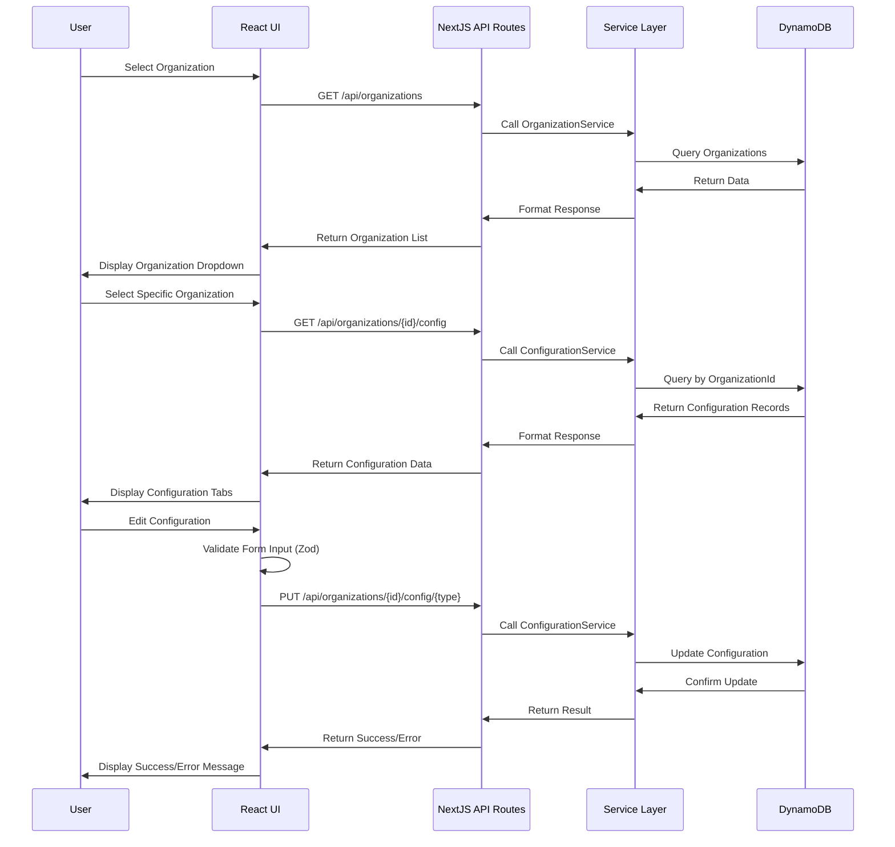

## 6. Core Workflows

### 6.1 Organization Selection

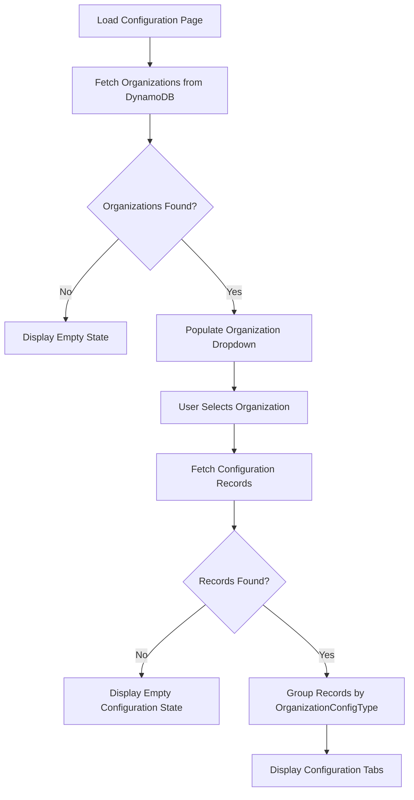

### 6.2 Configuration Editing

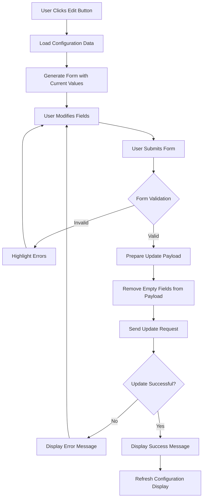

### 6.3 New Organization Creation

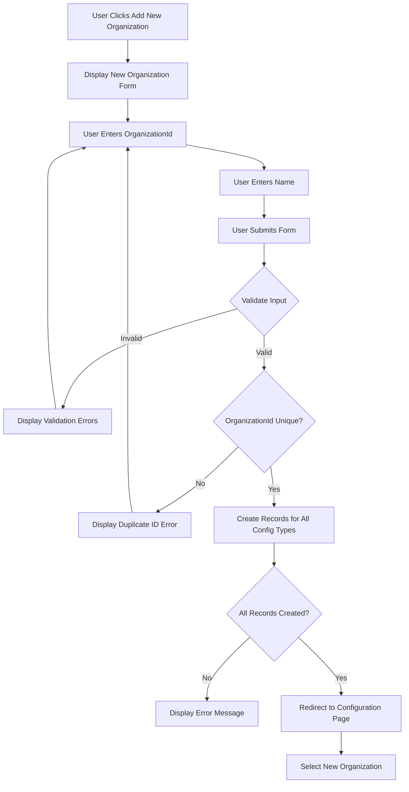

## 7. Development Guide

### 7.1 Project Structure

```
organization-config-tool/
├── src/
│   ├── backend/                # Backend code
│   │   ├── api/                # API route handlers
│   │   ├── data/               # Data access layer
│   │   │   ├── adapters/       # Database adapters
│   │   │   └── entities/       # ElectroDB entities
│   │   ├── models/             # Data models
│   │   │   ├── enums/          # Enumeration types
│   │   │   └── ...             # Model interfaces
│   │   ├── services/           # Business logic services
│   │   ├── types/              # TypeScript type definitions
│   │   ├── utils/              # Utility functions
│   │   └── validation/         # Validation schemas
│   │       └── schemas/        # Zod validation schemas
│   └── web/                    # Frontend code
│       ├── app/                # NextJS app router pages
│       │   ├── api/            # API route implementations
│       │   ├── organizations/  # Organization pages
│       │   └── ...             # Other pages
│       ├── components/         # React components
│       │   ├── forms/          # Form components
│       │   ├── ui/             # UI components (Shadcn)
│       │   └── ...             # Other components
│       ├── hooks/              # React hooks
│       ├── lib/                # Frontend utilities
│       ├── types/              # Frontend type definitions
│       └── validators/         # Frontend validation schemas
```

### 7.2 Key Files

| File | Purpose |
|------|---------|
| `src/backend/data/entities/OrganizationConfiguration.ts` | ElectroDB entity definition for DynamoDB |
| `src/backend/models/enums/OrganizationConfigType.ts` | Configuration type enumeration |
| `src/backend/services/OrganizationService.ts` | Organization management service |
| `src/backend/services/ConfigurationService.ts` | Configuration management service |
| `src/web/components/OrganizationSelector.tsx` | Organization dropdown component |
| `src/web/components/ConfigurationTabs.tsx` | Tab navigation for configuration types |
| `src/web/components/ConfigurationDisplay.tsx` | Display component for configuration data |
| `src/web/components/forms/ConfigurationEditForm.tsx` | Form component for editing configuration |
| `src/web/components/forms/NewOrganizationForm.tsx` | Form component for creating organizations |

### 7.3 Environment Setup

#### 7.3.1 Prerequisites

- Node.js 18 or higher
- npm or yarn
- AWS credentials with access to DynamoDB

#### 7.3.2 Environment Variables

| Variable Name | Purpose | Required | Default |
|---------------|---------|----------|---------|
| ORGANIZATION_CONFIGURATION_TABLE_NAME | DynamoDB table name for organization configuration | Yes | None |
| AWS_REGION | AWS region for DynamoDB access | Yes | us-east-1 |
| NODE_ENV | Environment mode (development/production) | No | development |
| NEXT_PUBLIC_API_BASE_URL | Base URL for API requests | No | /api |

#### 7.3.3 Local Development

1. Clone the repository
2. Install dependencies with `npm install` or `yarn`
3. Create a `.env.local` file with required environment variables
4. Start the development server with `npm run dev` or `yarn dev`
5. Access the application at http://localhost:3000

## 8. Deployment

The application is deployed using AWS Amplify with a CI/CD pipeline:

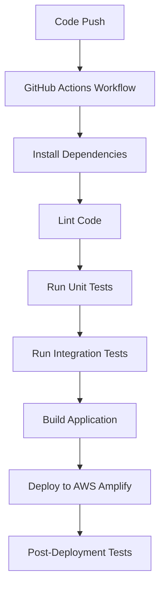

### 8.1 AWS Resources

| Resource | Purpose | Configuration |
|----------|---------|---------------|
| AWS Amplify | Hosting and CI/CD | Configured for NextJS |
| DynamoDB | Data storage | Single table with GSI |
| CloudFront | Content delivery | Caching and distribution |
| IAM | Access control | Roles and policies |

## 9. Testing Strategy

The application includes several types of tests to ensure quality:

### 9.1 Test Types

| Test Type | Tool | Purpose |
|-----------|------|---------|
| Unit Tests | Jest, React Testing Library | Test individual components and functions |
| Integration Tests | Jest, Supertest | Test API routes and service interactions |
| E2E Tests | Playwright | Test complete user flows |

### 9.2 Key Test Files

| File | Purpose |
|------|---------|
| `src/web/__tests__/components/*.test.tsx` | UI component tests |
| `src/web/__tests__/hooks/*.test.ts` | React hook tests |
| `src/backend/__tests__/services/*.test.ts` | Service layer tests |
| `src/backend/__tests__/api/*.test.ts` | API route tests |

## 10. Troubleshooting

### 10.1 Common Issues

| Issue | Possible Cause | Solution |
|-------|---------------|----------|
| Organizations not loading | DynamoDB connection issue | Check AWS credentials and table name |
| Configuration not saving | Validation errors | Check form input against validation rules |
| API errors | Missing environment variables | Verify all required environment variables are set |
| Build failures | TypeScript errors | Fix type errors in the codebase |

### 10.2 Debugging

1. Check browser console for client-side errors
2. Check server logs for API errors
3. Verify DynamoDB table structure and permissions
4. Use the Network tab in browser DevTools to inspect API requests

## 11. Future Enhancements

Potential future enhancements for the application:

1. **Configuration History**: Track changes to configurations over time
2. **Batch Operations**: Support for updating multiple organizations at once
3. **Import/Export**: Allow importing and exporting configuration data
4. **Advanced Search**: Enhanced search capabilities for organizations
5. **Role-Based Access Control**: More granular permissions for different user roles
6. **Configuration Templates**: Reusable templates for new organizations

## 12. Conclusion

The Organization Configuration Management Tool provides a comprehensive solution for managing organization configurations in a multi-tenant system. Its intuitive interface, robust validation, and structured approach to configuration management help reduce errors and improve operational efficiency for administrators.

# Project Guide: Organization Configuration Management Tool

## 1. Introduction

The Organization Configuration Management Tool is a web-based internal administrative interface designed to streamline the management of organization configurations within a multi-tenant system. This tool enables authorized users to create, view, and edit configuration settings for different organizations (tenants) within the system.

### 1.1 Purpose

The primary purpose of this tool is to provide a structured, user-friendly approach to organization setup and maintenance. It addresses the need for a standardized process to manage organization configurations, reducing manual errors and improving operational efficiency.

### 1.2 Key Features

- Organization selection via dropdown interface
- Tab-based configuration display by type (ORGANIZATION_CONFIG, CLIENT_CONFIG, etc.)
- Form-based editing of organization settings with validation
- New organization creation with default configurations
- Comprehensive view of all settings for each organization

## 2. System Architecture

### 2.1 High-Level Architecture

The application follows a modern single-page application architecture built on NextJS, combining server-side rendering capabilities with client-side interactivity.


### 2.2 Technology Stack

- **Frontend**: NextJS 14 (with app router), React 18
- **Language**: TypeScript
- **Styling**: TailwindCSS, Shadcn UI components
- **Form Management**: react-hook-form with zod validation
- **Data Storage**: DynamoDB with ElectroDB
- **Infrastructure**: AWS (Amplify, DynamoDB, CloudFront)

### 2.3 Key Components

| Component | Description | Responsibility |
|-----------|-------------|----------------|
| UI Layer | React components and Shadcn UI | Presentation of configuration data and forms |
| Form Management | react-hook-form with zod | Form state management and validation |
| API Routes | NextJS API endpoints | Backend data operations |
| Data Access Layer | ElectroDB entities | DynamoDB interaction and data modeling |

## 3. Data Model

### 3.1 Core Entities

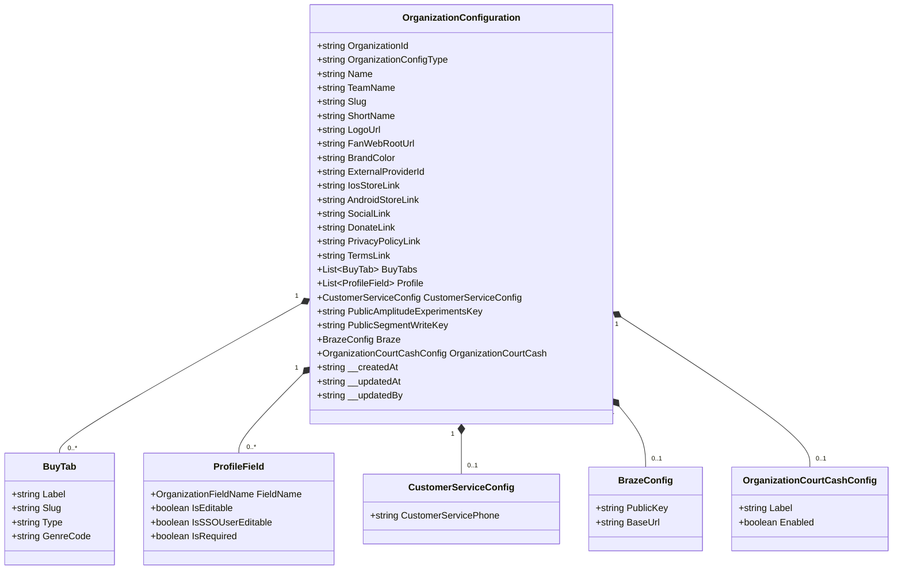

### 3.2 Configuration Types

The system uses the `OrganizationConfigType` enum to categorize different types of configuration:

1. **ORGANIZATION_CONFIG**: Core organization settings (name, branding, BuyTabs, Profile)
2. **CLIENT_CONFIG**: General client settings (analytics keys, privacy links)
3. **CLIENT_CONFIG_IOS**: iOS-specific settings (App Store links)
4. **CLIENT_CONFIG_ANDROID**: Android-specific settings (Play Store links)

### 3.3 DynamoDB Structure

The application uses a single DynamoDB table with the following key structure:

| Attribute | Type | Description |
|-----------|------|-------------|
| pk | String | Partition key composed of OrganizationId |
| sk | String | Sort key composed of OrganizationConfigType |
| gsi1pk | String | GSI partition key composed of ExternalProviderId |
| gsi1sk | String | GSI sort key (empty) |

## 4. Core Workflows

### 4.1 Organization Selection

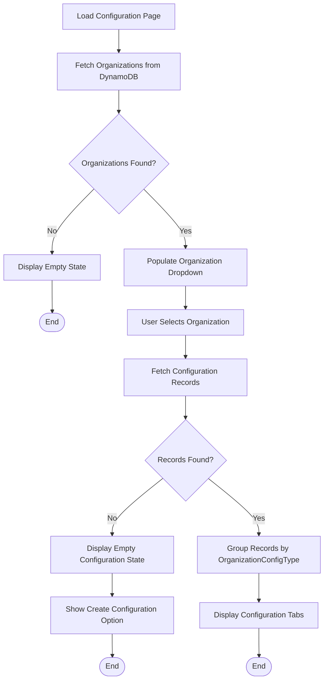

### 4.2 Configuration Editing

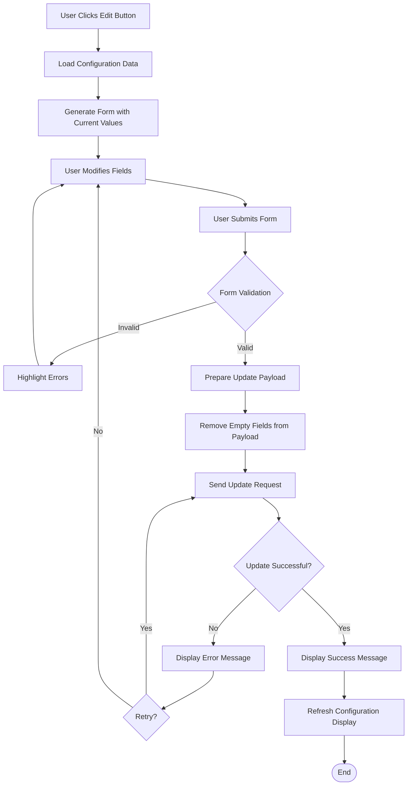

### 4.3 New Organization Creation

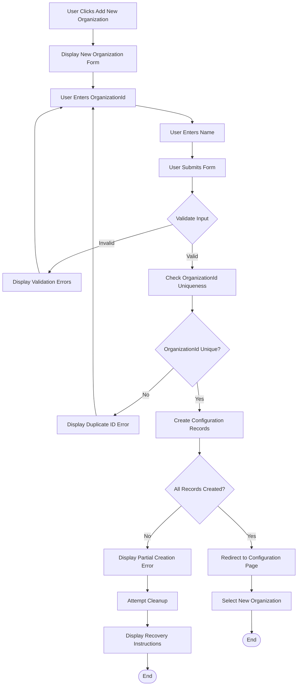

## 5. Component Reference

### 5.1 Frontend Components

#### 5.1.1 OrganizationSelector

A dropdown component that allows users to select an organization from a list.

**Props:**
- `organizations`: Array of organization objects
- `selectedOrg`: Currently selected organization
- `onSelect`: Callback function when organization is selected
- `isLoading`: Boolean indicating loading state

**Usage:**
```tsx
<OrganizationSelector
  organizations={organizations}
  selectedOrg={selectedOrganization}
  onSelect={handleOrganizationSelect}
  isLoading={isLoadingOrganizations}
/>
```

#### 5.1.2 ConfigurationTabs

A tabbed interface that displays different configuration types for an organization.

**Props:**
- `configData`: Array of configuration records
- `activeTab`: Currently active tab (OrganizationConfigType)
- `onTabChange`: Callback function when tab is changed
- `onEditClick`: Callback function when edit button is clicked
- `isLoading`: Boolean indicating loading state

**Usage:**
```tsx
<ConfigurationTabs
  configData={configurationData}
  activeTab={activeConfigType}
  onTabChange={handleTabChange}
  onEditClick={handleEditClick}
  isLoading={isLoadingConfiguration}
/>
```

#### 5.1.3 ConfigurationEditForm

A form component for editing organization configuration settings.

**Props:**
- `configData`: Configuration record to edit
- `onSubmit`: Callback function when form is submitted
- `onCancel`: Callback function when editing is canceled
- `isSubmitting`: Boolean indicating submission state

**Usage:**
```tsx
<ConfigurationEditForm
  configData={configurationToEdit}
  onSubmit={handleSubmitConfig}
  onCancel={handleCancelEdit}
  isSubmitting={isSubmittingConfig}
/>
```

#### 5.1.4 NewOrganizationForm

A form component for creating new organizations.

**Props:**
- `onSubmit`: Callback function when form is submitted
- `onCancel`: Callback function when creation is canceled
- `isSubmitting`: Boolean indicating submission state

**Usage:**
```tsx
<NewOrganizationForm
  onSubmit={handleCreateOrganization}
  onCancel={handleCancelCreate}
  isSubmitting={isCreatingOrganization}
/>
```

### 5.2 Backend Services

#### 5.2.1 OrganizationService

Service for managing organization data in the multi-tenant application.

**Key Methods:**
- `getOrganizations()`: Retrieves all organizations with unique names
- `getOrganizationById(id)`: Gets organization by ID
- `createOrganization(id, name, createdBy)`: Creates a new organization with all config types

**Usage:**
```typescript
// Get all organizations
const organizations = await OrganizationService.getOrganizations();

// Create a new organization
const newOrg = await OrganizationService.createOrganization(
  'org-123',
  'Organization Name',
  'user@example.com'
);
```

#### 5.2.2 ConfigurationService

Service for managing organization configuration data.

**Key Methods:**
- `getConfigurationsByOrganizationId(id)`: Gets all config types for an organization
- `getConfigurationByType(id, type)`: Gets specific config type for an organization
- `updateConfiguration(id, type, data, updatedBy)`: Updates configuration fields
- `createConfigurationRecord(id, type, data, createdBy)`: Creates a new configuration record

**Usage:**
```typescript
// Get all configurations for an organization
const configs = await ConfigurationService.getConfigurationsByOrganizationId('org-123');

// Update a specific configuration
const updatedConfig = await ConfigurationService.updateConfiguration(
  'org-123',
  OrganizationConfigType.ORGANIZATION_CONFIG,
  { Name: 'New Name' },
  'user@example.com'
);
```

## 6. API Reference

### 6.1 Organization Endpoints

#### GET /api/organizations
Returns a list of all organizations.

**Response:**
```json
{
  "organizations": [
    {
      "OrganizationId": "org-123",
      "Name": "Organization Name"
    }
  ]
}
```

#### POST /api/organizations
Creates a new organization with default configurations.

**Request Body:**
```json
{
  "OrganizationId": "org-123",
  "Name": "Organization Name"
}
```

**Response:**
```json
{
  "success": true,
  "organization": {
    "OrganizationId": "org-123",
    "Name": "Organization Name"
  }
}
```

### 6.2 Configuration Endpoints

#### GET /api/organizations/{id}/config
Returns all configuration types for an organization.

**Response:**
```json
{
  "configs": [
    {
      "OrganizationId": "org-123",
      "OrganizationConfigType": "ORGANIZATION_CONFIG",
      "Name": "Organization Name",
      // Other fields...
    },
    {
      "OrganizationId": "org-123",
      "OrganizationConfigType": "CLIENT_CONFIG",
      // Fields...
    }
  ]
}
```

#### GET /api/organizations/{id}/config/{type}
Returns a specific configuration type for an organization.

**Response:**
```json
{
  "config": {
    "OrganizationId": "org-123",
    "OrganizationConfigType": "ORGANIZATION_CONFIG",
    "Name": "Organization Name",
    // Other fields...
  }
}
```

#### PUT /api/organizations/{id}/config/{type}
Updates a specific configuration type for an organization.

**Request Body:**
```json
{
  "Name": "Updated Name",
  "TeamName": "Updated Team"
}
```

**Response:**
```json
{
  "success": true,
  "config": {
    "OrganizationId": "org-123",
    "OrganizationConfigType": "ORGANIZATION_CONFIG",
    "Name": "Updated Name",
    "TeamName": "Updated Team",
    // Other fields...
  }
}
```

## 7. Setup and Configuration

### 7.1 Prerequisites

- Node.js 18 or higher
- npm or yarn
- AWS credentials with access to DynamoDB

### 7.2 Environment Variables

| Variable Name | Purpose | Required | Default |
|---------------|---------|----------|---------|
| ORGANIZATION_CONFIGURATION_TABLE_NAME | DynamoDB table name for organization configuration | Yes | None |
| AWS_REGION | AWS region for DynamoDB access | Yes | us-east-1 |
| NODE_ENV | Environment mode (development/production) | No | development |
| NEXT_PUBLIC_API_BASE_URL | Base URL for API requests | No | /api |

### 7.3 Installation

1. Clone the repository:
   ```bash
   git clone <repository-url>
   cd organization-config-tool
   ```

2. Install dependencies:
   ```bash
   npm install
   # or
   yarn
   ```

3. Configure environment variables by creating a `.env.local` file:
   ```
   ORGANIZATION_CONFIGURATION_TABLE_NAME=your-dynamodb-table-name
   AWS_REGION=us-east-1
   ```

4. Start the development server:
   ```bash
   npm run dev
   # or
   yarn dev
   ```

5. Open [http://localhost:3000](http://localhost:3000) in your browser to see the application.

### 7.4 DynamoDB Local Setup (Optional)

For development without connecting to a real AWS DynamoDB instance:

1. Install DynamoDB Local:
   ```bash
   npm install -g dynamodb-local
   ```

2. Start DynamoDB Local:
   ```bash
   dynamodb-local -port 8000
   ```

3. Configure your application to use the local instance by adding the following to your `.env.local` file:
   ```
   DYNAMODB_ENDPOINT=http://localhost:8000
   ```

4. Create the necessary table structure using AWS CLI or a setup script.

## 8. Best Practices

### 8.1 Form Validation

The application uses zod schemas for form validation. When creating new forms or modifying existing ones:

1. Define a schema in the appropriate validator file
2. Use the `useFormWithConfirmation` hook for forms that require confirmation
3. Ensure all required fields have proper validation rules
4. Provide clear error messages for validation failures

### 8.2 Error Handling

Follow these guidelines for error handling:

1. Use the `AppError` class for backend errors with appropriate error codes
2. Display user-friendly error messages in the UI
3. Log detailed error information for debugging
4. Implement retry logic for transient errors

### 8.3 Performance Optimization

To maintain good performance:

1. Use memoization for expensive computations or component renders
2. Implement proper loading states for asynchronous operations
3. Only fetch the data needed for the current view
4. Remove empty fields from update payloads to reduce DynamoDB write units

### 8.4 Security Considerations

Keep these security practices in mind:

1. Validate all input data on both client and server
2. Use proper authentication and authorization checks
3. Don't expose sensitive information in error messages
4. Follow the principle of least privilege for AWS IAM roles

## 9. Troubleshooting

### 9.1 Common Issues

#### Configuration Not Loading
- Check that the organization ID is correct
- Verify DynamoDB table name in environment variables
- Ensure AWS credentials have proper permissions

#### Form Submission Errors
- Check browser console for validation errors
- Verify that the data matches the expected schema
- Check network tab for API response details

#### DynamoDB Connection Issues
- Verify AWS region and credentials
- Check if using DynamoDB Local correctly
- Ensure the table exists and has the correct schema

### 9.2 Debugging Tips

1. Enable verbose logging by setting `DEBUG=true` in environment variables
2. Use React DevTools to inspect component state and props
3. Check API responses in the Network tab of browser DevTools
4. Review CloudWatch logs for backend errors in production

## 10. Glossary

| Term | Definition |
|------|------------|
| Organization | A tenant in the multi-tenant application that this configuration tool manages |
| OrganizationId | Unique identifier for an organization |
| Configuration | Settings that control the behavior and appearance of an organization in the application |
| OrganizationConfigType | Category of configuration settings (ORGANIZATION_CONFIG, CLIENT_CONFIG, etc.) |
| BuyTabs | Configuration for purchase options displayed to users |
| Profile | Configuration for user profile fields and their properties |

# PROJECT STRUCTURE

The Organization Configuration Management Tool follows a well-organized structure that separates concerns and promotes maintainability. The project is built using NextJS with the app router, React, and TypeScript, with a clear separation between frontend and backend code.

## Directory Structure

```
organization-config-tool/
├── src/                  # Source code
│   ├── web/              # Frontend code
│   │   ├── app/          # NextJS app router pages
│   │   │   ├── api/      # API routes
│   │   │   └── organizations/ # Organization-related pages
│   │   ├── components/   # React components
│   │   │   ├── ui/       # UI components (Shadcn)
│   │   │   └── forms/    # Form components
│   │   ├── hooks/        # Custom React hooks
│   │   ├── lib/          # Utility functions
│   │   ├── types/        # TypeScript type definitions
│   │   ├── validators/   # Zod validation schemas
│   │   ├── contexts/     # React contexts
│   │   └── providers/    # React providers
│   ├── backend/          # Backend code
│   │   ├── api/          # API implementation
│   │   ├── config/       # Configuration settings
│   │   ├── data/         # Data access layer
│   │   │   ├── adapters/ # Database adapters
│   │   │   └── entities/ # ElectroDB entities
│   │   ├── middleware/   # API middleware
│   │   ├── models/       # Data models
│   │   │   └── enums/    # Enumeration types
│   │   ├── services/     # Business logic services
│   │   ├── types/        # TypeScript type definitions
│   │   ├── utils/        # Utility functions
│   │   └── validation/   # Validation schemas
├── infrastructure/       # Infrastructure as code
│   ├── cdk/              # AWS CDK code
│   ├── config/           # Environment configurations
│   └── scripts/          # Deployment scripts
├── docs/                 # Documentation
│   ├── architecture/     # Architecture documentation
│   ├── api/              # API documentation
│   ├── monitoring/       # Monitoring documentation
│   └── setup/            # Setup guides
├── .github/              # GitHub workflows and templates
└── public/               # Static assets
```

## Key Components

### Frontend (src/web)

- **app/**: NextJS app router pages and API routes
  - **page.tsx**: Main application page
  - **organizations/[id]/config/page.tsx**: Organization configuration page
  - **organizations/new/page.tsx**: New organization creation page
  - **api/**: API routes that interface with the backend services

- **components/**: Reusable React components
  - **ui/**: UI components from Shadcn (button, input, tabs, etc.)
  - **forms/**: Form components for editing configurations
  - **ConfigurationDisplay.tsx**: Displays configuration data
  - **ConfigurationTabs.tsx**: Tab interface for different config types
  - **OrganizationSelector.tsx**: Dropdown for selecting organizations

- **hooks/**: Custom React hooks
  - **useOrganizations.tsx**: Hook for fetching organization data
  - **useConfigurationData.tsx**: Hook for fetching configuration data
  - **useSubmitWithValidation.tsx**: Hook for form submission with validation
  - **useFormWithConfirmation.tsx**: Hook for form submission with confirmation

- **validators/**: Zod validation schemas for frontend validation
  - **organization.ts**: Validation for organization data
  - **organization-config.ts**: Validation for organization configuration
  - **client-config.ts**: Validation for client configuration
  - **client-config-ios.ts**: Validation for iOS client configuration
  - **client-config-android.ts**: Validation for Android client configuration

### Backend (src/backend)

- **data/**: Data access layer
  - **entities/OrganizationConfiguration.ts**: ElectroDB entity for DynamoDB
  - **adapters/ElectroDBAdapter.ts**: Adapter for ElectroDB operations

- **models/**: Data models and types
  - **enums/OrganizationConfigType.ts**: Configuration type enumeration
  - **enums/OrganizationFieldName.ts**: Field name enumeration
  - **ConfigurationRecord.ts**: Configuration record model
  - **Organization.ts**: Organization model

- **services/**: Business logic services
  - **OrganizationService.ts**: Service for organization operations
  - **ConfigurationService.ts**: Service for configuration operations

- **validation/**: Validation schemas for backend validation
  - **schemas/organization.ts**: Organization validation schema
  - **schemas/organizationConfig.ts**: Organization config validation schema
  - **schemas/clientConfig.ts**: Client config validation schema
  - **schemas/clientConfigIOS.ts**: iOS client config validation schema
  - **schemas/clientConfigAndroid.ts**: Android client config validation schema

### Infrastructure (infrastructure/)

- **cdk/**: AWS CDK infrastructure code
  - **lib/amplify-stack.ts**: AWS Amplify hosting stack
  - **lib/dynamodb-stack.ts**: DynamoDB table stack
  - **lib/cloudfront-stack.ts**: CloudFront distribution stack
  - **lib/iam-stack.ts**: IAM roles and policies stack
  - **lib/monitoring-stack.ts**: Monitoring and alerting stack

- **scripts/**: Deployment and maintenance scripts
  - **deploy.sh**: Deployment script
  - **bootstrap-environment.sh**: Environment setup script
  - **backup-dynamodb.sh**: DynamoDB backup script

## Data Flow

The application follows a clear data flow pattern:

1. **User Interface**: React components in the frontend render the UI and capture user interactions
2. **API Requests**: Custom hooks make API requests to the NextJS API routes
3. **API Routes**: NextJS API routes handle requests and delegate to backend services
4. **Services**: Backend services implement business logic and data validation
5. **Data Access**: ElectroDB entities provide a type-safe interface to DynamoDB
6. **Database**: DynamoDB stores the organization configuration data

## Key Files

- **src/web/app/page.tsx**: Main application page that displays the organization selector and configuration tabs
- **src/web/components/ConfigurationTabs.tsx**: Component that displays configuration data in a tabbed interface
- **src/web/components/forms/ConfigurationEditForm.tsx**: Form for editing configuration data
- **src/backend/data/entities/OrganizationConfiguration.ts**: ElectroDB entity for DynamoDB
- **src/backend/services/ConfigurationService.ts**: Service for configuration operations
- **src/backend/api/organizations/[id]/config/[type]/index.ts**: API route for configuration operations

## Technology Stack Integration

- **NextJS**: Provides the application framework, routing, and API routes
- **React**: Powers the user interface components
- **TypeScript**: Ensures type safety throughout the application
- **ElectroDB**: Provides a type-safe ORM layer for DynamoDB
- **DynamoDB**: Stores organization configuration data
- **Zod**: Validates data on both client and server
- **React Hook Form**: Manages form state and validation
- **Shadcn UI**: Provides accessible UI components
- **TailwindCSS**: Handles styling through utility classes
- **AWS CDK**: Defines infrastructure as code

This structure enables a clean separation of concerns, promotes code reuse, and ensures type safety throughout the application.

# CODE GUIDE

## Introduction

This guide provides a comprehensive overview of the Organization Configuration Management Tool codebase. This tool is designed as an internal administrative interface for managing organization configurations within a multi-tenant system. It enables authorized users to create, view, and edit configuration settings for different organizations (tenants).

The application is built using NextJS 14 with the app router, React 18, TypeScript, and integrates with DynamoDB for data storage. It follows a modern architecture with clear separation of concerns between frontend and backend components.

## Project Structure Overview

The project is organized into several main directories:

```
organization-config-tool/
├── src/                  # Source code
│   ├── backend/          # Backend code (API, services, data models)
│   ├── web/              # Frontend code (React components, hooks, utilities)
├── infrastructure/       # Infrastructure as Code (AWS CDK)
├── docs/                 # Documentation
```

Let's explore each section in detail.

## src/backend

The backend directory contains all server-side code, including API routes, data models, services, and utilities.

### src/backend/api

This directory contains the API routes implemented using NextJS API routes.

#### src/backend/api/organizations

- **index.ts**: Handles GET requests to list all organizations and POST requests to create new organizations.
- **[id]/index.ts**: Handles GET requests to retrieve a specific organization by ID.
- **[id]/config/index.ts**: Handles GET requests to retrieve all configuration types for a specific organization.
- **[id]/config/[type]/index.ts**: Handles GET and PUT requests to retrieve and update a specific configuration type for an organization.

#### src/backend/api/health

- **index.ts**: Provides a health check endpoint to verify the API is running.
- **db.ts**: Provides a health check endpoint to verify the database connection.

### src/backend/config

Contains configuration-related files for the backend.

- **environment.ts**: Defines and validates environment variables used by the application.
- **constants.ts**: Defines constant values used throughout the backend.
- **database.ts**: Configures database connections and settings.

### src/backend/data

Contains data access layer components.

#### src/backend/data/adapters

- **ElectroDBAdapter.ts**: Provides a wrapper around ElectroDB operations with error handling and consistent interfaces.
- **index.ts**: Exports all adapters for easy importing.

#### src/backend/data/entities

- **OrganizationConfiguration.ts**: Defines the ElectroDB entity for organization configuration, including attributes, indexes, and key structure. This is a critical file that defines the data model for DynamoDB.
- **index.ts**: Exports all entities for easy importing.

### src/backend/middleware

Contains middleware functions for API routes.

- **auth.ts**: Handles authentication and authorization for API requests.
- **error.ts**: Provides error handling middleware for API routes.
- **logging.ts**: Implements request logging middleware.
- **validation.ts**: Validates incoming request data.
- **index.ts**: Exports all middleware for easy importing.

### src/backend/models

Contains data models and type definitions.

- **BuyTab.ts**: Defines the BuyTab model for organization purchase options.
- **BrazeConfig.ts**: Defines the Braze configuration model for analytics integration.
- **ConfigurationRecord.ts**: Defines the core configuration record model and provides functions to create default configurations.
- **CustomerServiceConfig.ts**: Defines the customer service configuration model.
- **Organization.ts**: Defines the organization model.
- **OrganizationCourtCashConfig.ts**: Defines the court cash feature configuration model.
- **ProfileField.ts**: Defines the profile field model for user profile settings.
- **index.ts**: Exports all models for easy importing.

#### src/backend/models/enums

- **OrganizationConfigType.ts**: Defines the enum for different configuration types (ORGANIZATION_CONFIG, CLIENT_CONFIG, CLIENT_CONFIG_IOS, CLIENT_CONFIG_ANDROID).
- **OrganizationFieldName.ts**: Defines the enum for organization profile field names (EMAIL, FIRST_NAME, etc.).
- **index.ts**: Exports all enums for easy importing.

### src/backend/services

Contains business logic services.

- **ConfigurationService.ts**: Provides methods for retrieving, creating, and updating organization configurations.
- **OrganizationService.ts**: Provides methods for retrieving and creating organizations.
- **index.ts**: Exports all services for easy importing.

### src/backend/types

Contains TypeScript type definitions.

- **api.ts**: Defines types for API requests and responses.
- **configuration.ts**: Defines types for configuration data.
- **error.ts**: Defines error types and codes.
- **request.ts**: Defines request-related types.
- **response.ts**: Defines response-related types.
- **index.ts**: Exports all types for easy importing.

### src/backend/utils

Contains utility functions.

- **error-handling.ts**: Provides error handling utilities.
- **formatting.ts**: Provides data formatting utilities.
- **logging.ts**: Provides logging utilities.
- **validation.ts**: Provides validation utilities.
- **index.ts**: Exports all utilities for easy importing.

### src/backend/validation

Contains validation schemas.

#### src/backend/validation/schemas

- **clientConfig.ts**: Defines the validation schema for CLIENT_CONFIG type.
- **clientConfigAndroid.ts**: Defines the validation schema for CLIENT_CONFIG_ANDROID type.
- **clientConfigIOS.ts**: Defines the validation schema for CLIENT_CONFIG_IOS type.
- **organization.ts**: Defines the validation schema for organization data.
- **organizationConfig.ts**: Defines the validation schema for ORGANIZATION_CONFIG type.
- **index.ts**: Exports all schemas for easy importing.

## src/web

The web directory contains all frontend code, including React components, hooks, and utilities.

### src/web/app

Contains NextJS app router pages and layouts.

- **globals.css**: Global CSS styles.
- **layout.tsx**: Root layout component that wraps all pages.
- **page.tsx**: Home page component that displays the organization selector and configuration tabs.
- **loading.tsx**: Loading state component for the home page.
- **error.tsx**: Error state component for the home page.
- **not-found.tsx**: 404 page component.

#### src/web/app/api

Contains API route handlers for the frontend.

- **health/route.ts**: Health check API route.
- **organizations/route.ts**: Organizations API route.
- **organizations/[id]/config/route.ts**: Organization configuration API route.
- **organizations/[id]/config/[type]/route.ts**: Specific configuration type API route.

#### src/web/app/organizations

Contains organization-related pages.

- **[id]/config/page.tsx**: Page for viewing organization configuration.
- **new/page.tsx**: Page for creating a new organization.

### src/web/components

Contains React components.

- **ConfigurationDisplay.tsx**: Displays configuration data in a formatted way.
- **ConfigurationTabs.tsx**: Provides tab navigation for different configuration types.
- **EmptyState.tsx**: Displays empty state messages when no data is available.
- **ErrorFallback.tsx**: Displays error messages when errors occur.
- **Header.tsx**: Page header component.
- **LoadingIndicator.tsx**: Loading spinner component.
- **OrganizationSelector.tsx**: Dropdown for selecting organizations.

#### src/web/components/forms

Contains form-related components.

- **ArrayFieldEditor.tsx**: Generic component for editing array fields.
- **BuyTabsEditor.tsx**: Component for editing BuyTabs array.
- **ConfigurationEditForm.tsx**: Form for editing configuration data.
- **NewOrganizationForm.tsx**: Form for creating a new organization.
- **ProfileFieldsEditor.tsx**: Component for editing Profile fields array.

#### src/web/components/ui

Contains UI components, mostly from Shadcn UI.

- **alert-dialog.tsx**: Alert dialog component.
- **alert.tsx**: Alert component.
- **button.tsx**: Button component.
- **card.tsx**: Card component.
- **checkbox.tsx**: Checkbox component.
- **dialog.tsx**: Dialog component.
- **dropdown-menu.tsx**: Dropdown menu component.
- **form.tsx**: Form components.
- **input.tsx**: Input component.
- **label.tsx**: Label component.
- **select.tsx**: Select component.
- **separator.tsx**: Separator component.
- **tabs.tsx**: Tabs component.
- **toast.tsx**: Toast notification component.
- **toaster.tsx**: Toast container component.

### src/web/contexts

Contains React context providers.

- **ToastContext.tsx**: Context for managing toast notifications.

### src/web/hooks

Contains custom React hooks.

- **useConfigurationData.ts**: Hook for fetching and managing configuration data.
- **useFormWithConfirmation.ts**: Hook for handling forms with confirmation dialogs.
- **useOrganizations.ts**: Hook for fetching and managing organization data.
- **useSubmitWithValidation.ts**: Hook for form submission with validation.

### src/web/lib

Contains utility functions.

- **api-client.ts**: Client for making API requests.
- **form-helpers.ts**: Helper functions for forms.
- **schema-resolver.ts**: Resolves validation schemas based on configuration type.
- **utils.ts**: General utility functions.

### src/web/providers

Contains React context providers.

- **ToastProvider.tsx**: Provider for toast notifications.

### src/web/types

Contains TypeScript type definitions.

- **configuration.ts**: Types for configuration data.
- **form.ts**: Types for form components and data.
- **organization.ts**: Types for organization data.
- **ui.ts**: Types for UI components.

### src/web/validators

Contains validation schemas for the frontend.

- **client-config-android.ts**: Validation schema for CLIENT_CONFIG_ANDROID.
- **client-config-ios.ts**: Validation schema for CLIENT_CONFIG_IOS.
- **client-config.ts**: Validation schema for CLIENT_CONFIG.
- **organization-config.ts**: Validation schema for ORGANIZATION_CONFIG.
- **organization.ts**: Validation schema for organization data.

## infrastructure

Contains infrastructure as code (IaC) for deploying the application.

### infrastructure/cdk

Contains AWS CDK code for defining infrastructure.

- **bin/infrastructure.ts**: Entry point for CDK app.
- **lib/amplify-stack.ts**: Defines AWS Amplify resources.
- **lib/cloudfront-stack.ts**: Defines CloudFront distribution.
- **lib/dynamodb-stack.ts**: Defines DynamoDB table.
- **lib/iam-stack.ts**: Defines IAM roles and policies.
- **lib/monitoring-stack.ts**: Defines monitoring resources.

### infrastructure/config

Contains environment-specific configuration.

- **dev.json**: Development environment configuration.
- **test.json**: Testing environment configuration.
- **prod.json**: Production environment configuration.

### infrastructure/scripts

Contains deployment and maintenance scripts.

- **bootstrap-environment.sh**: Sets up the initial environment.
- **deploy.sh**: Deploys the application.
- **backup-dynamodb.sh**: Creates backups of DynamoDB tables.

## docs

Contains documentation for the project.

### docs/api

- **organizations.md**: Documentation for organization API endpoints.
- **configurations.md**: Documentation for configuration API endpoints.

### docs/architecture

- **data-model.md**: Documentation for the data model.
- **high-level-overview.md**: High-level architecture overview.
- **security.md**: Security documentation.

### docs/monitoring

- **alerts.md**: Documentation for monitoring alerts.
- **dashboards.md**: Documentation for monitoring dashboards.

### docs/setup

- **deployment.md**: Deployment instructions.
- **environment-variables.md**: Documentation for environment variables.
- **local-development.md**: Local development setup instructions.

## Key Concepts

### Organization Configuration Types

The application manages four types of configuration for each organization:

1. **ORGANIZATION_CONFIG**: Core organization settings like name, branding, BuyTabs, and Profile settings.
2. **CLIENT_CONFIG**: General client settings applicable across all platforms.
3. **CLIENT_CONFIG_IOS**: iOS-specific settings.
4. **CLIENT_CONFIG_ANDROID**: Android-specific settings.

### Data Model

The data is stored in DynamoDB using a single-table design with ElectroDB as an ORM layer. The key structure is:

- **Partition Key (pk)**: OrganizationId
- **Sort Key (sk)**: OrganizationConfigType
- **GSI1 Partition Key (gsi1pk)**: ExternalProviderId
- **GSI1 Sort Key (gsi1sk)**: (empty)

This structure allows efficient querying of all configuration types for a specific organization.

### Form Validation

The application uses zod for schema validation on both the frontend and backend. Each configuration type has its own validation schema that defines the allowed fields and their types.

### API Structure

The API follows RESTful principles with the following main endpoints:

- **GET /api/organizations**: List all organizations
- **POST /api/organizations**: Create a new organization
- **GET /api/organizations/{id}/config**: Get all configuration types for an organization
- **GET /api/organizations/{id}/config/{type}**: Get a specific configuration type
- **PUT /api/organizations/{id}/config/{type}**: Update a specific configuration type

## Common Workflows

### Viewing Organization Configuration

1. User selects an organization from the dropdown
2. The application fetches all configuration types for that organization
3. The configuration is displayed in tabs by type
4. User can navigate between tabs to view different configuration types

### Editing Configuration

1. User clicks the "Edit" button on a configuration tab
2. The application displays a form with the current configuration values
3. User modifies the values
4. User clicks "Save Changes"
5. A confirmation dialog is displayed
6. User confirms the changes
7. The application validates the input and saves the changes to DynamoDB
8. User is redirected back to the configuration view with updated data

### Creating a New Organization

1. User clicks the "Add New Organization" button
2. The application displays a form for entering OrganizationId and Name
3. User enters the values
4. User clicks "Create Organization"
5. The application validates the input
6. The application creates default configuration records for all types
7. User is redirected to the configuration view for the new organization

## Development Workflow

### Local Development

1. Clone the repository
2. Install dependencies with `npm install`
3. Set up environment variables in `.env.local`
4. Start the development server with `npm run dev`
5. Access the application at http://localhost:3000

### Testing

The application includes several types of tests:

- **Unit Tests**: Test individual components and functions
- **Integration Tests**: Test API routes and services
- **End-to-End Tests**: Test complete user flows

Run tests with `npm test`.

### Deployment

The application is deployed using AWS Amplify with a CI/CD pipeline. When code is pushed to the main branch, it automatically triggers a build and deployment process.

## Conclusion

This Organization Configuration Management Tool provides a comprehensive solution for managing organization configurations in a multi-tenant system. The codebase is well-structured with clear separation of concerns, making it maintainable and extensible.

The application leverages modern web technologies like NextJS, React, and TypeScript, along with AWS services like DynamoDB and Amplify for a robust and scalable solution.

# Development Guidelines

## Project Overview

The Organization Configuration Management Tool is a web-based internal administrative interface built to manage organization configurations within a multi-tenant system. It enables authorized users to create, view, and edit configuration settings for different organizations (tenants) within the system.

## Architecture

The application follows a modern single-page application architecture built with NextJS 14 (using the app router) and React 18. It uses TypeScript for type safety and connects to DynamoDB for data storage.

### Key Components

1. **Frontend Layer**
   - React components for UI rendering
   - Shadcn UI for consistent component styling
   - TailwindCSS for utility-first styling
   - react-hook-form with zod for form management and validation

2. **API Layer**
   - NextJS API routes for server-side operations
   - Validation middleware for request validation
   - Error handling middleware for consistent error responses

3. **Data Layer**
   - ElectroDB as an ORM for DynamoDB
   - Service layer for business logic
   - Data models and validation schemas

### Data Flow

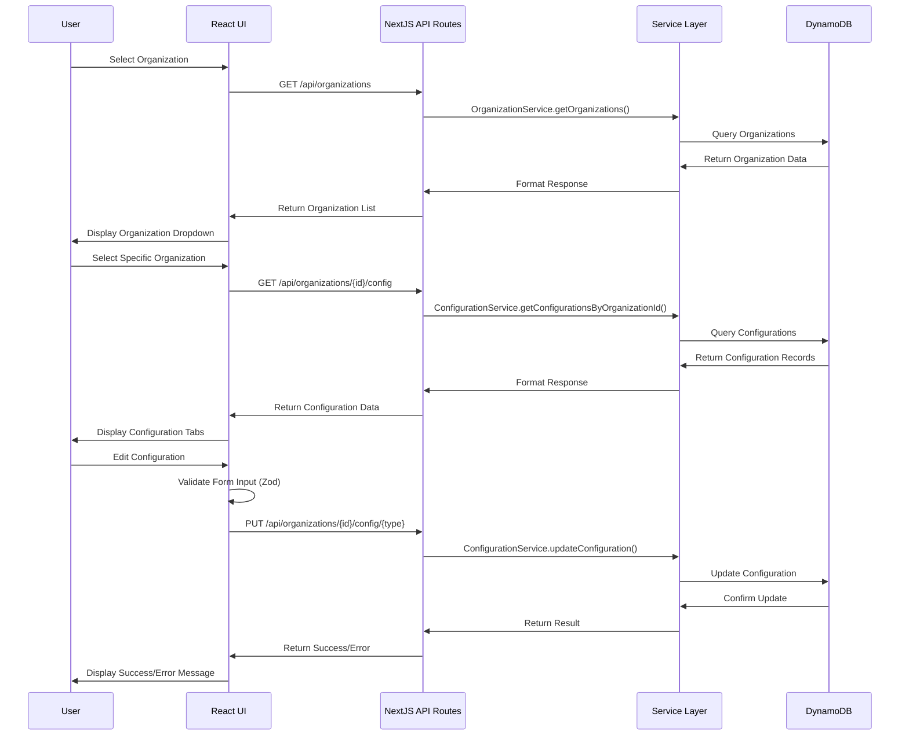

## Core Concepts

### Organization Configuration Types

The system manages four types of configuration records for each organization:

1. **ORGANIZATION_CONFIG**: Core organization settings including name, branding, BuyTabs, and Profile settings
2. **CLIENT_CONFIG**: General client configuration settings applicable across all platforms
3. **CLIENT_CONFIG_IOS**: iOS-specific client configuration settings
4. **CLIENT_CONFIG_ANDROID**: Android-specific client configuration settings

### Data Model

The primary entity is `OrganizationConfiguration` which uses a composite key structure:

- **Partition Key**: OrganizationId (groups all configuration types for an organization)
- **Sort Key**: OrganizationConfigType (differentiates configuration types)
- **GSI1**: Enables lookup by ExternalProviderId

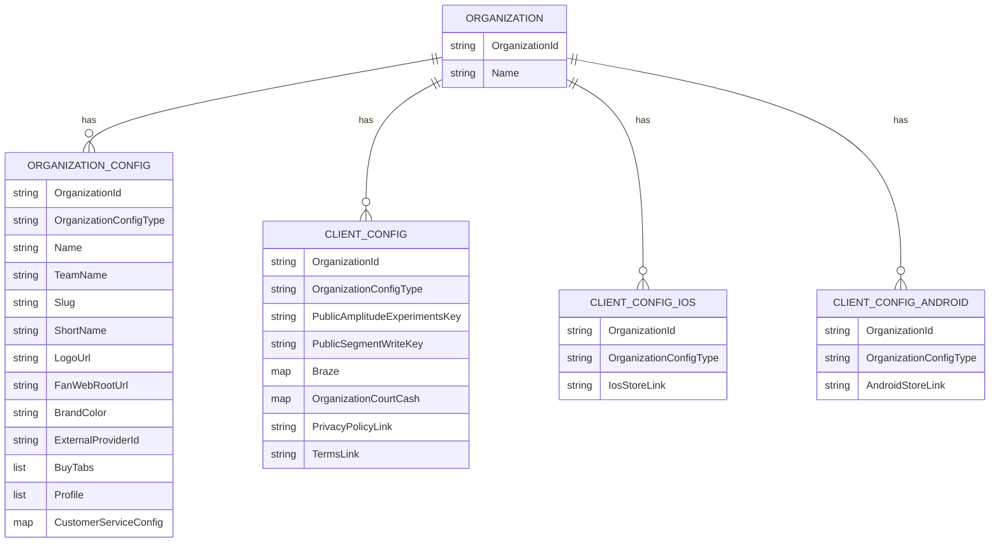

## Development Workflow

### Setting Up the Development Environment

1. **Prerequisites**
   - Node.js 18 or higher
   - npm or yarn
   - AWS credentials with access to DynamoDB

2. **Installation**
   ```bash
   git clone <repository-url>
   cd organization-config-tool
   npm install
   ```

3. **Environment Configuration**
   Create a `.env.local` file with the following variables:
   ```
   ORGANIZATION_CONFIGURATION_TABLE_NAME=your-dynamodb-table-name
   AWS_REGION=us-east-1
   ```

4. **Start Development Server**
   ```bash
   npm run dev
   ```

5. **Access the Application**
   Open [http://localhost:3000](http://localhost:3000) in your browser

### DynamoDB Local Setup (Optional)

For development without connecting to a real AWS DynamoDB instance:

1. Install DynamoDB Local:
   ```bash
   npm install -g dynamodb-local
   ```

2. Start DynamoDB Local:
   ```bash
   dynamodb-local -port 8000
   ```

3. Configure your application to use the local instance:
   ```
   DYNAMODB_ENDPOINT=http://localhost:8000
   ```

## Code Organization

```
organization-config-tool/
├── src/
│   ├── backend/                # Backend code
│   │   ├── api/                # API route handlers
│   │   ├── config/             # Configuration settings
│   │   ├── data/               # Data access layer
│   │   │   ├── adapters/       # Database adapters
│   │   │   └── entities/       # ElectroDB entities
│   │   ├── middleware/         # API middleware
│   │   ├── models/             # Data models
│   │   │   └── enums/          # Enumeration types
│   │   ├── services/           # Business logic services
│   │   ├── types/              # TypeScript type definitions
│   │   ├── utils/              # Utility functions
│   │   └── validation/         # Validation schemas
│   │       └── schemas/        # Zod schemas
│   │
│   └── web/                    # Frontend code
│       ├── app/                # NextJS app router pages
│       │   └── api/            # API route implementations
│       ├── components/         # React components
│       │   ├── forms/          # Form components
│       │   └── ui/             # UI components (Shadcn)
│       ├── contexts/           # React contexts
│       ├── hooks/              # Custom React hooks
│       ├── lib/                # Frontend utilities
│       ├── providers/          # React providers
│       ├── types/              # TypeScript type definitions
│       └── validators/         # Frontend validation schemas
│
├── infrastructure/             # Infrastructure code
│   └── cdk/                    # AWS CDK deployment code
│
└── docs/                       # Documentation
```

## Key Components

### Frontend Components

1. **OrganizationSelector**
   - Dropdown component for selecting organizations
   - Displays organization names and triggers configuration loading

2. **ConfigurationTabs**
   - Tab navigation for different configuration types
   - Renders appropriate configuration display based on selected tab

3. **ConfigurationDisplay**
   - Displays configuration data for the selected type
   - Provides edit button to modify configuration

4. **ConfigurationEditForm**
   - Form for editing configuration settings
   - Dynamically renders fields based on configuration type
   - Validates input using zod schemas

5. **NewOrganizationForm**
   - Form for creating new organizations
   - Validates OrganizationId and Name
   - Creates default configurations for all types

### Backend Services

1. **OrganizationService**
   - Manages organization data
   - Provides methods for listing, retrieving, and creating organizations

2. **ConfigurationService**
   - Manages configuration data
   - Provides methods for retrieving, updating, and creating configuration records

3. **ElectroDBAdapter**
   - Abstracts DynamoDB operations
   - Provides a consistent interface for data access

## Best Practices

### TypeScript

- Use strong typing for all variables, parameters, and return values
- Leverage interfaces and type aliases for complex data structures
- Use enums for fixed sets of values (like OrganizationConfigType)

### React Components

- Use functional components with hooks
- Keep components focused on a single responsibility
- Use composition to build complex UIs from simple components
- Implement proper error handling and loading states

### Form Handling

- Use react-hook-form for form state management
- Define zod schemas for validation
- Implement field-level validation for immediate feedback
- Handle form submission with proper error handling

### API Design

- Use RESTful principles for API endpoints
- Implement consistent error handling
- Validate all input data
- Return appropriate HTTP status codes

### Data Access

- Use ElectroDB for type-safe DynamoDB operations
- Implement service layer for business logic
- Handle database errors gracefully
- Validate data before storage

## Testing

The project uses Jest for unit and integration testing:

```bash
# Run unit tests
npm test

# Run tests with coverage
npm test -- --coverage
```

### Test Organization

- **Unit Tests**: Test individual components and functions
- **Integration Tests**: Test interactions between components
- **API Tests**: Test API endpoints

## Deployment

The application is deployed using AWS Amplify with a CI/CD pipeline:

1. Code is pushed to the repository
2. CI/CD pipeline runs tests and builds the application
3. Application is deployed to AWS Amplify
4. DynamoDB table is accessed via IAM roles

## Troubleshooting

### Common Issues

1. **DynamoDB Connection Issues**
   - Verify AWS credentials are correctly configured
   - Check that the DynamoDB table exists and is accessible
   - Ensure the table name matches the environment variable

2. **Form Validation Errors**
   - Check the validation schema for the specific form
   - Ensure input data matches the expected format
   - Look for console errors that might indicate validation issues

3. **API Errors**
   - Check the API route implementation
   - Verify that the request includes all required data
   - Look for server-side logs for more details

### Debugging Tips

1. Use browser developer tools to inspect network requests
2. Check console logs for client-side errors
3. Review server logs for API errors
4. Use the React Developer Tools extension for component debugging

## Resources

- [NextJS Documentation](https://nextjs.org/docs)
- [React Documentation](https://reactjs.org/docs)
- [ElectroDB Documentation](https://electrodb.dev/)
- [DynamoDB Developer Guide](https://docs.aws.amazon.com/amazondynamodb/latest/developerguide/)
- [Zod Documentation](https://zod.dev/)
- [React Hook Form Documentation](https://react-hook-form.com/)

# HUMAN INPUTS NEEDED

| Task | Description | Priority | Estimated Hours |
|------|-------------|----------|----------------|
| QA/Bug Fixes | Review generated code for compilation errors, fix package dependency issues, and ensure proper imports across the codebase | High | 16-24 |
| Environment Variable Configuration | Set up and validate all required environment variables including DynamoDB table name, AWS region, and API endpoints | High | 2-3 |
| AWS Credentials Setup | Configure proper AWS credentials and IAM roles for DynamoDB access in development and production environments | High | 3-4 |
| ElectroDB Entity Validation | Verify the ElectroDB entity configuration matches the existing DynamoDB table structure | High | 4-6 |
| Form Validation Schema Review | Review and test all zod validation schemas to ensure they match business requirements | Medium | 6-8 |
| API Error Handling Enhancement | Implement comprehensive error handling for all API routes with proper error messages | Medium | 4-6 |
| UI Component Testing | Test all UI components across different browsers and screen sizes for responsiveness | Medium | 8-10 |
| Authentication Integration | Integrate with existing corporate authentication system (SSO or Cognito) | High | 8-12 |
| CI/CD Pipeline Configuration | Set up GitHub Actions workflows for testing, building, and deploying to different environments | High | 6-8 |
| DynamoDB Access Optimization | Review and optimize DynamoDB query patterns for performance | Medium | 4-6 |
| Monitoring Setup | Configure CloudWatch alerts and dashboards for application monitoring | Medium | 3-5 |
| Security Review | Conduct security review of API routes, authentication, and data access patterns | High | 6-8 |
| Documentation Completion | Complete any missing documentation including API references and deployment guides | Low | 4-6 |
| User Acceptance Testing | Conduct UAT with internal stakeholders and incorporate feedback | High | 8-12 |
| Performance Testing | Test application performance under expected load conditions | Medium | 4-6 |
| Backup and Recovery Testing | Test DynamoDB backup and recovery procedures | Medium | 2-4 |
| Cross-browser Testing | Test application in all required browsers and fix compatibility issues | Medium | 4-6 |
| Accessibility Compliance | Ensure UI components meet WCAG AA accessibility standards | Medium | 6-8 |
| Code Review | Conduct comprehensive code review for best practices and optimization opportunities | Medium | 8-10 |
| Production Deployment Checklist | Create and validate production deployment checklist | High | 2-3 |