# Technical Specifications

## 1. INTRODUCTION

### 1.1 EXECUTIVE SUMMARY

This technical specification outlines the development of an internal configuration management tool for a multi-tenant application. The tool will enable authorized users to create, view, and edit configuration settings for different organizations (tenants) within the system.

| Business Problem | Solution Approach | Key Users | Value Proposition |
|------------------|-------------------|-----------|-------------------|
| Manual configuration management is error-prone and inefficient | Web-based configuration tool with intuitive UI | Internal administrators and support staff | Streamlined organization setup, reduced configuration errors, improved operational efficiency |

### 1.2 SYSTEM OVERVIEW

#### 1.2.1 Project Context

The platform serves as an internal administrative interface for managing organization configurations within a multi-tenant system. It addresses the need for a structured, user-friendly approach to organization setup and maintenance.

| Business Context | Current Limitations | Enterprise Integration |
|------------------|---------------------|------------------------|
| Supporting multiple organizations with unique configurations | Manual configuration processes lacking validation | Integrates with existing DynamoDB infrastructure storing organization data |

#### 1.2.2 High-Level Description

The system will be a single-page web application built with NextJS and React, providing a comprehensive interface for organization configuration management.

| Primary Capabilities | Major Components | Technical Approach |
|---------------------|------------------|-------------------|
| Organization listing and selection | Configuration viewing interface | NextJS application with React frontend |
| Configuration editing by type | Form-based editing interface | TypeScript with strong typing and validation |
| New organization creation | Organization creation workflow | DynamoDB with ElectroDB for data persistence |

#### 1.2.3 Success Criteria

| Objectives | Success Factors | Key Performance Indicators |
|------------|-----------------|----------------------------|
| Simplify organization configuration | Intuitive UI with minimal training required | Reduction in configuration errors |
| Standardize configuration process | Consistent data validation | Time saved in organization setup |
| Improve configuration visibility | Comprehensive view of all settings | Improved support response times |

### 1.3 SCOPE

#### 1.3.1 In-Scope

**Core Features and Functionalities:**

| Feature | Description |
|---------|-------------|
| Organization Selection | Dropdown interface to select organizations by name |
| Configuration Display | Tab-based interface showing configuration by type |
| Configuration Editing | Form-based editing of organization settings |
| New Organization Creation | Workflow to create new organizations with default configurations |

**Implementation Boundaries:**

| Boundary Type | Coverage |
|---------------|----------|
| System | Web-based internal tool only |
| Users | Internal administrators and support staff |
| Data | Organization configuration data stored in DynamoDB |
| Integration | Direct integration with existing DynamoDB table |

#### 1.3.2 Out-of-Scope

- Mobile application versions of the configuration tool
- End-user facing interfaces
- Batch import/export of organization configurations
- Integration with external configuration management systems
- User management and permission controls (assumed to be handled elsewhere)
- Historical configuration tracking and versioning
- Automated configuration testing or validation beyond form validation

## 2. PRODUCT REQUIREMENTS

### 2.1 FEATURE CATALOG

#### 2.1.1 Organization Management Features

| Feature ID | Feature Name | Feature Category | Priority | Status |
|------------|--------------|------------------|----------|--------|
| F-001 | Organization Selection | Core Functionality | Critical | Proposed |
| F-002 | Organization Creation | Core Functionality | Critical | Proposed |
| F-003 | Organization Configuration Display | Core Functionality | Critical | Proposed |

#### 2.1.2 Configuration Management Features

| Feature ID | Feature Name | Feature Category | Priority | Status |
|------------|--------------|------------------|----------|--------|
| F-004 | Configuration Editing | Core Functionality | Critical | Proposed |
| F-005 | Configuration Type Management | Core Functionality | High | Proposed |
| F-006 | Configuration Validation | Data Integrity | High | Proposed |

#### 2.1.3 Feature Descriptions

**F-001: Organization Selection**
- **Overview**: Allows users to select an organization from a dropdown list to view its configurations
- **Business Value**: Enables quick access to organization settings for support and administrative tasks
- **User Benefits**: Simplified navigation between organizations without complex search operations
- **Technical Context**: Requires integration with DynamoDB to fetch organization names and IDs

**F-002: Organization Creation**
- **Overview**: Enables users to create new organizations with default configurations
- **Business Value**: Streamlines onboarding process for new organizations
- **User Benefits**: Reduces manual configuration steps and potential errors
- **Technical Context**: Creates multiple configuration records in DynamoDB based on OrganizationConfigType

**F-003: Organization Configuration Display**
- **Overview**: Displays configuration settings for selected organizations in a tab-based interface
- **Business Value**: Provides comprehensive visibility into organization settings
- **User Benefits**: Enables quick assessment of configuration status
- **Technical Context**: Organizes configuration data by OrganizationConfigType for structured display

**F-004: Configuration Editing**
- **Overview**: Allows modification of configuration settings through form-based interfaces
- **Business Value**: Enables rapid updates to organization settings without direct database access
- **User Benefits**: Intuitive interface for making configuration changes with validation
- **Technical Context**: Uses react-hook-form with zod validation to ensure data integrity

**F-005: Configuration Type Management**
- **Overview**: Manages different configuration types (ORGANIZATION_CONFIG, CLIENT_CONFIG, etc.)
- **Business Value**: Organizes settings by functional area for better management
- **User Benefits**: Logical grouping of related settings improves usability
- **Technical Context**: Leverages OrganizationConfigType enum to categorize configuration data

**F-006: Configuration Validation**
- **Overview**: Validates configuration data before saving to ensure integrity
- **Business Value**: Prevents invalid configurations from being stored
- **User Benefits**: Immediate feedback on configuration errors
- **Technical Context**: Implements zod schemas for type validation and business rule enforcement

### 2.2 FUNCTIONAL REQUIREMENTS TABLE

#### 2.2.1 Organization Selection Requirements (F-001)

| Requirement ID | Description | Acceptance Criteria | Priority |
|----------------|-------------|---------------------|----------|
| F-001-RQ-001 | System shall display a dropdown of all organizations by Name | Dropdown shows all organization names from database | Must-Have |
| F-001-RQ-002 | System shall allow selection of an organization from the dropdown | User can select an organization and view its configuration | Must-Have |
| F-001-RQ-003 | System shall fetch and display configuration for the selected organization | All configuration records for selected organization are displayed | Must-Have |

**Technical Specifications**:
- **Input**: Organization selection from dropdown
- **Output**: Display of all configuration records for selected organization
- **Performance**: Load organization list in < 2 seconds, configuration in < 3 seconds
- **Data Requirements**: Organization Name and OrganizationId from DynamoDB

**Validation Rules**:
- Dropdown must not be empty if organizations exist in the database
- Selected organization's configurations must be displayed by type
- Error handling for cases where configurations cannot be retrieved

#### 2.2.2 Organization Creation Requirements (F-002)

| Requirement ID | Description | Acceptance Criteria | Priority |
|----------------|-------------|---------------------|----------|
| F-002-RQ-001 | System shall provide a form to create a new organization | Form includes fields for OrganizationId and Name | Must-Have |
| F-002-RQ-002 | System shall create configuration records for all OrganizationConfigTypes | All required configuration types are created in database | Must-Have |
| F-002-RQ-003 | System shall redirect to Configuration Page after creation | User is redirected with new organization selected | Must-Have |

**Technical Specifications**:
- **Input**: OrganizationId and Name
- **Output**: Creation of configuration records in DynamoDB
- **Performance**: Complete creation process in < 5 seconds
- **Data Requirements**: Valid OrganizationId and Name values

**Validation Rules**:
- OrganizationId must be unique
- Name field cannot be empty
- All required OrganizationConfigType records must be created
- Appropriate error handling for creation failures

#### 2.2.3 Organization Configuration Display Requirements (F-003)

| Requirement ID | Description | Acceptance Criteria | Priority |
|----------------|-------------|---------------------|----------|
| F-003-RQ-001 | System shall display configuration records in tabs by OrganizationConfigType | Each configuration type appears in a separate tab | Must-Have |
| F-003-RQ-002 | System shall show all fields for each configuration type | All available fields for the configuration type are displayed | Must-Have |
| F-003-RQ-003 | System shall provide edit button for each configuration | Edit button is available for each configuration record | Must-Have |

**Technical Specifications**:
- **Input**: Selected organization's configuration data
- **Output**: Tabbed display of configuration by type
- **Performance**: Render configuration display in < 2 seconds
- **Data Requirements**: Complete configuration records from DynamoDB

**Validation Rules**:
- All configuration types must be displayed if they exist
- Empty/null fields should be displayed appropriately
- Complex data types (lists, maps) should be formatted for readability

#### 2.2.4 Configuration Editing Requirements (F-004)

| Requirement ID | Description | Acceptance Criteria | Priority |
|----------------|-------------|---------------------|----------|
| F-004-RQ-001 | System shall provide form to edit configuration fields | Form displays all editable fields with current values | Must-Have |
| F-004-RQ-002 | System shall validate input before saving | Invalid inputs are flagged with appropriate error messages | Must-Have |
| F-004-RQ-003 | System shall update only changed fields in database | Only modified fields are updated in DynamoDB | Must-Have |
| F-004-RQ-004 | System shall not set empty fields in database | Fields left empty in form are not set in database | Must-Have |

**Technical Specifications**:
- **Input**: Form data for configuration fields
- **Output**: Updated configuration in DynamoDB
- **Performance**: Save updates in < 3 seconds
- **Data Requirements**: Valid field values according to schema

**Validation Rules**:
- Field validation according to data types in ElectroDB entity
- Complex data structures (BuyTabs, Profile) must be validated
- Required fields cannot be empty
- Appropriate error handling for validation failures

### 2.3 FEATURE RELATIONSHIPS

#### 2.3.1 Feature Dependencies Map

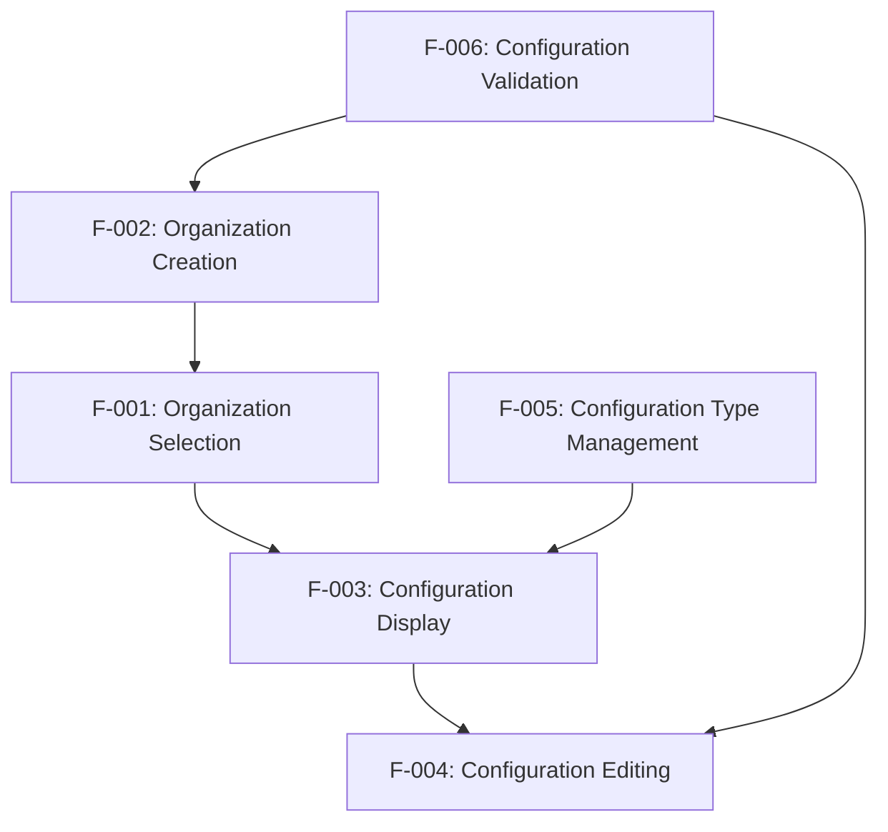
```mermaid
graph TD
    F001[F-001: Organization Selection] --> F003[F-003: Configuration Display]
    F003 --> F004[F-004: Configuration Editing]
    F002[F-002: Organization Creation] --> F001
    F005[F-005: Configuration Type Management] --> F003
    F006[F-006: Configuration Validation] --> F004
    F006 --> F002
```

#### 2.3.2 Integration Points

| Feature ID | Integration Point | Description |
|------------|-------------------|-------------|
| F-001, F-002, F-003, F-004 | DynamoDB | All features interact with DynamoDB for data persistence |
| F-004, F-006 | react-hook-form + zod | Form management and validation integration |
| F-003, F-004, F-005 | UI Components (Shadcn) | Interface components for displaying and editing configurations |

#### 2.3.3 Shared Components

| Component | Used By Features | Description |
|-----------|------------------|-------------|
| Organization Selector | F-001, F-003 | Dropdown component for organization selection |
| Configuration Tabs | F-003, F-005 | Tab interface for displaying configuration by type |
| Configuration Form | F-002, F-004 | Form component for creating/editing configurations |
| Validation Schema | F-002, F-004, F-006 | Zod schemas for data validation |

### 2.4 IMPLEMENTATION CONSIDERATIONS

#### 2.4.1 Technical Constraints

| Feature ID | Constraint | Impact |
|------------|------------|--------|
| All Features | NextJS + React (app router) | Defines application architecture and routing approach |
| F-001, F-002, F-003, F-004 | ElectroDB Entity Structure | Determines available fields and validation rules |
| F-005 | Fixed OrganizationConfigType values | Limits configuration types to predefined enum values |
| All Features | Web platform only | No mobile-specific considerations required |

#### 2.4.2 Performance Requirements

| Feature ID | Requirement | Description |
|------------|-------------|-------------|
| F-001 | Organization list loading | Must load within 2 seconds even with large number of organizations |
| F-003 | Configuration display | Must render configuration tabs within 2 seconds |
| F-004 | Configuration saving | Must validate and save updates within 3 seconds |
| F-002 | Organization creation | Must create all configuration types within 5 seconds |

#### 2.4.3 Security Implications

| Feature ID | Security Consideration | Mitigation |
|------------|------------------------|------------|
| All Features | Internal tool access | Assumes external authentication/authorization |
| F-004 | Configuration data validation | Implement strict validation to prevent invalid data |
| F-002 | Organization ID uniqueness | Validate uniqueness before creation |
| All Features | API route protection | Implement appropriate authorization checks |

#### 2.4.4 Maintenance Requirements

| Feature ID | Maintenance Consideration | Approach |
|------------|---------------------------|----------|
| F-005 | New configuration types | Design for extensibility to accommodate new types |
| F-004 | Schema changes | Modular validation approach to adapt to schema changes |
| All Features | Code organization | Structured component approach for maintainability |
| All Features | Documentation | Inline documentation of complex logic and data structures |

## 3. TECHNOLOGY STACK

### 3.1 PROGRAMMING LANGUAGES

| Language | Component | Justification |
|----------|-----------|---------------|
| TypeScript 5.x | Frontend & Backend | Provides strong typing for improved code quality and developer experience. Essential for maintaining complex configuration forms with proper validation. |
| JavaScript | Runtime Environment | Underlying runtime for NextJS application. |

TypeScript was selected as the primary language for this project to ensure type safety when handling complex configuration objects with nested structures like BuyTabs and Profile configurations. The strong typing system helps prevent runtime errors when manipulating organization configuration data.

### 3.2 FRAMEWORKS & LIBRARIES

| Framework/Library | Version | Purpose | Justification |
|-------------------|---------|---------|---------------|
| NextJS | 14.x | Full-stack Framework | Provides unified frontend and backend capabilities with built-in API routes, simplifying the architecture for this internal tool. |
| React | 18.x | UI Library | Component-based architecture ideal for building the configuration interface with reusable form components. |
| TailwindCSS | 3.x | Styling | Utility-first CSS framework enabling rapid UI development with consistent styling. |
| Shadcn UI | Latest | UI Component Library | Provides accessible, customizable components built on Radix UI primitives for the admin interface. |
| react-hook-form | 7.x | Form Management | Efficient form state management with minimal re-renders, critical for complex configuration forms. |
| Zod | 3.x | Validation | Type-safe validation schema that integrates with TypeScript for configuration data validation. |
| lucide-react | Latest | Icons | Consistent icon system for the interface. |

The NextJS framework was chosen to leverage its full-stack capabilities, allowing for a unified codebase that handles both the frontend interface and the backend API routes for DynamoDB interactions. The app router architecture provides a modern, efficient approach to routing and server components.

### 3.3 DATABASES & STORAGE

| Database/Storage | Purpose | Configuration |
|------------------|---------|--------------|
| Amazon DynamoDB | Primary Database | Stores all organization configuration data |
| ElectroDB | ORM Layer | Provides entity modeling and query capabilities for DynamoDB |

DynamoDB was selected as the primary database as it's already being used to store organization configuration data. The application will connect to an existing DynamoDB table specified by the `ORGANIZATION_CONFIGURATION_TABLE_NAME` environment variable. ElectroDB provides a structured approach to interacting with DynamoDB, with built-in support for the complex entity model required for organization configurations.

### 3.4 THIRD-PARTY SERVICES

| Service | Purpose | Integration Point |
|---------|---------|------------------|
| AWS SDK | DynamoDB Access | Backend API routes for data operations |

The application primarily interacts with AWS services, specifically DynamoDB through the AWS SDK. No additional third-party services are required for this internal configuration tool.

### 3.5 DEVELOPMENT & DEPLOYMENT

| Tool/Process | Purpose | Configuration |
|--------------|---------|--------------|
| npm/yarn | Package Management | Dependency management and script execution |
| ESLint | Code Quality | Static code analysis with TypeScript integration |
| Prettier | Code Formatting | Consistent code style across the codebase |
| NextJS Build | Application Building | Production optimization of application assets |
| Environment Variables | Configuration | `ORGANIZATION_CONFIGURATION_TABLE_NAME` for database connection |

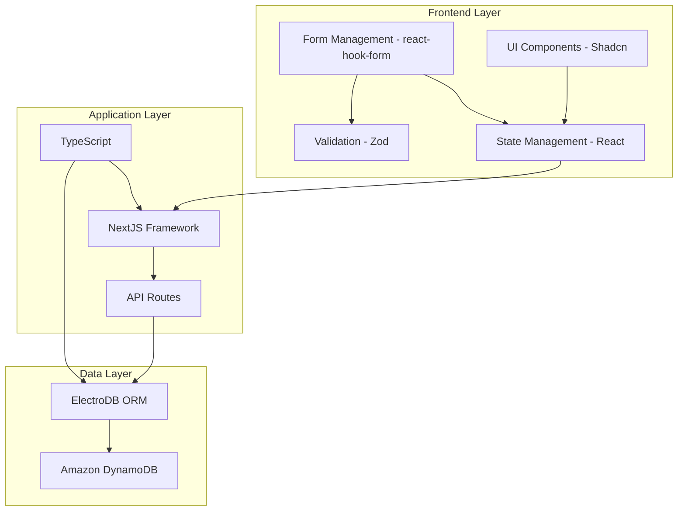
```mermaid
graph TD
    subgraph "Frontend Layer"
        UI[UI Components - Shadcn]
        Forms[Form Management - react-hook-form]
        Validation[Validation - Zod]
        State[State Management - React]
    end
    
    subgraph "Application Layer"
        NextJS[NextJS Framework]
        API[API Routes]
        TypeScript[TypeScript]
    end
    
    subgraph "Data Layer"
        ElectroDB[ElectroDB ORM]
        DynamoDB[Amazon DynamoDB]
    end
    
    UI --> State
    Forms --> Validation
    Forms --> State
    State --> NextJS
    NextJS --> API
    API --> ElectroDB
    ElectroDB --> DynamoDB
    TypeScript --> NextJS
    TypeScript --> ElectroDB
```

The development workflow leverages standard JavaScript/TypeScript tooling with NextJS's built-in development server. The application is designed to be deployed as a single NextJS application, with environment variables configuring the connection to the existing DynamoDB table.

## 4. PROCESS FLOWCHART

### 4.1 SYSTEM WORKFLOWS

#### 4.1.1 Core Business Processes

##### Organization Configuration Management Workflow

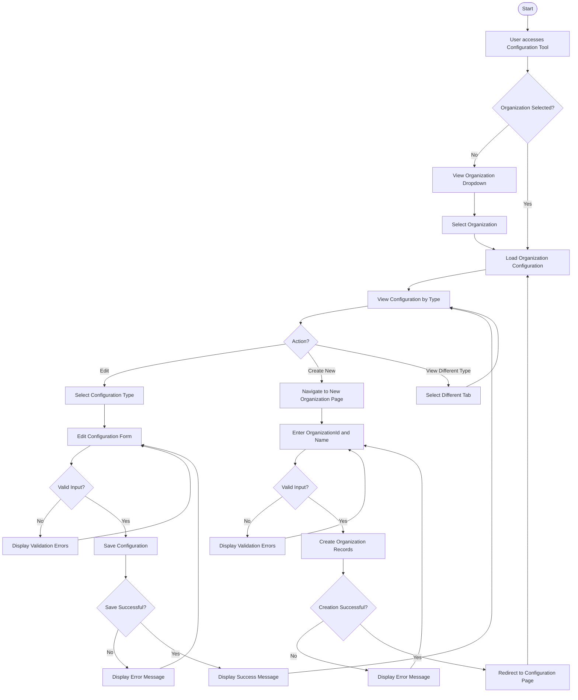
```mermaid
flowchart TD
    Start([Start]) --> A[User accesses Configuration Tool]
    A --> B{Organization Selected?}
    B -->|No| C[View Organization Dropdown]
    C --> D[Select Organization]
    D --> E[Load Organization Configuration]
    B -->|Yes| E
    E --> F[View Configuration by Type]
    F --> G{Action?}
    G -->|Edit| H[Select Configuration Type]
    H --> I[Edit Configuration Form]
    I --> J{Valid Input?}
    J -->|No| K[Display Validation Errors]
    K --> I
    J -->|Yes| L[Save Configuration]
    L --> M{Save Successful?}
    M -->|No| N[Display Error Message]
    N --> I
    M -->|Yes| O[Display Success Message]
    O --> F
    G -->|Create New| P[Navigate to New Organization Page]
    P --> Q[Enter OrganizationId and Name]
    Q --> R{Valid Input?}
    R -->|No| S[Display Validation Errors]
    S --> Q
    R -->|Yes| T[Create Organization Records]
    T --> U{Creation Successful?}
    U -->|No| V[Display Error Message]
    V --> Q
    U -->|Yes| W[Redirect to Configuration Page]
    W --> E
    G -->|View Different Type| X[Select Different Tab]
    X --> F
```

##### User Journey: Editing Configuration

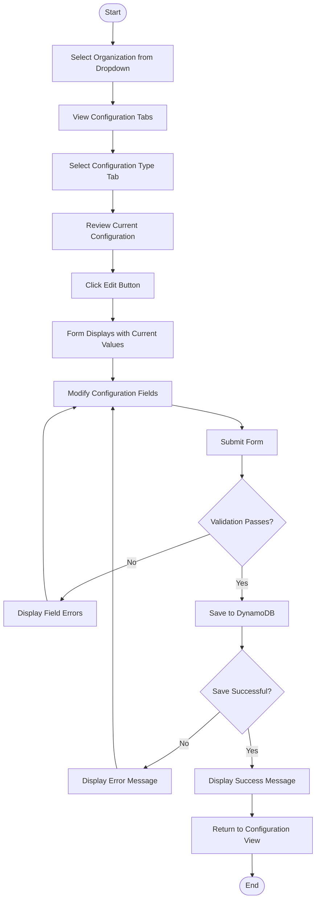
```mermaid
flowchart TD
    Start([Start]) --> A[Select Organization from Dropdown]
    A --> B[View Configuration Tabs]
    B --> C[Select Configuration Type Tab]
    C --> D[Review Current Configuration]
    D --> E[Click Edit Button]
    E --> F[Form Displays with Current Values]
    F --> G[Modify Configuration Fields]
    G --> H[Submit Form]
    H --> I{Validation Passes?}
    I -->|No| J[Display Field Errors]
    J --> G
    I -->|Yes| K[Save to DynamoDB]
    K --> L{Save Successful?}
    L -->|No| M[Display Error Message]
    M --> G
    L -->|Yes| N[Display Success Message]
    N --> O[Return to Configuration View]
    O --> End([End])
```

##### User Journey: Creating New Organization

```mermaid
flowchart TD
    Start([Start]) --> A[Click "Add New Organization" Button]
    A --> B[Display New Organization Form]
    B --> C[Enter OrganizationId]
    C --> D[Enter Organization Name]
    D --> E[Submit Form]
    E --> F{Validation Passes?}
    F -->|No| G[Display Field Errors]
    G --> C
    F -->|Yes| H{OrganizationId Unique?}
    H -->|No| I[Display Duplicate ID Error]
    I --> C
    H -->|Yes| J[Create Records for All Config Types]
    J --> K{Creation Successful?}
    K -->|No| L[Display Error Message]
    L --> C
    K -->|Yes| M[Redirect to Configuration Page]
    M --> N[New Organization Selected in Dropdown]
    N --> O[Display New Organization Configuration]
    O --> End([End])
```

#### 4.1.2 Integration Workflows

##### Data Flow Between Frontend and DynamoDB

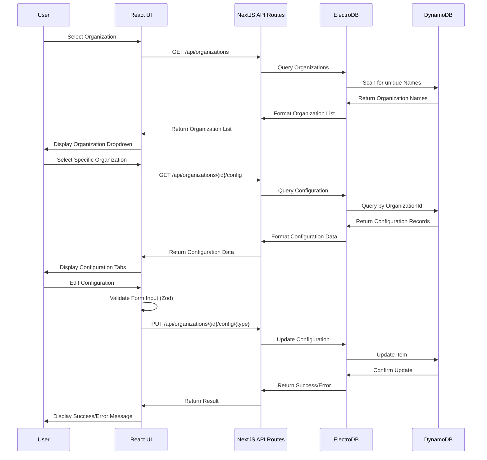
```mermaid
sequenceDiagram
    participant User
    participant UI as React UI
    participant API as NextJS API Routes
    participant ORM as ElectroDB
    participant DB as DynamoDB

    User->>UI: Select Organization
    UI->>API: GET /api/organizations
    API->>ORM: Query Organizations
    ORM->>DB: Scan for unique Names
    DB->>ORM: Return Organization Names
    ORM->>API: Format Organization List
    API->>UI: Return Organization List
    UI->>User: Display Organization Dropdown

    User->>UI: Select Specific Organization
    UI->>API: GET /api/organizations/{id}/config
    API->>ORM: Query Configuration
    ORM->>DB: Query by OrganizationId
    DB->>ORM: Return Configuration Records
    ORM->>API: Format Configuration Data
    API->>UI: Return Configuration Data
    UI->>User: Display Configuration Tabs

    User->>UI: Edit Configuration
    UI->>UI: Validate Form Input (Zod)
    UI->>API: PUT /api/organizations/{id}/config/{type}
    API->>ORM: Update Configuration
    ORM->>DB: Update Item
    DB->>ORM: Confirm Update
    ORM->>API: Return Success/Error
    API->>UI: Return Result
    UI->>User: Display Success/Error Message
```

##### Configuration Creation Process

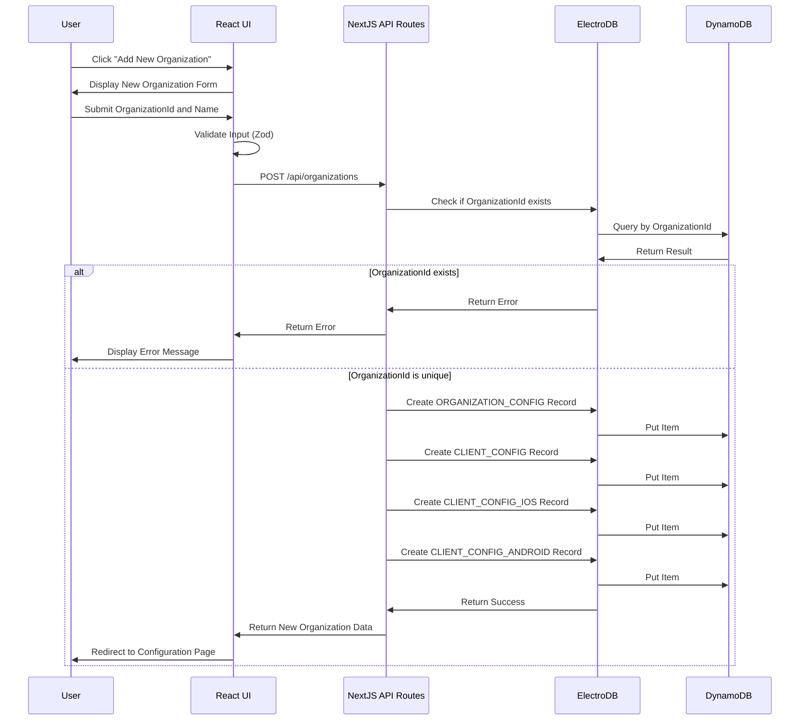
```mermaid
sequenceDiagram
    participant User
    participant UI as React UI
    participant API as NextJS API Routes
    participant ORM as ElectroDB
    participant DB as DynamoDB

    User->>UI: Click "Add New Organization"
    UI->>User: Display New Organization Form
    User->>UI: Submit OrganizationId and Name
    UI->>UI: Validate Input (Zod)
    UI->>API: POST /api/organizations
    API->>ORM: Check if OrganizationId exists
    ORM->>DB: Query by OrganizationId
    DB->>ORM: Return Result
    
    alt OrganizationId exists
        ORM->>API: Return Error
        API->>UI: Return Error
        UI->>User: Display Error Message
    else OrganizationId is unique
        API->>ORM: Create ORGANIZATION_CONFIG Record
        ORM->>DB: Put Item
        API->>ORM: Create CLIENT_CONFIG Record
        ORM->>DB: Put Item
        API->>ORM: Create CLIENT_CONFIG_IOS Record
        ORM->>DB: Put Item
        API->>ORM: Create CLIENT_CONFIG_ANDROID Record
        ORM->>DB: Put Item
        ORM->>API: Return Success
        API->>UI: Return New Organization Data
        UI->>User: Redirect to Configuration Page
    end
```

### 4.2 FLOWCHART REQUIREMENTS

#### 4.2.1 Organization Selection Workflow

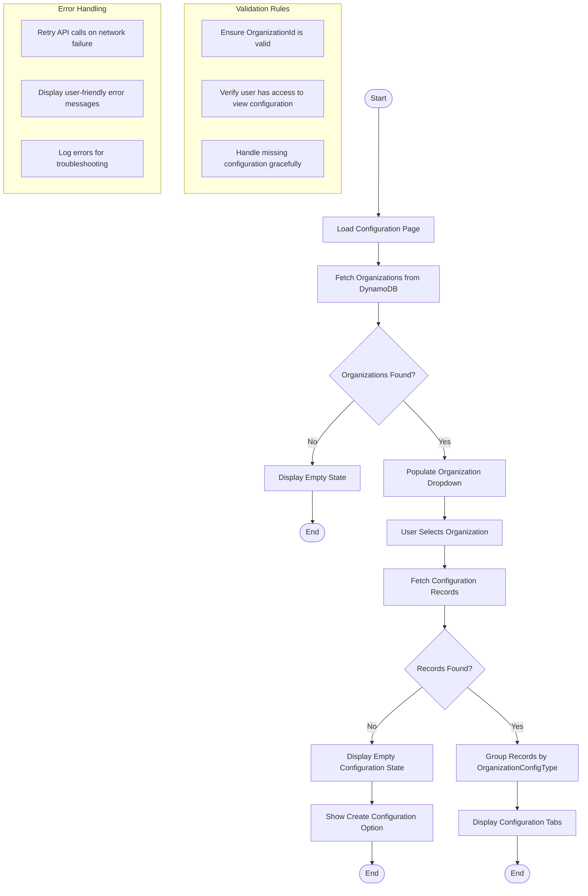
```mermaid
flowchart TD
    Start([Start]) --> A[Load Configuration Page]
    A --> B[Fetch Organizations from DynamoDB]
    B --> C{Organizations Found?}
    C -->|No| D[Display Empty State]
    D --> End1([End])
    C -->|Yes| E[Populate Organization Dropdown]
    E --> F[User Selects Organization]
    F --> G[Fetch Configuration Records]
    G --> H{Records Found?}
    H -->|No| I[Display Empty Configuration State]
    I --> J[Show Create Configuration Option]
    J --> End2([End])
    H -->|Yes| K[Group Records by OrganizationConfigType]
    K --> L[Display Configuration Tabs]
    L --> End3([End])

    subgraph "Validation Rules"
        VR1[Ensure OrganizationId is valid]
        VR2[Verify user has access to view configuration]
        VR3[Handle missing configuration gracefully]
    end

    subgraph "Error Handling"
        EH1[Retry API calls on network failure]
        EH2[Display user-friendly error messages]
        EH3[Log errors for troubleshooting]
    end
```

#### 4.2.2 Configuration Editing Workflow

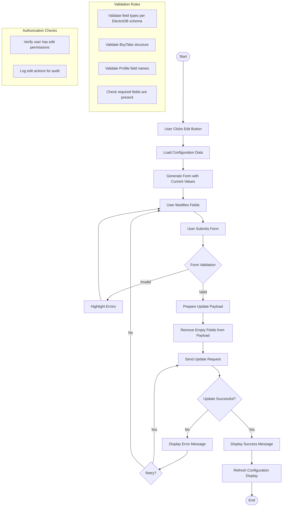
```mermaid
flowchart TD
    Start([Start]) --> A[User Clicks Edit Button]
    A --> B[Load Configuration Data]
    B --> C[Generate Form with Current Values]
    C --> D[User Modifies Fields]
    D --> E[User Submits Form]
    E --> F{Form Validation}
    F -->|Invalid| G[Highlight Errors]
    G --> D
    F -->|Valid| H[Prepare Update Payload]
    H --> I[Remove Empty Fields from Payload]
    I --> J[Send Update Request]
    J --> K{Update Successful?}
    K -->|No| L[Display Error Message]
    L --> M{Retry?}
    M -->|Yes| J
    M -->|No| D
    K -->|Yes| N[Display Success Message]
    N --> O[Refresh Configuration Display]
    O --> End([End])

    subgraph "Validation Rules"
        VR1[Validate field types per ElectroDB schema]
        VR2[Validate BuyTabs structure]
        VR3[Validate Profile field names]
        VR4[Check required fields are present]
    end

    subgraph "Authorization Checks"
        AC1[Verify user has edit permissions]
        AC2[Log edit actions for audit]
    end
```

#### 4.2.3 New Organization Creation Workflow

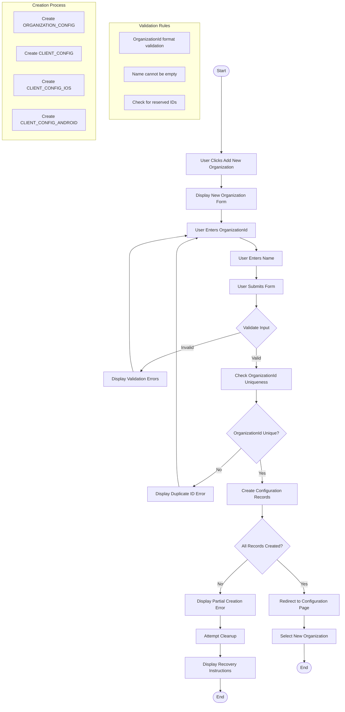
```mermaid
flowchart TD
    Start([Start]) --> A[User Clicks Add New Organization]
    A --> B[Display New Organization Form]
    B --> C[User Enters OrganizationId]
    C --> D[User Enters Name]
    D --> E[User Submits Form]
    E --> F{Validate Input}
    F -->|Invalid| G[Display Validation Errors]
    G --> C
    F -->|Valid| H[Check OrganizationId Uniqueness]
    H --> I{OrganizationId Unique?}
    I -->|No| J[Display Duplicate ID Error]
    J --> C
    I -->|Yes| K[Create Configuration Records]
    K --> L{All Records Created?}
    L -->|No| M[Display Partial Creation Error]
    M --> N[Attempt Cleanup]
    N --> O[Display Recovery Instructions]
    O --> End1([End])
    L -->|Yes| P[Redirect to Configuration Page]
    P --> Q[Select New Organization]
    Q --> End2([End])

    subgraph "Validation Rules"
        VR1[OrganizationId format validation]
        VR2[Name cannot be empty]
        VR3[Check for reserved IDs]
    end

    subgraph "Creation Process"
        CP1[Create ORGANIZATION_CONFIG]
        CP2[Create CLIENT_CONFIG]
        CP3[Create CLIENT_CONFIG_IOS]
        CP4[Create CLIENT_CONFIG_ANDROID]
    end
```

### 4.3 TECHNICAL IMPLEMENTATION

#### 4.3.1 State Management

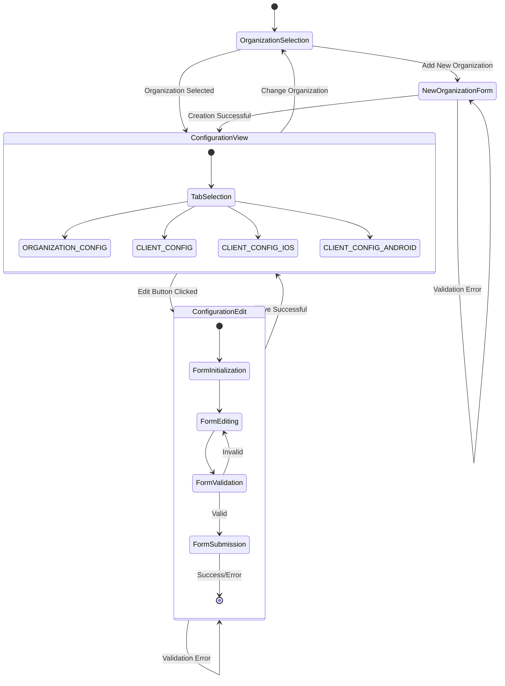
```mermaid
stateDiagram-v2
    [*] --> OrganizationSelection
    
    OrganizationSelection --> ConfigurationView: Organization Selected
    ConfigurationView --> ConfigurationEdit: Edit Button Clicked
    ConfigurationEdit --> ConfigurationView: Save Successful
    ConfigurationEdit --> ConfigurationEdit: Validation Error
    
    OrganizationSelection --> NewOrganizationForm: Add New Organization
    NewOrganizationForm --> ConfigurationView: Creation Successful
    NewOrganizationForm --> NewOrganizationForm: Validation Error
    
    ConfigurationView --> OrganizationSelection: Change Organization
    
    state ConfigurationView {
        [*] --> TabSelection
        TabSelection --> ORGANIZATION_CONFIG
        TabSelection --> CLIENT_CONFIG
        TabSelection --> CLIENT_CONFIG_IOS
        TabSelection --> CLIENT_CONFIG_ANDROID
    }
    
    state ConfigurationEdit {
        [*] --> FormInitialization
        FormInitialization --> FormEditing
        FormEditing --> FormValidation
        FormValidation --> FormSubmission: Valid
        FormValidation --> FormEditing: Invalid
        FormSubmission --> [*]: Success/Error
    }
```

#### 4.3.2 Error Handling Flow

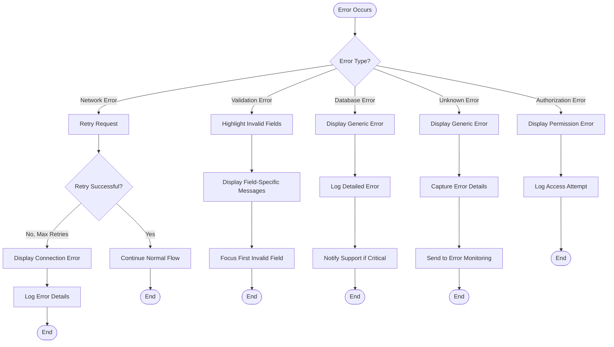
```mermaid
flowchart TD
    Start([Error Occurs]) --> A{Error Type?}
    
    A -->|Network Error| B[Retry Request]
    B --> C{Retry Successful?}
    C -->|Yes| D[Continue Normal Flow]
    C -->|No, Max Retries| E[Display Connection Error]
    E --> F[Log Error Details]
    
    A -->|Validation Error| G[Highlight Invalid Fields]
    G --> H[Display Field-Specific Messages]
    H --> I[Focus First Invalid Field]
    
    A -->|Authorization Error| J[Display Permission Error]
    J --> K[Log Access Attempt]
    
    A -->|Database Error| L[Display Generic Error]
    L --> M[Log Detailed Error]
    M --> N[Notify Support if Critical]
    
    A -->|Unknown Error| O[Display Generic Error]
    O --> P[Capture Error Details]
    P --> Q[Send to Error Monitoring]
    
    D --> End1([End])
    F --> End2([End])
    I --> End3([End])
    K --> End4([End])
    N --> End5([End])
    Q --> End6([End])
```

### 4.4 REQUIRED DIAGRAMS

#### 4.4.1 High-Level System Workflow

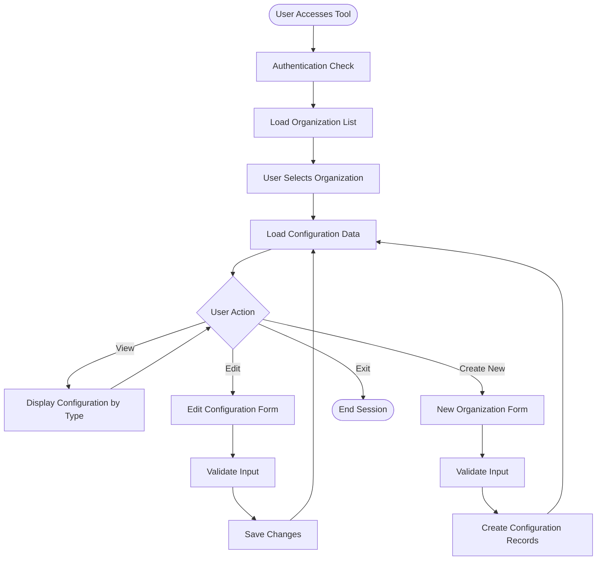
```mermaid
flowchart TD
    Start([User Accesses Tool]) --> A[Authentication Check]
    A --> B[Load Organization List]
    B --> C[User Selects Organization]
    C --> D[Load Configuration Data]
    D --> E{User Action}
    
    E -->|View| F[Display Configuration by Type]
    F --> E
    
    E -->|Edit| G[Edit Configuration Form]
    G --> H[Validate Input]
    H --> I[Save Changes]
    I --> D
    
    E -->|Create New| J[New Organization Form]
    J --> K[Validate Input]
    K --> L[Create Configuration Records]
    L --> D
    
    E -->|Exit| End([End Session])
```

#### 4.4.2 Detailed Process Flow: Configuration Editing

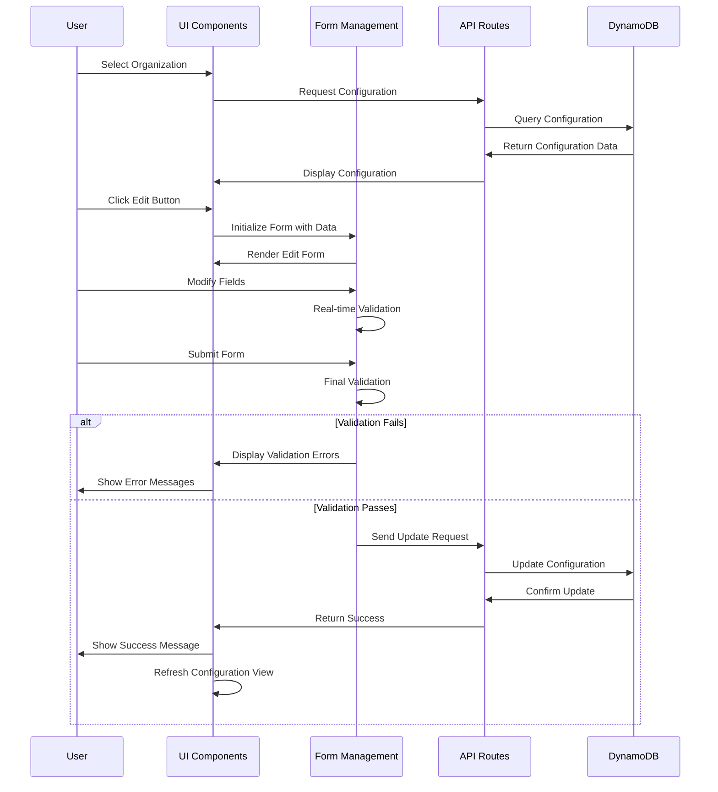
```mermaid
sequenceDiagram
    participant User
    participant UI as UI Components
    participant Form as Form Management
    participant API as API Routes
    participant DB as DynamoDB

    User->>UI: Select Organization
    UI->>API: Request Configuration
    API->>DB: Query Configuration
    DB->>API: Return Configuration Data
    API->>UI: Display Configuration
    
    User->>UI: Click Edit Button
    UI->>Form: Initialize Form with Data
    Form->>UI: Render Edit Form
    
    User->>Form: Modify Fields
    Form->>Form: Real-time Validation
    
    User->>Form: Submit Form
    Form->>Form: Final Validation
    
    alt Validation Fails
        Form->>UI: Display Validation Errors
        UI->>User: Show Error Messages
    else Validation Passes
        Form->>API: Send Update Request
        API->>DB: Update Configuration
        DB->>API: Confirm Update
        API->>UI: Return Success
        UI->>User: Show Success Message
        UI->>UI: Refresh Configuration View
    end
```

#### 4.4.3 Error Handling Flowchart

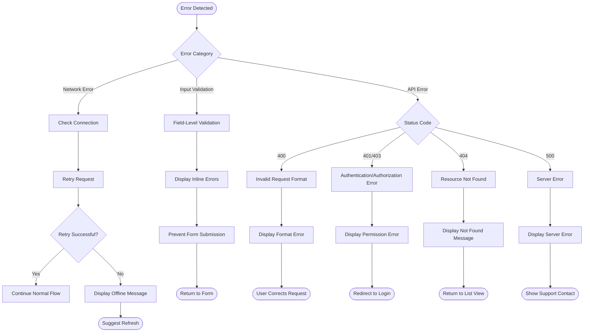
```mermaid
flowchart TD
    Start([Error Detected]) --> A{Error Category}
    
    A -->|Input Validation| B[Field-Level Validation]
    B --> C[Display Inline Errors]
    C --> D[Prevent Form Submission]
    
    A -->|API Error| E{Status Code}
    E -->|400| F[Invalid Request Format]
    E -->|401/403| G[Authentication/Authorization Error]
    E -->|404| H[Resource Not Found]
    E -->|500| I[Server Error]
    
    F --> J[Display Format Error]
    G --> K[Display Permission Error]
    H --> L[Display Not Found Message]
    I --> M[Display Server Error]
    
    A -->|Network Error| N[Check Connection]
    N --> O[Retry Request]
    O --> P{Retry Successful?}
    P -->|Yes| Q[Continue Normal Flow]
    P -->|No| R[Display Offline Message]
    
    D --> End1([Return to Form])
    J --> End2([User Corrects Request])
    K --> End3([Redirect to Login])
    L --> End4([Return to List View])
    M --> End5([Show Support Contact])
    R --> End6([Suggest Refresh])
```

#### 4.4.4 Integration Sequence: Configuration Update

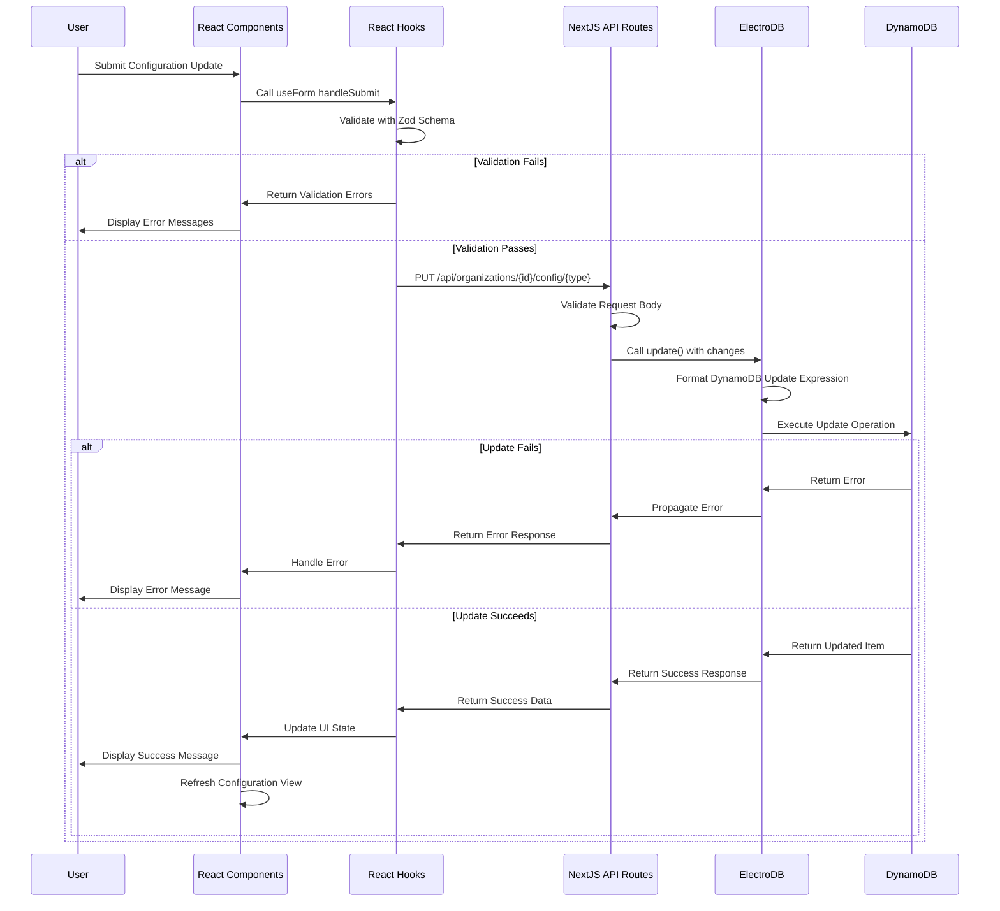
```mermaid
sequenceDiagram
    participant User
    participant React as React Components
    participant Hooks as React Hooks
    participant API as NextJS API Routes
    participant ORM as ElectroDB
    participant DB as DynamoDB

    User->>React: Submit Configuration Update
    React->>Hooks: Call useForm handleSubmit
    Hooks->>Hooks: Validate with Zod Schema
    
    alt Validation Fails
        Hooks->>React: Return Validation Errors
        React->>User: Display Error Messages
    else Validation Passes
        Hooks->>API: PUT /api/organizations/{id}/config/{type}
        
        API->>API: Validate Request Body
        API->>ORM: Call update() with changes
        ORM->>ORM: Format DynamoDB Update Expression
        ORM->>DB: Execute Update Operation
        
        alt Update Fails
            DB->>ORM: Return Error
            ORM->>API: Propagate Error
            API->>Hooks: Return Error Response
            Hooks->>React: Handle Error
            React->>User: Display Error Message
        else Update Succeeds
            DB->>ORM: Return Updated Item
            ORM->>API: Return Success Response
            API->>Hooks: Return Success Data
            Hooks->>React: Update UI State
            React->>User: Display Success Message
            React->>React: Refresh Configuration View
        end
    end
```

#### 4.4.5 State Transition: Organization Creation

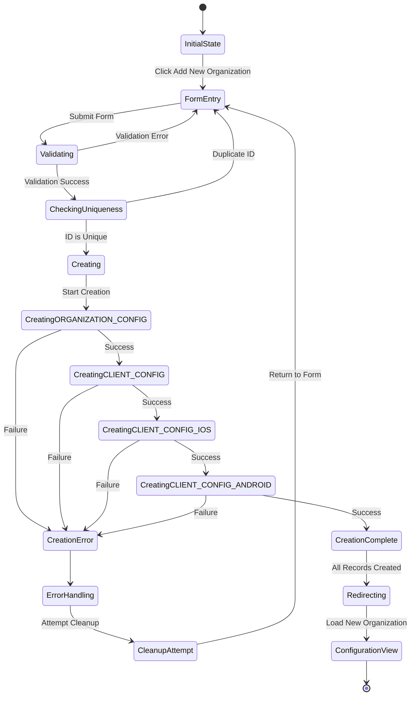
```mermaid
stateDiagram-v2
    [*] --> InitialState
    
    InitialState --> FormEntry: Click Add New Organization
    
    FormEntry --> Validating: Submit Form
    Validating --> FormEntry: Validation Error
    Validating --> CheckingUniqueness: Validation Success
    
    CheckingUniqueness --> FormEntry: Duplicate ID
    CheckingUniqueness --> Creating: ID is Unique
    
    Creating --> CreatingORGANIZATION_CONFIG: Start Creation
    CreatingORGANIZATION_CONFIG --> CreatingCLIENT_CONFIG: Success
    CreatingCLIENT_CONFIG --> CreatingCLIENT_CONFIG_IOS: Success
    CreatingCLIENT_CONFIG_IOS --> CreatingCLIENT_CONFIG_ANDROID: Success
    
    CreatingORGANIZATION_CONFIG --> CreationError: Failure
    CreatingCLIENT_CONFIG --> CreationError: Failure
    CreatingCLIENT_CONFIG_IOS --> CreationError: Failure
    CreatingCLIENT_CONFIG_ANDROID --> CreationError: Failure
    
    CreatingCLIENT_CONFIG_ANDROID --> CreationComplete: Success
    CreationComplete --> Redirecting: All Records Created
    
    CreationError --> ErrorHandling
    ErrorHandling --> CleanupAttempt: Attempt Cleanup
    CleanupAttempt --> FormEntry: Return to Form
    
    Redirecting --> ConfigurationView: Load New Organization
    ConfigurationView --> [*]
```

## 5. SYSTEM ARCHITECTURE

### 5.1 HIGH-LEVEL ARCHITECTURE

#### 5.1.1 System Overview

The configuration management tool follows a modern single-page application architecture built on NextJS, combining server-side rendering capabilities with client-side interactivity. The architecture employs the following key principles:

- **Layered Architecture**: Clear separation between UI components, business logic, and data access layers
- **API-First Design**: Well-defined API routes for all data operations, enabling clean separation of concerns
- **Single Responsibility Principle**: Each component and module has a focused purpose
- **Progressive Enhancement**: Core functionality works without JavaScript, enhanced with client-side features
- **Type Safety**: Comprehensive TypeScript typing throughout the application for improved reliability

The system boundaries are defined by the NextJS application, which serves both the frontend UI and backend API routes. The primary external interface is with DynamoDB, which stores all organization configuration data.

#### 5.1.2 Core Components Table

| Component Name | Primary Responsibility | Key Dependencies | Critical Considerations |
|----------------|------------------------|------------------|-------------------------|
| UI Layer | Presentation of configuration data and forms | React, Shadcn UI, TailwindCSS | Accessibility, responsive design, form validation feedback |
| Form Management | Handling form state and validation | react-hook-form, zod | Complex nested form structures, validation rules |
| API Routes | Backend endpoints for data operations | NextJS API routes, ElectroDB | Error handling, request validation |
| Data Access Layer | DynamoDB interaction and data modeling | ElectroDB, AWS SDK | Entity modeling, query optimization |

#### 5.1.3 Data Flow Description

The primary data flow begins with the UI requesting organization data from the API routes. When a user selects an organization, the system fetches all configuration records for that organization from DynamoDB through ElectroDB, which handles the data modeling and query construction.

For configuration editing, form data is collected and validated on the client side using react-hook-form with zod schemas. Valid form data is then sent to the appropriate API route, which uses ElectroDB to update the corresponding DynamoDB record. The API returns success or error responses, which are displayed to the user.

For new organization creation, the system follows a similar pattern but creates multiple configuration records (one for each OrganizationConfigType) in a coordinated process. The primary data store is DynamoDB, with no additional caching layer due to the relatively low volume of data and infrequent access patterns.

#### 5.1.4 External Integration Points

| System Name | Integration Type | Data Exchange Pattern | Protocol/Format |
|-------------|------------------|------------------------|-----------------|
| DynamoDB | Database | CRUD operations | AWS SDK/JSON |

### 5.2 COMPONENT DETAILS

#### 5.2.1 UI Layer

**Purpose and Responsibilities**:
- Render organization selection dropdown
- Display configuration data in tabbed interface
- Provide form interfaces for editing configurations
- Handle user interactions and form submissions
- Display validation errors and success messages

**Technologies and Frameworks**:
- React 18 for component-based UI
- NextJS 14 for page routing and server components
- TailwindCSS for styling
- Shadcn UI for accessible component library
- lucide-react for iconography

**Key Interfaces**:
- Organization selection component
- Configuration tab navigation
- Configuration display components
- Form components for each configuration type

**Data Persistence Requirements**:
- Temporary form state maintained in react-hook-form
- No client-side persistence beyond form state

**Scaling Considerations**:
- Component composition for reusability
- Modular form components for different configuration types

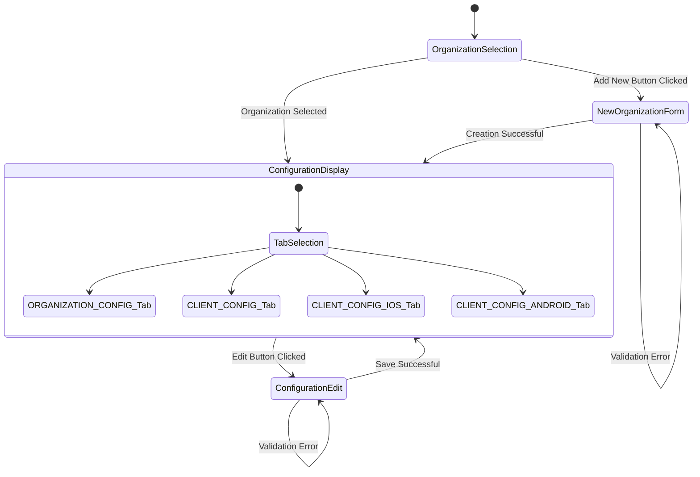
```mermaid
stateDiagram-v2
    [*] --> OrganizationSelection
    
    OrganizationSelection --> ConfigurationDisplay: Organization Selected
    ConfigurationDisplay --> ConfigurationEdit: Edit Button Clicked
    ConfigurationEdit --> ConfigurationDisplay: Save Successful
    ConfigurationEdit --> ConfigurationEdit: Validation Error
    
    OrganizationSelection --> NewOrganizationForm: Add New Button Clicked
    NewOrganizationForm --> ConfigurationDisplay: Creation Successful
    NewOrganizationForm --> NewOrganizationForm: Validation Error
    
    state ConfigurationDisplay {
        [*] --> TabSelection
        TabSelection --> ORGANIZATION_CONFIG_Tab
        TabSelection --> CLIENT_CONFIG_Tab
        TabSelection --> CLIENT_CONFIG_IOS_Tab
        TabSelection --> CLIENT_CONFIG_ANDROID_Tab
    }
```

#### 5.2.2 Form Management

**Purpose and Responsibilities**:
- Manage form state for configuration editing
- Validate form input against schema
- Handle form submission
- Display validation errors

**Technologies and Frameworks**:
- react-hook-form for form state management
- zod for schema validation
- TypeScript for type safety

**Key Interfaces**:
- Form initialization with default values
- Form validation against zod schemas
- Form submission handlers

**Data Persistence Requirements**:
- Temporary form state during editing
- No persistence beyond form submission

**Scaling Considerations**:
- Schema composition for complex configuration types
- Reusable validation rules across forms

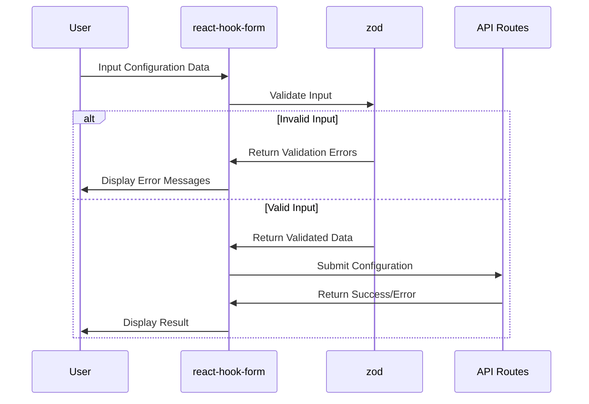
```mermaid
sequenceDiagram
    participant User
    participant Form as react-hook-form
    participant Validation as zod
    participant API as API Routes
    
    User->>Form: Input Configuration Data
    Form->>Validation: Validate Input
    
    alt Invalid Input
        Validation->>Form: Return Validation Errors
        Form->>User: Display Error Messages
    else Valid Input
        Validation->>Form: Return Validated Data
        Form->>API: Submit Configuration
        API->>Form: Return Success/Error
        Form->>User: Display Result
    end
```

#### 5.2.3 API Routes

**Purpose and Responsibilities**:
- Provide endpoints for organization data retrieval
- Handle configuration updates
- Process new organization creation
- Validate request data

**Technologies and Frameworks**:
- NextJS API routes
- TypeScript for type safety
- ElectroDB for data access

**Key Interfaces**:
- GET /api/organizations - List organizations
- GET /api/organizations/{id}/config - Get configuration
- PUT /api/organizations/{id}/config/{type} - Update configuration
- POST /api/organizations - Create new organization

**Data Persistence Requirements**:
- No persistence at API layer
- Delegates to data access layer

**Scaling Considerations**:
- Stateless API design for horizontal scaling
- Request validation for data integrity

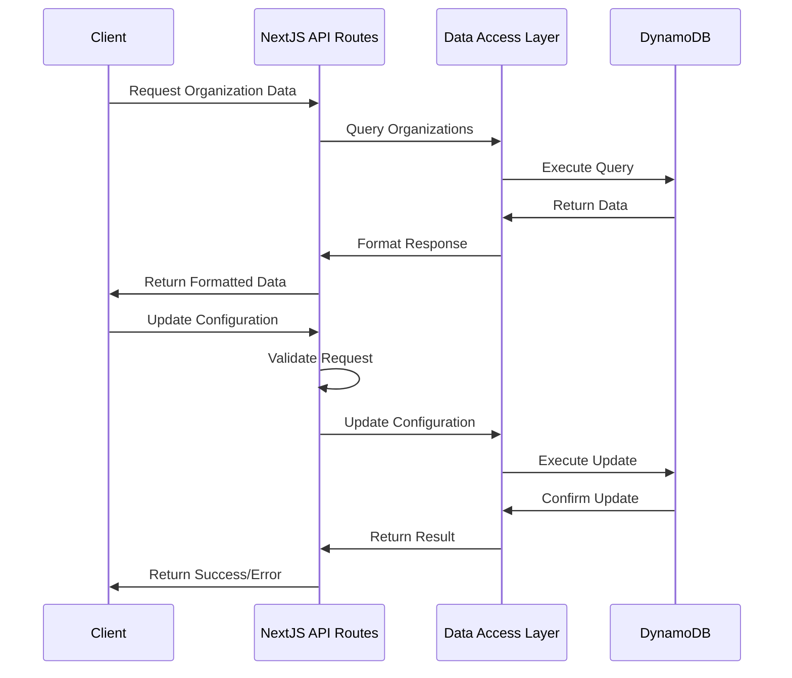
```mermaid
sequenceDiagram
    participant Client
    participant API as NextJS API Routes
    participant DAL as Data Access Layer
    participant DB as DynamoDB
    
    Client->>API: Request Organization Data
    API->>DAL: Query Organizations
    DAL->>DB: Execute Query
    DB->>DAL: Return Data
    DAL->>API: Format Response
    API->>Client: Return Formatted Data
    
    Client->>API: Update Configuration
    API->>API: Validate Request
    API->>DAL: Update Configuration
    DAL->>DB: Execute Update
    DB->>DAL: Confirm Update
    DAL->>API: Return Result
    API->>Client: Return Success/Error
```

#### 5.2.4 Data Access Layer

**Purpose and Responsibilities**:
- Provide abstraction over DynamoDB
- Handle data modeling and schema
- Execute database operations
- Format data for API responses

**Technologies and Frameworks**:
- ElectroDB for ORM functionality
- AWS SDK for DynamoDB access
- TypeScript for type safety

**Key Interfaces**:
- Organization query operations
- Configuration CRUD operations
- Data transformation functions

**Data Persistence Requirements**:
- DynamoDB table for organization configuration
- ElectroDB entity model for data structure

**Scaling Considerations**:
- Query optimization for DynamoDB
- Connection pooling for efficient resource usage

```mermaid
classDiagram
    class OrganizationConfigurationEntity {
        +OrganizationId: string
        +OrganizationConfigType: string
        +Name: string
        +TeamName: string
        +Slug: string
        +ShortName: string
        +LogoUrl: string
        +FanWebRootUrl: string
        +BrandColor: string
        +ExternalProviderId: string
        +IosStoreLink: string
        +AndroidStoreLink: string
        +SocialLink: string
        +DonateLink: string
        +PrivacyPolicyLink: string
        +TermsLink: string
        +BuyTabs: List~Map~
        +Profile: List~Map~
        +CustomerServiceConfig: Map
        +PublicAmplitudeExperimentsKey: string
        +PublicSegmentWriteKey: string
        +Braze: Map
        +OrganizationCourtCash: Map
        +__createdAt: string
        +__updatedAt: string
        +__updatedBy: string
    }
    
    class DataAccessLayer {
        +getOrganizations()
        +getOrganizationConfig(id: string)
        +updateOrganizationConfig(id: string, type: string, data: object)
        +createOrganization(id: string, name: string)
    }
    
    DataAccessLayer --> OrganizationConfigurationEntity: uses
```

### 5.3 TECHNICAL DECISIONS

#### 5.3.1 Architecture Style Decisions

| Decision | Options Considered | Selected Approach | Rationale |
|----------|-------------------|-------------------|-----------|
| Application Architecture | Microservices, Monolith, SPA | NextJS SPA with API Routes | Simplifies deployment, reduces complexity for internal tool |
| UI Framework | React, Vue, Angular | React with NextJS | Strong typing support, component reusability, team familiarity |
| Form Management | Custom state, Formik, react-hook-form | react-hook-form with zod | Performance, TypeScript integration, validation capabilities |
| Data Access | Raw DynamoDB, ORM | ElectroDB | Type safety, simplified queries, entity modeling |

The monolithic NextJS application architecture was selected for this internal tool to minimize operational complexity while providing a modern development experience. The unified codebase simplifies development and deployment, which is appropriate for the scale and scope of this project.

React was chosen as the UI framework due to its component-based architecture, which aligns well with the form-heavy nature of the configuration tool. NextJS provides additional benefits with its built-in API routes, eliminating the need for a separate backend service.

```mermaid
graph TD
    A[Architecture Decision] --> B{Application Type}
    B -->|Internal Tool| C[Monolithic SPA]
    B -->|High Scale Public App| D[Microservices]
    B -->|Complex Domain| E[Domain-Driven Design]
    
    C --> F{UI Framework}
    F -->|TypeScript Support| G[React]
    F -->|Lightweight| H[Vue]
    F -->|Enterprise| I[Angular]
    
    G --> J{Form Handling}
    J -->|Performance| K[react-hook-form]
    J -->|Simplicity| L[Formik]
    J -->|Custom| M[useState]
    
    K --> N{Validation}
    N -->|TypeScript Integration| O[zod]
    N -->|Schema-based| P[Yup]
    N -->|Custom| Q[Manual Validation]
```

#### 5.3.2 Communication Pattern Choices

| Pattern | Use Case | Implementation | Benefits |
|---------|----------|----------------|----------|
| Request-Response | API Data Fetching | NextJS API Routes | Simplicity, familiar HTTP semantics |
| Form Submission | Configuration Updates | react-hook-form | Structured data collection, validation |
| State Management | UI State | React Hooks | Component-level state, reduced complexity |

The application uses standard HTTP request-response patterns for all data operations, which provides a simple and familiar approach for an internal tool. This approach avoids the complexity of real-time communication patterns like WebSockets, which aren't necessary for this use case.

#### 5.3.3 Data Storage Solution Rationale

| Consideration | DynamoDB Approach | Benefit |
|---------------|-------------------|---------|
| Data Structure | Key-value with GSI | Flexible schema for configuration types |
| Query Patterns | Primary key + sort key | Efficient organization-based queries |
| Scale | Auto-scaling | Handles growth without management |
| Integration | Existing table | Reuses existing infrastructure |

DynamoDB was selected as the data storage solution because it's already being used to store organization configuration data. The application connects to an existing DynamoDB table, leveraging the established data model. ElectroDB provides an ORM layer that simplifies interactions with DynamoDB while maintaining type safety.

#### 5.3.4 Security Mechanism Selection

| Security Concern | Approach | Implementation |
|------------------|----------|----------------|
| Authentication | External | Assumes external authentication system |
| Authorization | External | Assumes role-based access control |
| Data Validation | Client + Server | zod schemas on both client and server |
| API Protection | NextJS middleware | Route protection for API endpoints |

The application assumes external authentication and authorization mechanisms are in place, focusing instead on data validation and integrity. All user inputs are validated using zod schemas on both the client and server sides to ensure data integrity.

### 5.4 CROSS-CUTTING CONCERNS

#### 5.4.1 Monitoring and Observability Approach

For this internal tool, a lightweight monitoring approach is appropriate:

- **Client-Side Monitoring**: Console error tracking and reporting
- **Server-Side Logging**: API route request/response logging
- **Error Tracking**: Capture and log unexpected errors
- **Performance Monitoring**: Basic page load and API response time tracking

Implementation will leverage NextJS's built-in error handling and logging capabilities, with structured logging for API routes to facilitate troubleshooting.

#### 5.4.2 Error Handling Patterns

| Error Type | Handling Approach | User Experience |
|------------|-------------------|-----------------|
| Validation Errors | Client-side validation with inline messages | Immediate feedback on form fields |
| API Errors | Structured error responses with status codes | Error messages with retry options |
| Network Errors | Retry mechanism with exponential backoff | Connection error notification |
| Unexpected Errors | Global error boundary with fallback UI | Friendly error page with support contact |

```mermaid
flowchart TD
    A[Error Occurs] --> B{Error Type}
    
    B -->|Validation| C[Display Field Errors]
    C --> D[Prevent Form Submission]
    
    B -->|API| E[Parse Error Response]
    E --> F[Display Error Message]
    F --> G{Retryable?}
    G -->|Yes| H[Show Retry Button]
    G -->|No| I[Show Alternative Action]
    
    B -->|Network| J[Attempt Retry]
    J --> K{Retry Successful?}
    K -->|Yes| L[Continue Operation]
    K -->|No| M[Show Connection Error]
    
    B -->|Unexpected| N[Log Error Details]
    N --> O[Show Fallback UI]
    O --> P[Provide Support Contact]
```

#### 5.4.3 Authentication and Authorization Framework

The application assumes external authentication and authorization mechanisms are in place. The implementation considerations include:

- **API Route Protection**: NextJS middleware to verify authentication
- **Role-Based Access**: Assumes users have appropriate permissions
- **Audit Logging**: Track configuration changes with user information

Since this is an internal tool, it will rely on existing company authentication systems rather than implementing its own authentication logic.

#### 5.4.4 Performance Requirements and SLAs

| Operation | Target Response Time | Optimization Approach |
|-----------|----------------------|------------------------|
| Organization List Loading | < 2 seconds | Efficient DynamoDB queries |
| Configuration Display | < 3 seconds | Optimized data fetching |
| Configuration Saving | < 3 seconds | Targeted updates of changed fields only |
| New Organization Creation | < 5 seconds | Parallel creation of configuration records |

The application is designed for internal use with a relatively small number of users, so extreme performance optimization is not a primary concern. However, the application should still provide a responsive experience with reasonable loading times.

#### 5.4.5 Disaster Recovery Procedures

For this internal tool, disaster recovery focuses on data integrity:

- **Data Backup**: Relies on DynamoDB point-in-time recovery
- **Configuration Versioning**: Tracks updates with timestamps
- **Rollback Capability**: Manual process through AWS console
- **Documentation**: Procedures for restoring from backups

Since the application is read/write only and doesn't own the data storage, disaster recovery procedures are primarily focused on handling unexpected errors and providing clear paths to recovery.

## 6. SYSTEM COMPONENTS DESIGN

### 6.1 FRONTEND COMPONENTS

#### 6.1.1 Component Hierarchy

The frontend architecture follows a hierarchical component structure to maintain separation of concerns and promote reusability:

```mermaid
graph TD
    A[App Root] --> B[Layout]
    B --> C[Organization Selection]
    B --> D[Configuration Display]
    D --> E[Configuration Tabs]
    E --> F[ORGANIZATION_CONFIG Tab]
    E --> G[CLIENT_CONFIG Tab]
    E --> H[CLIENT_CONFIG_IOS Tab]
    E --> I[CLIENT_CONFIG_ANDROID Tab]
    D --> J[Edit Button]
    J --> K[Configuration Edit Form]
    B --> L[New Organization Button]
    L --> M[New Organization Form]
    K --> N[Form Fields]
    M --> O[Organization Form Fields]
```

#### 6.1.2 Core Components

| Component | Purpose | Props | State | Key Functions |
|-----------|---------|-------|-------|--------------|
| OrganizationSelector | Dropdown for organization selection | `organizations`, `selectedOrg`, `onSelect` | Loading state | `handleOrganizationChange()` |
| ConfigurationTabs | Tab navigation for config types | `configData`, `selectedType` | Active tab | `handleTabChange()` |
| ConfigurationDisplay | Display configuration data | `configData`, `configType` | None | `renderConfigFields()` |
| ConfigurationEditForm | Edit configuration | `configData`, `configType`, `onSubmit` | Form state | `handleSubmit()`, `validateForm()` |
| NewOrganizationForm | Create new organization | `onSubmit` | Form state | `handleSubmit()`, `validateForm()` |

#### 6.1.3 Component Specifications

**OrganizationSelector Component**

```mermaid
classDiagram
    class OrganizationSelector {
        +Array~Organization~ organizations
        +Organization selectedOrganization
        +Function onSelect
        +Boolean isLoading
        +handleOrganizationChange(Organization)
        +renderDropdown()
    }
```

- **Responsibilities**: 
  - Display dropdown of all organizations by Name
  - Allow selection of an organization
  - Trigger loading of configuration data when selection changes
- **UI Elements**:
  - Dropdown with organization names
  - Loading indicator during data fetch
- **Interactions**:
  - On selection, calls `onSelect` with selected organization ID

**ConfigurationTabs Component**

```mermaid
classDiagram
    class ConfigurationTabs {
        +Array~ConfigRecord~ configData
        +String activeTab
        +Function onTabChange
        +handleTabChange(String)
        +renderTabContent(String)
    }
```

- **Responsibilities**:
  - Display tabs for each OrganizationConfigType
  - Manage active tab state
  - Render appropriate configuration data based on active tab
- **UI Elements**:
  - Tab navigation with OrganizationConfigType values
  - Tab content area for configuration display
- **Interactions**:
  - Tab click changes active configuration type

**ConfigurationDisplay Component**

```mermaid
classDiagram
    class ConfigurationDisplay {
        +ConfigRecord configData
        +String configType
        +Boolean isEditable
        +Function onEditClick
        +renderConfigFields()
        +formatFieldValue(String, Any)
    }
```

- **Responsibilities**:
  - Display configuration fields for selected type
  - Format complex data types for display
  - Provide edit button for configuration
- **UI Elements**:
  - Field labels and values
  - Edit button
  - Formatted display of complex types (BuyTabs, Profile)
- **Interactions**:
  - Edit button click triggers edit mode

**ConfigurationEditForm Component**

```mermaid
classDiagram
    class ConfigurationEditForm {
        +ConfigRecord defaultValues
        +String configType
        +Function onSubmit
        +Function onCancel
        +Object formMethods
        +handleSubmit(FormData)
        +validateForm(FormData)
        +renderFormFields()
    }
```

- **Responsibilities**:
  - Render form with fields based on configuration type
  - Pre-fill form with existing values
  - Validate input using zod schemas
  - Submit changes to API
- **UI Elements**:
  - Form fields for all editable properties
  - Submit and Cancel buttons
  - Validation error messages
- **Interactions**:
  - Form submission with validation
  - Cancel button returns to display view

**NewOrganizationForm Component**

```mermaid
classDiagram
    class NewOrganizationForm {
        +Function onSubmit
        +Function onCancel
        +Object formMethods
        +handleSubmit(FormData)
        +validateForm(FormData)
    }
```

- **Responsibilities**:
  - Collect OrganizationId and Name for new organization
  - Validate input
  - Submit to API for creation
- **UI Elements**:
  - OrganizationId and Name input fields
  - Submit and Cancel buttons
  - Validation error messages
- **Interactions**:
  - Form submission with validation
  - Redirect to Configuration page on success

### 6.2 BACKEND COMPONENTS

#### 6.2.1 API Routes Structure

The backend is structured around NextJS API routes that provide data access and manipulation capabilities:

```mermaid
graph TD
    A[API Routes] --> B[/api/organizations]
    A --> C[/api/organizations/[id]/config]
    A --> D[/api/organizations/[id]/config/[type]]
    
    B -->|GET| E[List Organizations]
    B -->|POST| F[Create Organization]
    
    C -->|GET| G[Get All Config Types]
    
    D -->|GET| H[Get Specific Config]
    D -->|PUT| I[Update Config]
```

#### 6.2.2 API Endpoints

| Endpoint | Method | Purpose | Request Body | Response |
|----------|--------|---------|-------------|----------|
| `/api/organizations` | GET | List all organizations | None | `{ organizations: Organization[] }` |
| `/api/organizations` | POST | Create new organization | `{ organizationId: string, name: string }` | `{ success: boolean, organization?: Organization, error?: string }` |
| `/api/organizations/[id]/config` | GET | Get all config types for org | None | `{ configs: ConfigRecord[] }` |
| `/api/organizations/[id]/config/[type]` | GET | Get specific config | None | `{ config: ConfigRecord }` |
| `/api/organizations/[id]/config/[type]` | PUT | Update config | `{ [field]: value, ... }` | `{ success: boolean, config?: ConfigRecord, error?: string }` |

#### 6.2.3 Data Access Layer

```mermaid
classDiagram
    class OrganizationService {
        +getOrganizations()
        +getOrganizationById(id)
        +getOrganizationsByName(name)
        +createOrganization(id, name)
    }
    
    class ConfigurationService {
        +getConfigurationsByOrganizationId(id)
        +getConfigurationByType(id, type)
        +updateConfiguration(id, type, data)
        +createConfigurationRecord(id, type, data)
    }
    
    class ElectroDBAdapter {
        +query(params)
        +get(params)
        +put(params)
        +update(params)
        +delete(params)
    }
    
    OrganizationService --> ElectroDBAdapter
    ConfigurationService --> ElectroDBAdapter
```

**OrganizationService**

- **Responsibilities**:
  - Retrieve list of organizations
  - Get organization by ID or Name
  - Create new organization records
- **Key Methods**:
  - `getOrganizations()`: Retrieves all unique organization names
  - `getOrganizationById(id)`: Gets organization by ID
  - `getOrganizationsByName(name)`: Gets all configurations for an organization by name
  - `createOrganization(id, name)`: Creates a new organization with all config types

**ConfigurationService**

- **Responsibilities**:
  - Retrieve configuration records by organization ID
  - Get specific configuration type
  - Update configuration data
  - Create new configuration records
- **Key Methods**:
  - `getConfigurationsByOrganizationId(id)`: Gets all config types for an organization
  - `getConfigurationByType(id, type)`: Gets specific config type for an organization
  - `updateConfiguration(id, type, data)`: Updates configuration fields
  - `createConfigurationRecord(id, type, data)`: Creates a new configuration record

**ElectroDBAdapter**

- **Responsibilities**:
  - Provide abstraction over ElectroDB operations
  - Handle error handling and response formatting
- **Key Methods**:
  - `query(params)`: Execute ElectroDB query
  - `get(params)`: Get specific item
  - `put(params)`: Create new item
  - `update(params)`: Update existing item
  - `delete(params)`: Delete item

### 6.3 DATA MODELS

#### 6.3.1 Core Data Structures

```mermaid
classDiagram
    class Organization {
        +string OrganizationId
        +string Name
    }
    
    class ConfigurationRecord {
        +string OrganizationId
        +OrganizationConfigType OrganizationConfigType
        +string? Name
        +string? TeamName
        +string? Slug
        +string? ShortName
        +string? LogoUrl
        +string? FanWebRootUrl
        +string? BrandColor
        +string? ExternalProviderId
        +string? IosStoreLink
        +string? AndroidStoreLink
        +string? SocialLink
        +string? DonateLink
        +string? PrivacyPolicyLink
        +string? TermsLink
        +BuyTab[]? BuyTabs
        +ProfileField[]? Profile
        +CustomerServiceConfig? CustomerServiceConfig
        +string? PublicAmplitudeExperimentsKey
        +string? PublicSegmentWriteKey
        +BrazeConfig? Braze
        +OrganizationCourtCashConfig? OrganizationCourtCash
        +string __createdAt
        +string __updatedAt
        +string __updatedBy
    }
    
    class BuyTab {
        +string Label
        +string Slug
        +string Type
        +string GenreCode
    }
    
    class ProfileField {
        +OrganizationFieldName FieldName
        +boolean IsEditable
        +boolean IsSSOUserEditable
        +boolean IsRequired
    }
    
    class CustomerServiceConfig {
        +string CustomerServicePhone
    }
    
    class BrazeConfig {
        +string PublicKey
        +string BaseUrl
    }
    
    class OrganizationCourtCashConfig {
        +string Label
        +boolean Enabled
    }
    
    Organization "1" -- "n" ConfigurationRecord
    ConfigurationRecord "1" -- "n" BuyTab
    ConfigurationRecord "1" -- "n" ProfileField
    ConfigurationRecord "1" -- "1" CustomerServiceConfig
    ConfigurationRecord "1" -- "1" BrazeConfig
    ConfigurationRecord "1" -- "1" OrganizationCourtCashConfig
```

#### 6.3.2 Validation Schemas

**Organization Schema**

```typescript
const organizationSchema = z.object({
  OrganizationId: z.string().min(1, "Organization ID is required"),
  Name: z.string().min(1, "Name is required")
});
```

**Configuration Schemas by Type**

```typescript
const organizationConfigSchema = z.object({
  OrganizationId: z.string(),
  OrganizationConfigType: z.literal(OrganizationConfigType.ORGANIZATION_CONFIG),
  Name: z.string().optional(),
  TeamName: z.string().optional(),
  Slug: z.string().optional(),
  ShortName: z.string().optional(),
  LogoUrl: z.string().url().optional(),
  FanWebRootUrl: z.string().url().optional(),
  BrandColor: z.string().optional(),
  ExternalProviderId: z.string().optional(),
  BuyTabs: z.array(
    z.object({
      Label: z.string(),
      Slug: z.string(),
      Type: z.string(),
      GenreCode: z.string().optional()
    })
  ).optional(),
  Profile: z.array(
    z.object({
      FieldName: z.enum([
        OrganizationFieldName.EMAIL,
        OrganizationFieldName.FIRST_NAME,
        OrganizationFieldName.LAST_NAME,
        OrganizationFieldName.BIRTHDAY,
        OrganizationFieldName.PHONE_NUMBER
      ]),
      IsEditable: z.boolean().optional(),
      IsSSOUserEditable: z.boolean().optional(),
      IsRequired: z.boolean().optional()
    })
  ).optional(),
  CustomerServiceConfig: z.object({
    CustomerServicePhone: z.string().optional()
  }).optional()
});

const clientConfigSchema = z.object({
  OrganizationId: z.string(),
  OrganizationConfigType: z.literal(OrganizationConfigType.CLIENT_CONFIG),
  PublicAmplitudeExperimentsKey: z.string().optional(),
  PublicSegmentWriteKey: z.string().optional(),
  Braze: z.object({
    PublicKey: z.string().optional(),
    BaseUrl: z.string().url().optional()
  }).optional(),
  OrganizationCourtCash: z.object({
    Label: z.string().optional(),
    Enabled: z.boolean().optional()
  }).optional(),
  PrivacyPolicyLink: z.string().url().optional(),
  TermsLink: z.string().url().optional()
});

const clientConfigIOSSchema = z.object({
  OrganizationId: z.string(),
  OrganizationConfigType: z.literal(OrganizationConfigType.CLIENT_CONFIG_IOS),
  IosStoreLink: z.string().url().optional()
});

const clientConfigAndroidSchema = z.object({
  OrganizationId: z.string(),
  OrganizationConfigType: z.literal(OrganizationConfigType.CLIENT_CONFIG_ANDROID),
  AndroidStoreLink: z.string().url().optional()
});
```

### 6.4 INTEGRATION POINTS

#### 6.4.1 DynamoDB Integration

```mermaid
sequenceDiagram
    participant UI as React UI
    participant API as NextJS API Routes
    participant Service as Service Layer
    participant ORM as ElectroDB
    participant DB as DynamoDB

    UI->>API: Request Organization Data
    API->>Service: Call Service Method
    Service->>ORM: Execute ElectroDB Query
    ORM->>DB: AWS SDK DynamoDB Operation
    DB->>ORM: Return Data
    ORM->>Service: Format Response
    Service->>API: Return Formatted Data
    API->>UI: JSON Response
```

**Key Integration Points**:

1. **ElectroDB Entity Configuration**:
   - Uses the provided ElectroDB entity definition
   - Connects to DynamoDB table specified by environment variable

2. **AWS SDK Configuration**:
   - Configured through environment variables
   - Assumes AWS credentials are available in the deployment environment

3. **Query Patterns**:
   - Organization listing: Query for unique organization names
   - Configuration retrieval: Query by OrganizationId and OrganizationConfigType
   - Configuration update: Update specific fields only

#### 6.4.2 Form Integration

```mermaid
sequenceDiagram
    participant User
    participant Form as react-hook-form
    participant Schema as Zod Schema
    participant API as API Route
    
    User->>Form: Input Data
    Form->>Schema: Validate Input
    
    alt Invalid Input
        Schema->>Form: Return Validation Errors
        Form->>User: Display Error Messages
    else Valid Input
        Schema->>Form: Return Validated Data
        Form->>API: Submit Data
        API->>Form: Return Response
        Form->>User: Show Success/Error
    end
```

**Key Integration Points**:

1. **react-hook-form with zod**:
   - Zod schemas define validation rules
   - react-hook-form manages form state and validation
   - Integration via `zodResolver` from `@hookform/resolvers/zod`

2. **Form to API Integration**:
   - Form submission sends data to API routes
   - API routes validate input server-side
   - Response handling for success/error states

### 6.5 USER INTERFACE DESIGN

#### 6.5.1 Page Layouts

**Configuration Page Layout**

```mermaid
graph TD
    A[Header] --> B[Organization Selector]
    A --> C[Add New Organization Button]
    B --> D[Configuration Tabs]
    D --> E[Tab Content]
    E --> F[Configuration Display]
    F --> G[Edit Button]
```

**Edit Page Layout**

```mermaid
graph TD
    A[Header] --> B[Organization Name]
    A --> C[Configuration Type]
    B --> D[Form Container]
    D --> E[Form Fields]
    E --> F[Submit Button]
    E --> G[Cancel Button]
```

**New Organization Page Layout**

```mermaid
graph TD
    A[Header] --> B[Page Title]
    B --> C[Form Container]
    C --> D[OrganizationId Field]
    C --> E[Name Field]
    C --> F[Submit Button]
    C --> G[Cancel Button]
```

#### 6.5.2 UI Component Specifications

**Organization Selector**
- Type: Dropdown (Shadcn Select component)
- States: Default, Loading, Error
- Behavior: Displays organization names, triggers configuration load on selection

**Configuration Tabs**
- Type: Tab navigation (Shadcn Tabs component)
- States: Default, Active
- Behavior: Displays tabs for each OrganizationConfigType, shows content for active tab

**Configuration Display**
- Type: Card layout with field groups
- States: Default, Empty
- Behavior: Displays formatted configuration data with labels and values

**Edit Button**
- Type: Button (Shadcn Button component)
- States: Default, Hover, Focus
- Behavior: Transitions to edit mode for current configuration

**Configuration Form**
- Type: Form with field groups
- States: Default, Invalid, Submitting
- Behavior: Displays form fields based on configuration type, validates input, submits changes

**Submit/Cancel Buttons**
- Type: Button group (Shadcn Button component)
- States: Default, Hover, Focus, Disabled
- Behavior: Submit saves changes, Cancel returns to display view

#### 6.5.3 Responsive Design Considerations

The UI is designed to be responsive for desktop use, with the following considerations:

- **Layout**: Fluid layout that adapts to different screen sizes
- **Components**: Responsive components from Shadcn UI library
- **Tables**: Horizontal scrolling for tables on smaller screens
- **Forms**: Stacked layout for form fields on smaller screens
- **Navigation**: Collapsible tabs for configuration types on smaller screens

#### 6.5.4 Accessibility Considerations

The UI implements the following accessibility features:

- **Keyboard Navigation**: All interactive elements are keyboard accessible
- **Screen Reader Support**: Proper ARIA labels and roles
- **Focus Management**: Visible focus indicators for all interactive elements
- **Color Contrast**: Meets WCAG AA standards for text contrast
- **Form Validation**: Accessible error messages linked to form fields
- **Semantic HTML**: Proper heading structure and semantic elements

### 6.6 ERROR HANDLING

#### 6.6.1 Error Types and Handling Strategies

| Error Type | Detection Method | Handling Strategy | User Experience |
|------------|------------------|-------------------|-----------------|
| Validation Error | Client-side zod validation | Display inline error messages | Field-level error indicators |
| Network Error | Fetch API error handling | Retry with exponential backoff | Error message with retry option |
| API Error | HTTP error status codes | Parse error response for details | Contextual error message |
| Authentication Error | 401/403 status codes | Redirect to authentication | Session expired message |
| Database Error | Error in ElectroDB operations | Log error, return friendly message | Generic error with support contact |
| Unexpected Error | Try/catch blocks | Log error, show fallback UI | Error boundary with reload option |

#### 6.6.2 Error Handling Implementation

**Client-Side Error Handling**

```mermaid
flowchart TD
    A[Error Occurs] --> B{Error Type}
    
    B -->|Form Validation| C[Display Field Errors]
    C --> D[Prevent Form Submission]
    
    B -->|API Request| E[Check Response Status]
    E -->|4xx| F[Display Specific Error]
    E -->|5xx| G[Display Server Error]
    
    B -->|Network| H[Check Online Status]
    H -->|Offline| I[Show Offline Message]
    H -->|Online| J[Retry Request]
    
    B -->|Unexpected| K[Log to Console]
    K --> L[Show Error Boundary]
```

**Server-Side Error Handling**

```mermaid
flowchart TD
    A[API Request] --> B[Input Validation]
    B -->|Invalid| C[Return 400 with Details]
    B -->|Valid| D[Process Request]
    
    D --> E{Error Occurs?}
    E -->|Yes| F{Error Type}
    E -->|No| G[Return Success Response]
    
    F -->|Database| H[Log Error Details]
    H --> I[Return 500 with Generic Message]
    
    F -->|Not Found| J[Return 404 with Message]
    
    F -->|Validation| K[Return 400 with Details]
    
    F -->|Permission| L[Return 403 with Message]
```

#### 6.6.3 Error Messages and Codes

| Error Code | Message Template | Context | User Action |
|------------|------------------|---------|------------|
| FORM_VALIDATION | "{field} {message}" | Field-specific validation errors | Correct input |
| NETWORK_ERROR | "Unable to connect to server. Please check your connection." | Network connectivity issues | Check connection, retry |
| API_ERROR | "An error occurred: {message}" | API request failures | Try again, contact support |
| NOT_FOUND | "The requested {resource} was not found." | Resource not found | Check input, navigate back |
| PERMISSION_ERROR | "You don't have permission to {action}." | Authorization failures | Contact administrator |
| SERVER_ERROR | "An unexpected error occurred. Please try again later." | Server-side failures | Try again later, contact support |

### 6.7 PERFORMANCE CONSIDERATIONS

#### 6.7.1 Client-Side Optimizations

1. **Component Rendering**:
   - Memoization of expensive components with React.memo
   - Virtualization for long lists if needed
   - Lazy loading of components not needed on initial render

2. **Data Fetching**:
   - Fetch only necessary data
   - Implement request caching for frequently accessed data
   - Use SWR or React Query for data fetching and caching

3. **Form Performance**:
   - Debounce input validation for complex forms
   - Optimize validation to run only when needed
   - Use controlled inputs judiciously

#### 6.7.2 API Optimizations

1. **Query Efficiency**:
   - Optimize DynamoDB queries to fetch only required attributes
   - Use batch operations where appropriate
   - Implement pagination for large result sets

2. **Response Size**:
   - Return only necessary fields
   - Compress responses for larger payloads
   - Structure responses to minimize parsing overhead

3. **Caching Strategy**:
   - Implement appropriate cache headers
   - Consider server-side caching for frequently accessed data
   - Use stale-while-revalidate pattern for fresh data

#### 6.7.3 Performance Metrics

| Metric | Target | Measurement Method |
|--------|--------|-------------------|
| Time to First Contentful Paint | < 1.5s | Browser Performance API |
| Time to Interactive | < 3.5s | Browser Performance API |
| API Response Time | < 300ms | Server-side timing logs |
| Form Submission Time | < 2s | Client-side timing |
| Page Load Time | < 3s | Browser Performance API |

### 6.8 SECURITY CONSIDERATIONS

#### 6.8.1 Input Validation

All user inputs are validated using zod schemas with the following considerations:

- **Client-Side Validation**: Immediate feedback for user errors
- **Server-Side Validation**: Prevent invalid data from reaching the database
- **Type Checking**: Ensure data types match expected schema
- **Sanitization**: Prevent injection attacks in string inputs
- **Business Rules**: Enforce business logic constraints

#### 6.8.2 API Security

The API routes implement the following security measures:

- **Authentication**: Assumes external authentication mechanism
- **Authorization**: Verify user has permission to access/modify data
- **Input Validation**: Validate all request parameters and body
- **Error Handling**: Return appropriate error codes without exposing internals
- **Rate Limiting**: Consider implementing rate limiting for production

#### 6.8.3 Data Security

Data security considerations include:

- **Sensitive Data**: No sensitive data is stored or displayed
- **Data Integrity**: Validate data before storage
- **Audit Trail**: Track changes with __updatedAt and __updatedBy fields
- **Error Logging**: Ensure logs don't contain sensitive information

### 6.1 CORE SERVICES ARCHITECTURE

Core Services Architecture is not applicable for this system in the traditional microservices sense. This application follows a monolithic architecture pattern using NextJS, which combines frontend and backend capabilities in a single codebase. The system does not require distributed architecture or distinct service components for the following reasons:

1. The application serves as an internal tool with limited user base and moderate traffic expectations
2. The functionality is focused on a single domain (organization configuration management)
3. The data model is relatively simple and contained within a single DynamoDB table
4. The application has minimal external dependencies beyond DynamoDB

Instead, the system uses a layered architecture within the NextJS framework:

#### 6.1.1 LAYERED ARCHITECTURE APPROACH

| Layer | Responsibility | Components |
|-------|----------------|------------|
| Presentation Layer | User interface and interactions | React components, Shadcn UI, TailwindCSS |
| Application Layer | Business logic and form handling | React hooks, form controllers, validation |
| API Layer | Data access endpoints | NextJS API routes |
| Data Access Layer | Database interactions | ElectroDB entities, DynamoDB client |

```mermaid
graph TD
    subgraph "NextJS Application"
        A[Presentation Layer] --> B[Application Layer]
        B --> C[API Layer]
        C --> D[Data Access Layer]
        D --> E[DynamoDB]
    end
    
    style A fill:#f9f,stroke:#333,stroke-width:2px
    style B fill:#bbf,stroke:#333,stroke-width:2px
    style C fill:#bfb,stroke:#333,stroke-width:2px
    style D fill:#fbb,stroke:#333,stroke-width:2px
```

#### 6.1.2 REQUEST FLOW PATTERNS

While not using microservices, the application still implements structured request flow patterns:

```mermaid
sequenceDiagram
    participant User
    participant UI as React UI
    participant Hook as React Hooks
    participant API as NextJS API Routes
    participant DAL as Data Access Layer
    participant DB as DynamoDB

    User->>UI: Interact with component
    UI->>Hook: Trigger data operation
    Hook->>API: Make API request
    API->>DAL: Call data access method
    DAL->>DB: Execute DynamoDB operation
    DB->>DAL: Return data
    DAL->>API: Format response
    API->>Hook: Return API response
    Hook->>UI: Update UI state
    UI->>User: Display updated UI
```

#### 6.1.3 SCALABILITY CONSIDERATIONS

Although not designed as a distributed system, the application includes scalability considerations:

| Aspect | Approach | Implementation |
|--------|----------|----------------|
| Deployment Scaling | Horizontal scaling | Deploy multiple instances behind load balancer |
| Database Scaling | DynamoDB auto-scaling | Configure read/write capacity units |
| Performance | Efficient data access | Optimized queries and selective attribute retrieval |
| Caching | Client-side caching | SWR/React Query for API response caching |

```mermaid
graph TD
    subgraph "Deployment Architecture"
        LB[Load Balancer] --> App1[NextJS Instance 1]
        LB --> App2[NextJS Instance 2]
        LB --> App3[NextJS Instance n]
        App1 --> DynamoDB
        App2 --> DynamoDB
        App3 --> DynamoDB
    end
    
    style LB fill:#f9f,stroke:#333,stroke-width:2px
    style App1 fill:#bbf,stroke:#333,stroke-width:2px
    style App2 fill:#bbf,stroke:#333,stroke-width:2px
    style App3 fill:#bbf,stroke:#333,stroke-width:2px
    style DynamoDB fill:#fbb,stroke:#333,stroke-width:2px
```

#### 6.1.4 RESILIENCE PATTERNS

Even in a monolithic architecture, the system implements resilience patterns:

| Pattern | Implementation | Purpose |
|---------|----------------|---------|
| Error Boundaries | React error boundaries | Prevent UI crashes from component errors |
| API Retries | Fetch retry logic | Handle transient network failures |
| Graceful Degradation | Progressive enhancement | Core functionality works without JS |
| Data Validation | Client and server validation | Prevent data corruption |

```mermaid
flowchart TD
    A[Request] --> B{API Available?}
    B -->|Yes| C[Process Request]
    B -->|No| D[Retry with Backoff]
    D --> E{Max Retries?}
    E -->|No| B
    E -->|Yes| F[Show Error UI]
    
    C --> G{Success?}
    G -->|Yes| H[Update UI]
    G -->|No| I{Recoverable?}
    I -->|Yes| J[Retry Operation]
    I -->|No| K[Show Error Message]
    
    J --> G
```

This monolithic approach is appropriate for the system requirements, providing simplicity in development, deployment, and maintenance while still allowing for reasonable scalability and resilience through proper implementation patterns within the NextJS framework.

## 6.2 DATABASE DESIGN

### 6.2.1 SCHEMA DESIGN

#### Entity Relationships

The database design centers around a single DynamoDB table that stores all organization configuration data. The primary entity is `OrganizationConfiguration` which uses a composite key structure to represent different configuration types for each organization.

```mermaid
erDiagram
    ORGANIZATION ||--o{ ORGANIZATION_CONFIG : has
    ORGANIZATION ||--o{ CLIENT_CONFIG : has
    ORGANIZATION ||--o{ CLIENT_CONFIG_IOS : has
    ORGANIZATION ||--o{ CLIENT_CONFIG_ANDROID : has
    
    ORGANIZATION {
        string OrganizationId PK
        string Name
    }
    
    ORGANIZATION_CONFIG {
        string OrganizationId PK
        string OrganizationConfigType SK
        string Name
        string TeamName
        string Slug
        string ShortName
        string LogoUrl
        string FanWebRootUrl
        string BrandColor
        string ExternalProviderId
        list BuyTabs
        list Profile
        map CustomerServiceConfig
    }
    
    CLIENT_CONFIG {
        string OrganizationId PK
        string OrganizationConfigType SK
        string PublicAmplitudeExperimentsKey
        string PublicSegmentWriteKey
        map Braze
        map OrganizationCourtCash
        string PrivacyPolicyLink
        string TermsLink
    }
    
    CLIENT_CONFIG_IOS {
        string OrganizationId PK
        string OrganizationConfigType SK
        string IosStoreLink
    }
    
    CLIENT_CONFIG_ANDROID {
        string OrganizationId PK
        string OrganizationConfigType SK
        string AndroidStoreLink
    }
```

#### Data Models and Structures

The DynamoDB table uses a single-table design pattern with the following key structure:

| Attribute | Type | Description |
|-----------|------|-------------|
| pk | String | Partition key composed of OrganizationId |
| sk | String | Sort key composed of OrganizationConfigType |
| gsi1pk | String | GSI partition key composed of ExternalProviderId |
| gsi1sk | String | GSI sort key (empty) |

The table stores different types of configuration records distinguished by the `OrganizationConfigType` attribute:

1. **ORGANIZATION_CONFIG**: Core organization details
2. **CLIENT_CONFIG**: General client configuration settings
3. **CLIENT_CONFIG_IOS**: iOS-specific configuration
4. **CLIENT_CONFIG_ANDROID**: Android-specific configuration

Complex data structures are stored as DynamoDB maps and lists:

| Complex Attribute | Structure | Purpose |
|-------------------|-----------|---------|
| BuyTabs | List of Maps | Stores tab configuration for purchasing |
| Profile | List of Maps | Defines user profile field settings |
| CustomerServiceConfig | Map | Customer service contact information |
| Braze | Map | Braze integration configuration |
| OrganizationCourtCash | Map | Court cash feature configuration |

#### Indexing Strategy

The table uses a primary index and one Global Secondary Index (GSI):

1. **Primary Index**:
   - Partition Key: `pk` (OrganizationId)
   - Sort Key: `sk` (OrganizationConfigType)
   - Enables efficient retrieval of all configuration types for a specific organization

2. **GSI1 (bySSOId)**:
   - Partition Key: `gsi1pk` (ExternalProviderId)
   - Sort Key: `gsi1sk` (empty)
   - Enables lookup of organizations by their external SSO provider ID

```mermaid
graph TD
    subgraph "Primary Index"
        PK[pk: OrganizationId]
        SK[sk: OrganizationConfigType]
    end
    
    subgraph "GSI1 (bySSOId)"
        GSI1PK[gsi1pk: ExternalProviderId]
        GSI1SK[gsi1sk: empty]
    end
    
    PK --> Record[Full Item Data]
    SK --> Record
    GSI1PK --> Record
    GSI1SK --> Record
```

#### Partitioning Approach

DynamoDB automatically handles partitioning based on the partition key (OrganizationId). The design ensures even distribution of data and access patterns by:

1. Using OrganizationId as the partition key, which distributes data across partitions
2. Keeping related configuration types together within the same partition
3. Limiting the number of items per partition (maximum 4 configuration types per organization)

#### Replication Configuration

The application relies on DynamoDB's built-in replication capabilities:

1. **Regional Replication**: DynamoDB automatically replicates data across multiple Availability Zones within a region
2. **Global Tables**: Not implemented in the initial design but could be added if multi-region access becomes necessary

#### Backup Architecture

The application leverages DynamoDB's native backup capabilities:

1. **Point-in-Time Recovery (PITR)**: Enabled to allow restoration to any point within the last 35 days
2. **On-demand Backups**: Scheduled daily backups for long-term retention
3. **Automated Backup Retention**: 30-day retention policy for daily backups

### 6.2.2 DATA MANAGEMENT

#### Migration Procedures

The application does not require complex migration procedures as it uses an existing DynamoDB table. However, the following procedures are defined for future schema changes:

1. **Schema Evolution**:
   - Add new attributes without disrupting existing records
   - Use conditional updates when modifying existing records
   - Deploy code changes that handle both old and new schemas during transition

2. **Data Transformation**:
   - Use AWS Lambda for batch processing of records during migrations
   - Implement version flags to track migration status

#### Versioning Strategy

The ElectroDB entity includes versioning information:

```
model: {
  entity: 'OrganizationConfiguration',
  version: '1',
  service: 'OrganizationConfigurationService',
}
```

This versioning approach allows:

1. Tracking schema versions in the application code
2. Supporting multiple schema versions during transitions
3. Implementing version-specific validation and transformation logic

#### Archival Policies

The application does not implement specific archival policies as organization configurations are expected to have long-term relevance. However, the following considerations are in place:

1. **Inactive Organizations**: Configurations for inactive organizations remain in the database
2. **Historical Tracking**: The `__createdAt` and `__updatedAt` attributes track record lifecycle
3. **Audit Trail**: The `__updatedBy` attribute tracks who made changes

#### Data Storage and Retrieval Mechanisms

The application uses ElectroDB as an ORM layer over DynamoDB with the following patterns:

| Operation | Implementation | Purpose |
|-----------|----------------|---------|
| Create | ElectroDB `put` | Create new configuration records |
| Read | ElectroDB `get` and `query` | Retrieve configuration data |
| Update | ElectroDB `update` | Modify existing configurations |
| Delete | Not implemented | Deletion not supported in UI |

```mermaid
sequenceDiagram
    participant App as Application
    participant ORM as ElectroDB
    participant DB as DynamoDB
    
    App->>ORM: Create/Read/Update Request
    ORM->>ORM: Transform to DynamoDB Format
    ORM->>DB: Execute DynamoDB Operation
    DB->>ORM: Return Results
    ORM->>ORM: Transform to Application Format
    ORM->>App: Return Typed Results
```

#### Caching Policies

The application implements a lightweight caching strategy:

1. **Client-Side Caching**:
   - SWR pattern for API responses
   - Short TTL (30 seconds) for organization list
   - Invalidation on write operations

2. **No Server-Side Caching**:
   - Direct DynamoDB access for all operations
   - No additional caching layer between API and database

### 6.2.3 COMPLIANCE CONSIDERATIONS

#### Data Retention Rules

The application follows these data retention principles:

1. **Configuration Data**: Retained indefinitely as reference data
2. **Audit Information**: `__createdAt`, `__updatedAt`, and `__updatedBy` fields retained indefinitely
3. **No Personal Data**: The configuration tool does not store end-user personal data

#### Backup and Fault Tolerance Policies

The application leverages DynamoDB's built-in fault tolerance and implements the following backup policies:

1. **Automated Backups**:
   - Daily full backups with 30-day retention
   - Point-in-Time Recovery enabled (35-day window)

2. **Disaster Recovery**:
   - Restore procedures documented for administrators
   - Recovery Time Objective (RTO): 1 hour
   - Recovery Point Objective (RPO): 24 hours (maximum data loss)

#### Privacy Controls

The configuration data does not contain personal information but may contain organization-specific settings that require protection:

1. **Access Restriction**: Limited to authorized internal users
2. **No Export Functionality**: Data cannot be exported through the UI
3. **Minimal Data Collection**: Only configuration data is stored, no usage or personal data

#### Audit Mechanisms

The application implements basic audit mechanisms:

1. **Change Tracking**:
   - `__updatedAt`: Timestamp of last modification
   - `__updatedBy`: Identifier of user who made the change
   - `__createdAt`: Original creation timestamp

2. **No Explicit History**:
   - The system does not maintain a history of configuration changes
   - Only the current state is stored

#### Access Controls

Access controls are implemented at the application level:

1. **Authentication**: Relies on external authentication system
2. **Authorization**: Assumes all authenticated users have access to all organizations
3. **AWS IAM**: DynamoDB access restricted through IAM roles

### 6.2.4 PERFORMANCE OPTIMIZATION

#### Query Optimization Patterns

The application implements the following query optimization patterns:

1. **Selective Attribute Retrieval**:
   - Retrieve only needed attributes for list operations
   - Full attribute retrieval for detailed views

2. **Efficient Key Access**:
   - Use direct key access when retrieving specific configurations
   - Use query operations for filtering by organization

3. **Batch Operations**:
   - Use batch gets for retrieving multiple configuration types
   - Single-item writes for updates to avoid consistency issues

```mermaid
flowchart TD
    A[Query Need] --> B{Single Item?}
    B -->|Yes| C[Direct Key Access]
    B -->|No| D{Filter by Org?}
    D -->|Yes| E[Query on PK]
    D -->|No| F{Filter by ExternalId?}
    F -->|Yes| G[Query on GSI1]
    F -->|No| H[Scan with Filter]
    
    C --> I[ElectroDB get]
    E --> J[ElectroDB query]
    G --> K[ElectroDB query on GSI1]
    H --> L[ElectroDB scan]
```

#### Caching Strategy

The application implements a client-side caching strategy:

1. **React Query/SWR**:
   - Cache API responses in memory
   - Stale-while-revalidate pattern for fresh data
   - Cache invalidation on mutations

2. **Cache TTL**:
   - Organization list: 30 seconds
   - Configuration data: 60 seconds
   - Immediate invalidation on update

#### Connection Pooling

The application uses the AWS SDK for JavaScript v3, which implements connection pooling for DynamoDB:

1. **HTTP Keep-Alive**: Enabled for connection reuse
2. **Connection Limits**: Default AWS SDK limits applied
3. **Timeout Configuration**: Standard timeouts for DynamoDB operations

#### Read/Write Splitting

The application does not implement explicit read/write splitting as DynamoDB handles this internally. However, the access patterns are designed to optimize for DynamoDB's architecture:

1. **Read-Heavy Workload**: Optimized for frequent reads of configuration data
2. **Infrequent Writes**: Configuration updates are relatively rare
3. **Eventually Consistent Reads**: Used for list operations to improve performance
4. **Strongly Consistent Reads**: Used when retrieving configuration after updates

#### Batch Processing Approach

The application implements minimal batch processing:

1. **Batch Creation**: When creating a new organization, all configuration types are created in a single logical operation
2. **No Batch Updates**: Updates are performed as single-item operations
3. **Batch Reads**: When loading the configuration page, all configuration types for an organization are retrieved in a batch

```mermaid
sequenceDiagram
    participant UI as User Interface
    participant API as API Layer
    participant DAL as Data Access Layer
    participant DB as DynamoDB
    
    UI->>API: Create New Organization
    API->>DAL: Create Organization Request
    
    par Batch Creation
        DAL->>DB: Create ORGANIZATION_CONFIG
        DAL->>DB: Create CLIENT_CONFIG
        DAL->>DB: Create CLIENT_CONFIG_IOS
        DAL->>DB: Create CLIENT_CONFIG_ANDROID
    end
    
    DB->>DAL: Confirm Creation
    DAL->>API: Return Success
    API->>UI: Display New Organization
```

### 6.2.5 DATABASE SCHEMA DETAILS

```mermaid
classDiagram
    class OrganizationConfiguration {
        +string pk
        +string sk
        +string gsi1pk
        +string gsi1sk
        +string OrganizationId
        +string OrganizationConfigType
        +string Name
        +string TeamName
        +string Slug
        +string ShortName
        +string LogoUrl
        +string FanWebRootUrl
        +string BrandColor
        +string ExternalProviderId
        +string IosStoreLink
        +string AndroidStoreLink
        +string SocialLink
        +string DonateLink
        +string PrivacyPolicyLink
        +string TermsLink
        +List~BuyTab~ BuyTabs
        +List~ProfileField~ Profile
        +CustomerServiceConfig CustomerServiceConfig
        +string PublicAmplitudeExperimentsKey
        +string PublicSegmentWriteKey
        +BrazeConfig Braze
        +OrganizationCourtCashConfig OrganizationCourtCash
        +string __createdAt
        +string __updatedAt
        +string __updatedBy
    }
    
    class BuyTab {
        +string Label
        +string Slug
        +string Type
        +string GenreCode
    }
    
    class ProfileField {
        +OrganizationFieldName FieldName
        +boolean IsEditable
        +boolean IsSSOUserEditable
        +boolean IsRequired
    }
    
    class CustomerServiceConfig {
        +string CustomerServicePhone
    }
    
    class BrazeConfig {
        +string PublicKey
        +string BaseUrl
    }
    
    class OrganizationCourtCashConfig {
        +string Label
        +boolean Enabled
    }
    
    OrganizationConfiguration "1" *-- "0..*" BuyTab
    OrganizationConfiguration "1" *-- "0..*" ProfileField
    OrganizationConfiguration "1" *-- "0..1" CustomerServiceConfig
    OrganizationConfiguration "1" *-- "0..1" BrazeConfig
    OrganizationConfiguration "1" *-- "0..1" OrganizationCourtCashConfig
```

#### Table Structure and Indexes

| Table Name | Primary Key | Sort Key | GSI Name | GSI Partition Key | GSI Sort Key |
|------------|-------------|----------|----------|-------------------|--------------|
| OrganizationConfiguration | pk (OrganizationId) | sk (OrganizationConfigType) | gsi1 (bySSOId) | gsi1pk (ExternalProviderId) | gsi1sk (empty) |

#### Data Flow Diagram

```mermaid
flowchart TD
    A[User Interface] --> B[API Layer]
    B --> C[Data Access Layer]
    C --> D[ElectroDB]
    D --> E[DynamoDB]
    
    subgraph "Read Flow"
        F[List Organizations] --> G[Query Unique Names]
        G --> H[Return Organization List]
        I[Select Organization] --> J[Query by OrganizationId]
        J --> K[Return All Config Types]
    end
    
    subgraph "Write Flow"
        L[Edit Configuration] --> M[Validate Input]
        M --> N[Update Specific Fields]
        O[Create Organization] --> P[Validate Input]
        P --> Q[Create All Config Types]
    end
```

## 6.3 INTEGRATION ARCHITECTURE

### 6.3.1 API DESIGN

The configuration management tool provides a set of RESTful API endpoints to enable interaction with the organization configuration data stored in DynamoDB.

#### Protocol Specifications

| Aspect | Specification | Description |
|--------|---------------|-------------|
| Protocol | HTTPS | All API communication uses secure HTTPS |
| Format | JSON | Request and response bodies use JSON format |
| Status Codes | Standard HTTP | 200 (OK), 201 (Created), 400 (Bad Request), 404 (Not Found), 500 (Server Error) |
| Error Format | Consistent JSON | All errors return `{ error: string, details?: object }` |

#### Authentication Methods

The API routes rely on the organization's existing authentication infrastructure:

| Method | Implementation | Purpose |
|--------|----------------|---------|
| Session-based | NextJS middleware | Verifies authenticated session before processing requests |
| JWT | Token validation | Alternative method if session-based auth is not available |

```mermaid
sequenceDiagram
    participant Client
    participant Middleware as NextJS Auth Middleware
    participant API as API Routes
    participant DB as DynamoDB
    
    Client->>Middleware: API Request with Auth
    
    alt Invalid Authentication
        Middleware->>Client: 401 Unauthorized
    else Valid Authentication
        Middleware->>API: Forward Request
        API->>DB: Database Operation
        DB->>API: Return Data
        API->>Client: JSON Response
    end
```

#### Authorization Framework

| Level | Implementation | Description |
|-------|----------------|-------------|
| Route-level | NextJS middleware | Checks user permissions for specific operations |
| Data-level | API implementation | Filters data based on user access rights |

The system assumes all authenticated users have access to view and edit all organization configurations, as this is an internal administrative tool.

#### Rate Limiting Strategy

| Aspect | Implementation | Description |
|--------|----------------|-------------|
| Limit Type | Request-based | Limits based on requests per minute |
| Scope | Per-user | Rate limits applied per authenticated user |
| Response | 429 Too Many Requests | Returns standard error with retry-after header |

For this internal tool with limited users, a simple rate limiting approach is sufficient:

```mermaid
flowchart TD
    A[API Request] --> B{Check Rate Limit}
    B -->|Limit Exceeded| C[Return 429 Response]
    B -->|Within Limit| D[Process Request]
    D --> E[Increment Counter]
    E --> F[Return Response]
    
    subgraph "Rate Limit Implementation"
        G[In-memory Counter]
        H[Reset Counter Every Minute]
    end
    
    B -.-> G
    E -.-> G
    H -.-> G
```

#### Versioning Approach

| Aspect | Implementation | Description |
|--------|----------------|-------------|
| Strategy | URL Path | Version included in URL path (e.g., `/api/v1/organizations`) |
| Compatibility | Forward compatible | New fields ignored by older clients |
| Deprecation | Header notification | Deprecated endpoints include warning headers |

The initial implementation uses implicit v1 APIs without version in the path. Future versions will use explicit versioning if breaking changes are required.

#### Documentation Standards

| Aspect | Implementation | Description |
|--------|----------------|-------------|
| Format | OpenAPI 3.0 | API documentation follows OpenAPI specification |
| Location | `/api/docs` | Interactive documentation available at this endpoint |
| Generation | Automated | Documentation generated from code comments |

### 6.3.2 API ENDPOINTS

#### Organization Management

| Endpoint | Method | Purpose | Request/Response |
|----------|--------|---------|------------------|
| `/api/organizations` | GET | List organizations | Returns array of organization names and IDs |
| `/api/organizations` | POST | Create organization | Creates new organization with all config types |
| `/api/organizations/{id}` | GET | Get organization | Returns organization details |

#### Configuration Management

| Endpoint | Method | Purpose | Request/Response |
|----------|--------|---------|------------------|
| `/api/organizations/{id}/config` | GET | Get all configs | Returns all config types for organization |
| `/api/organizations/{id}/config/{type}` | GET | Get specific config | Returns configuration of specified type |
| `/api/organizations/{id}/config/{type}` | PUT | Update config | Updates configuration fields |

```mermaid
classDiagram
    class OrganizationsAPI {
        +GET /api/organizations
        +POST /api/organizations
        +GET /api/organizations/{id}
    }
    
    class ConfigurationAPI {
        +GET /api/organizations/{id}/config
        +GET /api/organizations/{id}/config/{type}
        +PUT /api/organizations/{id}/config/{type}
    }
    
    OrganizationsAPI --> ConfigurationAPI : related to
```

### 6.3.3 MESSAGE PROCESSING

The configuration management tool primarily uses synchronous request-response patterns rather than asynchronous message processing. However, some aspects of message processing are implemented for specific use cases.

#### Event Processing Patterns

| Pattern | Implementation | Purpose |
|---------|----------------|---------|
| Form Submission | Client-side events | Handle form validation and submission |
| State Updates | React state events | Manage UI state changes |
| API Responses | Promise resolution | Handle asynchronous API responses |

```mermaid
sequenceDiagram
    participant User
    participant UI as React UI
    participant Form as Form Handler
    participant API as API Routes
    
    User->>UI: Submit Form
    UI->>Form: Form Submit Event
    Form->>Form: Validate Input
    
    alt Invalid Input
        Form->>UI: Validation Error Event
        UI->>User: Display Error Messages
    else Valid Input
        Form->>API: HTTP Request
        API->>Form: HTTP Response
        Form->>UI: State Update Event
        UI->>User: Display Updated UI
    end
```

#### Batch Processing Flows

The system implements a simple batch processing flow when creating a new organization:

| Process | Implementation | Purpose |
|---------|----------------|---------|
| Organization Creation | Sequential API calls | Create multiple configuration records |
| Configuration Loading | Parallel API calls | Load all configuration types at once |

```mermaid
sequenceDiagram
    participant UI as React UI
    participant API as API Routes
    participant DB as DynamoDB
    
    UI->>API: POST /api/organizations
    
    API->>DB: Create ORGANIZATION_CONFIG
    API->>DB: Create CLIENT_CONFIG
    API->>DB: Create CLIENT_CONFIG_IOS
    API->>DB: Create CLIENT_CONFIG_ANDROID
    
    DB->>API: Confirm Creation
    API->>UI: Return Success Response
    
    UI->>API: GET /api/organizations/{id}/config
    
    par Parallel Loading
        API->>DB: Get ORGANIZATION_CONFIG
        API->>DB: Get CLIENT_CONFIG
        API->>DB: Get CLIENT_CONFIG_IOS
        API->>DB: Get CLIENT_CONFIG_ANDROID
    end
    
    DB->>API: Return Configuration Data
    API->>UI: Return All Configurations
```

#### Error Handling Strategy

| Error Type | Handling Approach | Response |
|------------|-------------------|----------|
| Validation Errors | Client-side validation | Immediate feedback with field-level errors |
| API Errors | Structured error responses | JSON error object with message and details |
| Network Errors | Retry mechanism | Automatic retry with exponential backoff |
| Database Errors | Graceful degradation | User-friendly error message with support contact |

```mermaid
flowchart TD
    A[Error Occurs] --> B{Error Type}
    
    B -->|Validation| C[Return 400 Bad Request]
    C --> D[Include Field-Level Errors]
    
    B -->|Not Found| E[Return 404 Not Found]
    E --> F[Include Resource Information]
    
    B -->|Server| G[Return 500 Server Error]
    G --> H[Log Detailed Error]
    H --> I[Return Generic Message]
    
    B -->|Network| J[Implement Retry Logic]
    J --> K{Max Retries?}
    K -->|No| L[Retry with Backoff]
    L --> A
    K -->|Yes| M[Return Connection Error]
```

### 6.3.4 EXTERNAL SYSTEMS

The configuration management tool has minimal integration with external systems, primarily interacting with DynamoDB for data storage and retrieval.

#### DynamoDB Integration

| Aspect | Implementation | Description |
|--------|----------------|-------------|
| Connection | AWS SDK v3 | Uses AWS SDK for JavaScript to connect to DynamoDB |
| ORM | ElectroDB | Provides entity modeling and query capabilities |
| Configuration | Environment Variables | Table name configured via environment variable |

```mermaid
flowchart TD
    subgraph "NextJS Application"
        A[React UI]
        B[API Routes]
        C[ElectroDB]
    end
    
    subgraph "AWS Services"
        D[DynamoDB]
    end
    
    A <--> B
    B <--> C
    C <--> D
    
    E[Environment Variables] -.-> C
```

#### Integration Flow Diagram

```mermaid
sequenceDiagram
    participant User
    participant UI as React UI
    participant API as NextJS API Routes
    participant ORM as ElectroDB
    participant DB as DynamoDB

    User->>UI: Select Organization
    UI->>API: GET /api/organizations
    API->>ORM: Query Organizations
    ORM->>DB: Scan for unique Names
    DB->>ORM: Return Organization Names
    ORM->>API: Format Organization List
    API->>UI: Return Organization List
    UI->>User: Display Organization Dropdown

    User->>UI: Select Specific Organization
    UI->>API: GET /api/organizations/{id}/config
    API->>ORM: Query Configuration
    ORM->>DB: Query by OrganizationId
    DB->>ORM: Return Configuration Records
    ORM->>API: Format Configuration Data
    API->>UI: Return Configuration Data
    UI->>User: Display Configuration Tabs

    User->>UI: Edit Configuration
    UI->>UI: Validate Form Input (Zod)
    UI->>API: PUT /api/organizations/{id}/config/{type}
    API->>ORM: Update Configuration
    ORM->>DB: Update Item
    DB->>ORM: Confirm Update
    ORM->>API: Return Success/Error
    API->>UI: Return Result
    UI->>User: Display Success/Error Message
```

#### API Architecture Diagram

```mermaid
graph TD
    subgraph "Client Layer"
        A[React Components]
        B[Form Handlers]
        C[API Clients]
    end
    
    subgraph "API Layer"
        D[NextJS API Routes]
        E[Request Validation]
        F[Response Formatting]
    end
    
    subgraph "Service Layer"
        G[Organization Service]
        H[Configuration Service]
    end
    
    subgraph "Data Access Layer"
        I[ElectroDB Adapter]
        J[DynamoDB Client]
    end
    
    A --> B
    B --> C
    C --> D
    D --> E
    E --> G
    E --> H
    G --> I
    H --> I
    I --> J
    J --> K[DynamoDB]
    F --> D
```

### 6.3.5 INTEGRATION CONSIDERATIONS

#### Security Considerations

| Aspect | Implementation | Description |
|--------|----------------|-------------|
| Data Transmission | HTTPS | All API communication uses secure HTTPS |
| Authentication | Session/JWT | API routes protected by authentication |
| Authorization | Role-based | Access control based on user roles |
| Input Validation | Zod schemas | Strict validation of all input data |

#### Performance Considerations

| Aspect | Implementation | Description |
|--------|----------------|-------------|
| Request Caching | SWR/React Query | Client-side caching of API responses |
| Connection Pooling | AWS SDK | Reuse of DynamoDB connections |
| Payload Size | Selective Fields | Request only needed fields from DynamoDB |
| Parallel Requests | Promise.all | Load multiple configurations in parallel |

#### Resilience Patterns

| Pattern | Implementation | Description |
|---------|----------------|-------------|
| Retry Logic | Exponential Backoff | Retry failed requests with increasing delays |
| Circuit Breaker | Manual Implementation | Prevent cascading failures from external services |
| Fallback Responses | Default Values | Provide sensible defaults when data is unavailable |
| Error Boundaries | React Error Boundaries | Contain errors within components |

```mermaid
sequenceDiagram
    participant Client
    participant API
    participant DB as DynamoDB
    
    Client->>API: Request Data
    
    alt DynamoDB Available
        API->>DB: Query Data
        DB->>API: Return Data
        API->>Client: Return Response
    else DynamoDB Unavailable
        API->>DB: Query Data
        DB->>API: Connection Error
        
        loop Retry Logic
            API->>DB: Retry Query (with backoff)
            
            alt Retry Successful
                DB->>API: Return Data
                API->>Client: Return Response
            else Max Retries Exceeded
                API->>Client: Return Error Response
            end
        end
    end
```

## 6.4 SECURITY ARCHITECTURE

### 6.4.1 AUTHENTICATION FRAMEWORK

For this internal configuration management tool, authentication relies on existing organizational authentication infrastructure rather than implementing a custom solution. The application assumes authenticated access is managed externally.

```mermaid
sequenceDiagram
    participant User
    participant Browser
    participant AuthSystem as External Auth System
    participant NextApp as Configuration Tool
    participant API as API Routes
    participant DB as DynamoDB
    
    User->>Browser: Access Configuration Tool
    Browser->>AuthSystem: Redirect to Authentication
    AuthSystem->>AuthSystem: Validate Credentials
    AuthSystem->>Browser: Return Auth Token/Session
    Browser->>NextApp: Access with Auth Token
    NextApp->>NextApp: Verify Authentication
    
    alt Invalid Authentication
        NextApp->>Browser: Redirect to Login
    else Valid Authentication
        NextApp->>Browser: Render Application
        
        Browser->>API: API Request with Auth Token
        API->>API: Validate Token
        API->>DB: Authorized Request
        DB->>API: Return Data
        API->>Browser: Return Response
    end
```

#### Session Management

| Aspect | Implementation | Description |
|--------|----------------|-------------|
| Session Storage | HTTP-only Cookies | Sessions stored in secure, HTTP-only cookies |
| Session Duration | 8 hours | Sessions expire after 8 hours of inactivity |
| Session Validation | Server-side | All API requests validate session before processing |

#### Token Handling

| Approach | Implementation | Purpose |
|----------|----------------|---------|
| JWT Validation | Server middleware | Validates tokens on all API requests |
| Token Refresh | Automatic | Transparently refreshes tokens before expiration |
| Token Storage | Secure storage | Tokens stored in HTTP-only cookies |

### 6.4.2 AUTHORIZATION SYSTEM

The authorization model for this internal tool is relatively simple, as it's designed for administrative users who need full access to organization configurations.

```mermaid
flowchart TD
    A[User Request] --> B{Authentication Valid?}
    B -->|No| C[Reject Request]
    B -->|Yes| D{Has Admin Role?}
    D -->|No| E[Return Forbidden]
    D -->|Yes| F[Process Request]
    
    subgraph "Authorization Checks"
        G[Verify User Role]
        H[Check Resource Access]
        I[Log Access Attempt]
    end
    
    D -.-> G
    F -.-> H
    F -.-> I
```

#### Role-Based Access Control

| Role | Permissions | Description |
|------|-------------|-------------|
| Admin | Full Access | Can view and edit all organization configurations |
| Viewer | Read-only | Can view but not modify configurations |

#### Audit Logging

| Event Type | Data Captured | Retention |
|------------|--------------|-----------|
| Configuration View | User, Organization, Timestamp | 90 days |
| Configuration Edit | User, Organization, Changes, Timestamp | 1 year |
| New Organization | User, Organization Details, Timestamp | 1 year |

```mermaid
sequenceDiagram
    participant User
    participant API as API Routes
    participant Auth as Authorization Service
    participant DB as DynamoDB
    participant Audit as Audit Logger
    
    User->>API: Request to Edit Configuration
    API->>Auth: Check Permissions
    
    alt Insufficient Permissions
        Auth->>API: Deny Access
        API->>User: Return 403 Forbidden
        API->>Audit: Log Access Attempt
    else Has Required Permissions
        Auth->>API: Grant Access
        API->>DB: Perform Update
        DB->>API: Confirm Update
        API->>User: Return Success
        API->>Audit: Log Successful Edit
    end
```

### 6.4.3 DATA PROTECTION

The configuration data managed by this tool is not highly sensitive but still requires appropriate protection measures.

#### Encryption Standards

| Data Type | Encryption Method | Implementation |
|-----------|-------------------|----------------|
| Data in Transit | TLS 1.2+ | HTTPS for all communications |
| Data at Rest | AWS DynamoDB Encryption | Server-side encryption with AWS-managed keys |

#### Secure Communication

| Communication Path | Security Measure | Implementation |
|-------------------|------------------|----------------|
| Browser to Server | HTTPS | TLS 1.2+ with strong cipher suites |
| Server to DynamoDB | AWS SDK | Encrypted using AWS internal network |

```mermaid
graph TD
    subgraph "Security Zones"
        A[User Browser]
        
        subgraph "Application Zone"
            B[NextJS Application]
            C[API Routes]
        end
        
        subgraph "Data Zone"
            D[DynamoDB]
        end
    end
    
    A <-->|HTTPS| B
    B <-->|Internal| C
    C <-->|AWS SDK Encrypted| D
    
    style A fill:#f9f,stroke:#333,stroke-width:1px
    style B fill:#bbf,stroke:#333,stroke-width:1px
    style C fill:#bbf,stroke:#333,stroke-width:1px
    style D fill:#bfb,stroke:#333,stroke-width:1px
```

#### Data Protection Controls

| Control | Implementation | Purpose |
|---------|----------------|---------|
| Input Validation | Zod schemas | Prevent injection attacks and data corruption |
| Output Encoding | React escaping | Prevent XSS vulnerabilities |
| CSRF Protection | NextJS built-in | Prevent cross-site request forgery |

### 6.4.4 SECURITY CONTROLS MATRIX

| Security Control | Implementation | Verification Method | Responsibility |
|------------------|----------------|---------------------|----------------|
| Authentication | External system | Session validation | Platform Team |
| Authorization | Role-based checks | Permission validation | Application |
| Data Encryption | TLS + AWS encryption | Configuration audit | Infrastructure |
| Input Validation | Zod schemas | Automated testing | Development |
| Audit Logging | Request logging | Log review | Operations |
| Error Handling | Secure error messages | Code review | Development |
| CSRF Protection | Anti-forgery tokens | Security testing | Development |

### 6.4.5 COMPLIANCE CONSIDERATIONS

As an internal administrative tool, this application has limited compliance requirements. However, it should still adhere to organizational security policies.

| Requirement | Implementation | Verification |
|-------------|----------------|-------------|
| Access Control | Role-based permissions | Access review |
| Audit Logging | Change tracking | Log retention |
| Secure Development | Code reviews | Security testing |
| Data Protection | Encryption in transit and at rest | Configuration audit |

### 6.4.6 SECURITY IMPLEMENTATION NOTES

The security architecture for this internal configuration tool follows a defense-in-depth approach while remaining appropriate for the risk level of the application:

1. **Authentication**: Relies on existing organizational authentication infrastructure
2. **Authorization**: Simple role-based model appropriate for an internal admin tool
3. **Data Protection**: Standard encryption for data in transit and at rest
4. **Audit**: Basic logging of configuration changes with user attribution

The application leverages NextJS and React security features:

1. **XSS Protection**: React's automatic output encoding
2. **CSRF Protection**: NextJS built-in anti-forgery tokens
3. **Content Security Policy**: Restrictive CSP headers
4. **Secure Headers**: HTTP security headers via NextJS config

```mermaid
flowchart TD
    A[Security Architecture] --> B[Authentication]
    A --> C[Authorization]
    A --> D[Data Protection]
    A --> E[Audit Logging]
    
    B --> B1[External Auth System]
    B --> B2[Session Management]
    
    C --> C1[Role-Based Access]
    C --> C2[Permission Checks]
    
    D --> D1[TLS Encryption]
    D --> D2[DynamoDB Encryption]
    D --> D3[Input Validation]
    
    E --> E1[Change Tracking]
    E --> E2[Access Logging]
    
    style A fill:#f9f,stroke:#333,stroke-width:2px
    style B fill:#bbf,stroke:#333,stroke-width:1px
    style C fill:#bbf,stroke:#333,stroke-width:1px
    style D fill:#bbf,stroke:#333,stroke-width:1px
    style E fill:#bbf,stroke:#333,stroke-width:1px
```

## 6.5 MONITORING AND OBSERVABILITY

### 6.5.1 MONITORING INFRASTRUCTURE

For this internal configuration management tool, a lightweight monitoring approach is appropriate given its scope and usage patterns. The monitoring infrastructure will focus on essential metrics and logs to ensure system health and performance.

#### Metrics Collection

| Metric Type | Collection Method | Storage | Retention |
|-------------|-------------------|---------|-----------|
| API Performance | NextJS middleware | CloudWatch | 30 days |
| Client-side Performance | Web Vitals API | CloudWatch | 30 days |
| Error Rates | Error boundary logging | CloudWatch | 30 days |

The metrics collection will be implemented using NextJS middleware to capture API performance metrics and the Web Vitals API for client-side performance monitoring. These metrics will be stored in CloudWatch with a 30-day retention period.

#### Log Aggregation

| Log Source | Collection Method | Format | Retention |
|------------|-------------------|--------|-----------|
| API Requests | NextJS middleware | JSON | 30 days |
| Client Errors | Error boundaries | JSON | 30 days |
| DynamoDB Operations | AWS SDK logging | JSON | 30 days |

```mermaid
flowchart TD
    A[Application Logs] --> B[Log Router]
    C[API Request Logs] --> B
    D[Client Error Logs] --> B
    E[DynamoDB Logs] --> B
    
    B --> F[CloudWatch Logs]
    F --> G[Log Insights]
    F --> H[Alerts]
    
    style A fill:#bbf,stroke:#333,stroke-width:1px
    style B fill:#bfb,stroke:#333,stroke-width:1px
    style C fill:#bbf,stroke:#333,stroke-width:1px
    style D fill:#bbf,stroke:#333,stroke-width:1px
    style E fill:#bbf,stroke:#333,stroke-width:1px
    style F fill:#fbb,stroke:#333,stroke-width:1px
    style G fill:#fbf,stroke:#333,stroke-width:1px
    style H fill:#fbf,stroke:#333,stroke-width:1px
```

#### Alert Management

| Alert Type | Trigger Condition | Notification Channel | Priority |
|------------|-------------------|----------------------|----------|
| API Error Rate | >5% errors in 5 minutes | Email, Slack | High |
| API Latency | >1s p95 latency for 5 minutes | Email, Slack | Medium |
| DynamoDB Throttling | Any throttling events | Email, Slack | High |

Alerts will be configured in CloudWatch to notify the development team via email and Slack when critical thresholds are exceeded. The alert system will use a simple priority-based approach with high-priority alerts requiring immediate attention.

#### Dashboard Design

A simple monitoring dashboard will be created to provide visibility into the system's health and performance:

```mermaid
graph TD
    subgraph "Configuration Tool Dashboard"
        A[System Health] --> B[API Health]
        A --> C[Client Health]
        A --> D[DynamoDB Health]
        
        E[Performance Metrics] --> F[API Response Times]
        E --> G[Page Load Times]
        E --> H[DynamoDB Latency]
        
        I[Usage Metrics] --> J[Active Users]
        I --> K[Configuration Changes]
        I --> L[New Organizations]
    end
```

### 6.5.2 OBSERVABILITY PATTERNS

#### Health Checks

| Health Check | Endpoint | Frequency | Success Criteria |
|--------------|----------|-----------|------------------|
| API Availability | /api/health | 1 minute | 200 OK response |
| DynamoDB Connection | /api/health/db | 5 minutes | Successful query |
| Client Rendering | Client-side check | On load | No JS errors |

Health checks will be implemented to verify the availability and functionality of critical system components. These checks will be used by monitoring systems to detect and alert on system failures.

#### Performance Metrics

The following performance metrics will be tracked to ensure the system meets performance requirements:

| Metric | Description | Target | Collection Method |
|--------|-------------|--------|-------------------|
| API Response Time | Time to complete API requests | <500ms p95 | NextJS middleware |
| Page Load Time | Time to interactive for main pages | <3s p95 | Web Vitals |
| DynamoDB Latency | Time for database operations | <100ms p95 | AWS SDK metrics |

#### Business Metrics

In addition to technical metrics, the following business metrics will be tracked:

| Metric | Description | Purpose | Collection Method |
|--------|-------------|---------|-------------------|
| Configuration Changes | Count of configuration updates | Track usage patterns | API logging |
| New Organizations | Count of new organizations created | Track growth | API logging |
| Active Users | Count of unique users | Track adoption | Client-side tracking |

#### SLA Monitoring

For this internal tool, formal SLAs are not defined, but the following service level objectives (SLOs) will be monitored:

| Service Level Objective | Target | Measurement Window | Monitoring Method |
|-------------------------|--------|-------------------|-------------------|
| API Availability | 99.5% | 30 days | Health check success rate |
| API Response Time | 95% < 500ms | 7 days | API latency metrics |
| Error Rate | < 1% | 7 days | Error count / request count |

### 6.5.3 INCIDENT RESPONSE

#### Alert Routing

```mermaid
flowchart TD
    A[Alert Triggered] --> B{Priority Level}
    
    B -->|High| C[Notify On-Call Engineer]
    B -->|Medium| D[Notify Team Channel]
    B -->|Low| E[Log in Dashboard]
    
    C --> F[Acknowledge Alert]
    F --> G[Investigate Issue]
    G --> H{Resolved?}
    
    H -->|Yes| I[Document Resolution]
    H -->|No| J[Escalate to Team]
    
    D --> K[Team Triage]
    K --> L[Assign Owner]
    L --> G
    
    E --> M[Review in Daily Standup]
    M --> N[Prioritize Fix]
```

#### Escalation Procedures

For this internal tool, a simple escalation procedure will be implemented:

1. Initial alert goes to the primary on-call engineer
2. If not acknowledged within 15 minutes, alert the secondary on-call engineer
3. If not resolved within 1 hour, escalate to the engineering manager
4. For critical issues affecting multiple users, engage the entire team

#### Runbooks

Basic runbooks will be created for common issues:

1. **API Availability Issues**
   - Check application logs for errors
   - Verify DynamoDB connection
   - Check for recent deployments
   - Restart application if necessary

2. **DynamoDB Connection Issues**
   - Verify AWS credentials
   - Check DynamoDB service status
   - Verify table exists and is accessible
   - Check for throttling or capacity issues

3. **Performance Degradation**
   - Check for increased traffic
   - Review recent code changes
   - Analyze slow API endpoints
   - Check DynamoDB performance metrics

#### Post-Mortem Process

After significant incidents, a simple post-mortem process will be followed:

1. Document the incident timeline
2. Identify root causes
3. Determine preventive measures
4. Assign action items
5. Share learnings with the team

```mermaid
flowchart TD
    A[Incident Resolved] --> B[Schedule Post-Mortem]
    B --> C[Document Timeline]
    C --> D[Identify Root Causes]
    D --> E[Determine Preventive Measures]
    E --> F[Assign Action Items]
    F --> G[Share Learnings]
    G --> H[Track Implementation]
```

### 6.5.4 MONITORING ARCHITECTURE

The overall monitoring architecture for the configuration management tool is designed to be lightweight yet effective:

```mermaid
graph TD
    subgraph "Client Side"
        A[React Application]
        B[Error Boundaries]
        C[Performance Monitoring]
    end
    
    subgraph "Server Side"
        D[NextJS API Routes]
        E[Middleware Logging]
        F[Health Check Endpoints]
    end
    
    subgraph "Data Layer"
        G[DynamoDB]
        H[AWS SDK Metrics]
    end
    
    subgraph "Monitoring Infrastructure"
        I[CloudWatch]
        J[Alarms]
        K[Dashboards]
        L[Log Insights]
    end
    
    subgraph "Notification Channels"
        M[Email]
        N[Slack]
    end
    
    A --> B
    A --> C
    C --> I
    B --> I
    
    D --> E
    D --> F
    E --> I
    F --> I
    
    G --> H
    H --> I
    
    I --> J
    I --> K
    I --> L
    
    J --> M
    J --> N
```

### 6.5.5 ALERT THRESHOLDS

| Metric | Warning Threshold | Critical Threshold | Evaluation Period |
|--------|-------------------|-------------------|-------------------|
| API Error Rate | 2% | 5% | 5 minutes |
| API Latency (p95) | 500ms | 1000ms | 5 minutes |
| Page Load Time (p95) | 3s | 5s | 15 minutes |
| DynamoDB Throttling | Any | >5 events | 5 minutes |
| Health Check Failures | 1 failure | 3 consecutive failures | 5 minutes |

### 6.5.6 DASHBOARD LAYOUT

The monitoring dashboard will be organized into three main sections:

```mermaid
graph TD
    subgraph "System Health"
        A[API Health Status]
        B[DynamoDB Health]
        C[Client Health]
    end
    
    subgraph "Performance Metrics"
        D[API Response Times]
        E[Error Rates]
        F[DynamoDB Latency]
        G[Page Load Times]
    end
    
    subgraph "Usage Metrics"
        H[Active Users]
        I[Configuration Changes]
        J[New Organizations]
        K[Most Active Organizations]
    end
```

This dashboard layout provides a comprehensive view of the system's health, performance, and usage patterns, enabling quick identification of issues and trends.

### 6.5.7 IMPLEMENTATION CONSIDERATIONS

For this internal configuration management tool, the monitoring and observability implementation will be kept simple and focused on essential metrics. The following considerations will guide the implementation:

1. **Minimal Overhead**: Monitoring should not significantly impact application performance
2. **Actionable Metrics**: Focus on metrics that drive actions rather than collecting everything
3. **Self-Service**: Dashboard should enable team members to diagnose common issues without escalation
4. **Appropriate Alerting**: Alert only on conditions that require human intervention
5. **Continuous Improvement**: Regularly review and refine monitoring based on actual incidents

This lightweight approach to monitoring and observability is appropriate for an internal tool with moderate usage patterns and criticality.

## 6.6 TESTING STRATEGY

### 6.6.1 TESTING APPROACH

#### Unit Testing

The unit testing strategy focuses on testing individual components in isolation to ensure they function correctly.

| Framework/Tool | Purpose | Configuration |
|----------------|---------|---------------|
| Jest | Test runner and assertion library | Default NextJS configuration |
| React Testing Library | Component testing | Component rendering and interaction testing |
| MSW (Mock Service Worker) | API mocking | Intercept and mock API requests |
| ts-jest | TypeScript support | Integrated with Jest configuration |

**Test Organization Structure**:

```
__tests__/
  ├── components/       # Component tests
  │   ├── ui/           # UI component tests
  │   └── forms/        # Form component tests
  ├── hooks/            # Custom hooks tests
  ├── utils/            # Utility function tests
  └── api/              # API route tests
```

**Mocking Strategy**:

| Mock Type | Implementation | Use Case |
|-----------|----------------|----------|
| Component Props | Jest mock functions | Test component callbacks |
| API Responses | MSW handlers | Mock API responses for component tests |
| DynamoDB | Custom mock implementation | Mock database operations |
| ElectroDB | Jest mock | Mock ORM layer for service tests |

**Code Coverage Requirements**:

| Component Type | Coverage Target | Critical Areas |
|----------------|-----------------|---------------|
| UI Components | 80% | Form validation, error handling |
| API Routes | 90% | Input validation, error responses |
| Utility Functions | 95% | Data transformation, validation |
| Overall | 85% | All business logic |

**Test Naming Conventions**:

```
[component/function name].[scenario being tested].test.tsx
```

Example: `OrganizationSelector.renders-dropdown-with-organizations.test.tsx`

**Test Data Management**:

| Data Type | Management Approach | Implementation |
|-----------|---------------------|----------------|
| Test Fixtures | JSON files | Static test data in `__fixtures__` directory |
| Dynamic Test Data | Factory functions | Generate test data with specific properties |
| Mock Responses | MSW handlers | Define expected API responses |

```mermaid
flowchart TD
    A[Unit Test] --> B{Component Type}
    B -->|UI Component| C[Render with React Testing Library]
    B -->|Custom Hook| D[Render with renderHook]
    B -->|Utility| E[Direct Function Call]
    B -->|API Route| F[Mock Request/Response]
    
    C --> G[Assert DOM Structure]
    C --> H[Simulate User Interaction]
    C --> I[Verify State Changes]
    
    D --> J[Call Hook Methods]
    D --> K[Assert Return Values]
    D --> L[Verify State Updates]
    
    E --> M[Provide Test Inputs]
    E --> N[Assert Return Values]
    E --> O[Verify Error Handling]
    
    F --> P[Mock Dependencies]
    F --> Q[Execute Handler]
    F --> R[Verify Response]
```

#### Integration Testing

Integration tests verify that different parts of the application work together correctly.

| Test Type | Focus Area | Tools |
|-----------|------------|-------|
| API Integration | API route interaction with ElectroDB | Jest, Supertest |
| Form-to-API | Form submission to API | React Testing Library, MSW |
| Component Integration | Component interaction | React Testing Library |

**Service Integration Test Approach**:

```mermaid
sequenceDiagram
    participant Test as Test Case
    participant API as API Route
    participant Service as Service Layer
    participant Mock as Mock ElectroDB
    
    Test->>API: HTTP Request
    API->>Service: Call Service Method
    Service->>Mock: Execute Query/Update
    Mock->>Service: Return Mock Data
    Service->>API: Return Formatted Response
    API->>Test: HTTP Response
    Test->>Test: Assert Response
```

**API Testing Strategy**:

| API Endpoint | Test Scenarios | Validation Points |
|--------------|----------------|-------------------|
| GET /api/organizations | Success, Empty result | Status code, Response structure |
| POST /api/organizations | Success, Validation error, Duplicate ID | Status code, Error messages |
| GET /api/organizations/{id}/config | Success, Not found | Configuration data structure |
| PUT /api/organizations/{id}/config/{type} | Success, Validation error | Updated data, Error handling |

**Database Integration Testing**:

| Approach | Implementation | Purpose |
|----------|----------------|---------|
| Mock ElectroDB | Jest mock functions | Test service layer without DynamoDB |
| Local DynamoDB | DynamoDB Local | Optional: Test with actual DynamoDB API |

**External Service Mocking**:

The application primarily interacts with DynamoDB, which will be mocked using Jest mock functions for ElectroDB methods.

**Test Environment Management**:

| Environment | Purpose | Configuration |
|-------------|---------|---------------|
| CI Environment | Automated testing | GitHub Actions with Node.js |
| Development | Local testing | NextJS development server |

#### End-to-End Testing

End-to-end tests verify the complete user flows through the application.

| E2E Framework | Purpose | Configuration |
|---------------|---------|---------------|
| Playwright | Browser automation | Multi-browser testing |
| Cypress | Alternative option | Component and E2E testing |

**E2E Test Scenarios**:

| Scenario | Steps | Validation Points |
|----------|-------|-------------------|
| View Organization Configuration | Select organization, View tabs | Correct data display |
| Edit Configuration | Select organization, Edit fields, Save | Data persistence, UI updates |
| Create New Organization | Fill form, Submit, View new org | Creation success, Redirect |
| Form Validation | Submit invalid data | Error messages display |

**UI Automation Approach**:

```mermaid
flowchart TD
    A[E2E Test] --> B[Setup Test Environment]
    B --> C[Navigate to Application]
    C --> D[Perform User Actions]
    D --> E[Assert Expected Results]
    E --> F[Cleanup Test Data]
    
    subgraph "User Actions"
        G[Select Organization]
        H[Navigate to Tab]
        I[Edit Configuration]
        J[Submit Form]
    end
    
    D --> G
    G --> H
    H --> I
    I --> J
```

**Test Data Setup/Teardown**:

| Phase | Approach | Implementation |
|-------|----------|----------------|
| Setup | API calls to create test data | Before test hooks |
| Teardown | API calls to remove test data | After test hooks |
| Isolation | Unique organization IDs per test | Test-specific prefixes |

**Performance Testing Requirements**:

For this internal tool with limited users, extensive performance testing is not required. Basic performance checks will be included:

| Metric | Target | Testing Method |
|--------|--------|---------------|
| Page Load Time | < 3s | Lighthouse in CI |
| API Response Time | < 500ms | API timing in E2E tests |

**Cross-browser Testing Strategy**:

| Browser | Version | Testing Frequency |
|---------|---------|-------------------|
| Chrome | Latest | Every build |
| Firefox | Latest | Every build |
| Edge | Latest | Weekly |
| Safari | Latest | Weekly |

### 6.6.2 TEST AUTOMATION

**CI/CD Integration**:

```mermaid
flowchart TD
    A[Code Push] --> B[GitHub Actions Workflow]
    B --> C[Install Dependencies]
    C --> D[Lint Code]
    D --> E[Run Unit Tests]
    E --> F[Run Integration Tests]
    F --> G[Run E2E Tests]
    G --> H[Build Application]
    H --> I[Deploy to Test Environment]
    I --> J[Run Post-Deployment Tests]
    
    style A fill:#bbf,stroke:#333,stroke-width:1px
    style B fill:#bfb,stroke:#333,stroke-width:1px
    style E fill:#fbf,stroke:#333,stroke-width:1px
    style F fill:#fbf,stroke:#333,stroke-width:1px
    style G fill:#fbf,stroke:#333,stroke-width:1px
```

**Automated Test Triggers**:

| Trigger | Test Types | Environment |
|---------|------------|-------------|
| Pull Request | Unit, Integration | CI |
| Merge to Main | Unit, Integration, E2E | CI |
| Scheduled | All tests | CI |

**Parallel Test Execution**:

| Test Type | Parallelization | Configuration |
|-----------|-----------------|---------------|
| Unit Tests | Jest workers | `--maxWorkers=4` |
| E2E Tests | Playwright sharding | `--shard=1/3` |

**Test Reporting Requirements**:

| Report Type | Tool | Output |
|-------------|------|--------|
| Test Results | Jest JUnit | XML report |
| Coverage | Jest Coverage | HTML report |
| E2E Results | Playwright Report | HTML report |

**Failed Test Handling**:

| Failure Type | Action | Notification |
|--------------|--------|-------------|
| Unit/Integration | Fail PR | GitHub status check |
| E2E Critical Path | Fail PR | GitHub status check |
| E2E Non-Critical | Warning | GitHub comment |

**Flaky Test Management**:

| Approach | Implementation | Process |
|----------|----------------|---------|
| Identification | Test retries | Retry failed tests up to 2 times |
| Reporting | Flaky test report | Flag tests that pass on retry |
| Resolution | Prioritized fixes | Track flaky tests in issues |

### 6.6.3 QUALITY METRICS

**Code Coverage Targets**:

| Component | Line Coverage | Branch Coverage | Function Coverage |
|-----------|---------------|----------------|-------------------|
| UI Components | 80% | 70% | 85% |
| API Routes | 90% | 85% | 95% |
| Services | 90% | 85% | 95% |
| Utilities | 95% | 90% | 100% |

**Test Success Rate Requirements**:

| Environment | Required Success Rate | Action on Failure |
|-------------|----------------------|-------------------|
| Development | 90% | Developer notification |
| CI | 100% | Block PR/merge |
| Production | 100% | Rollback deployment |

**Performance Test Thresholds**:

| Metric | Threshold | Testing Tool |
|--------|-----------|-------------|
| First Contentful Paint | < 1.5s | Lighthouse |
| Time to Interactive | < 3.5s | Lighthouse |
| API Response Time | < 500ms | Custom timing |

**Quality Gates**:

```mermaid
flowchart TD
    A[Code Push] --> B{Lint Passes?}
    B -->|No| C[Fix Lint Issues]
    B -->|Yes| D{Unit Tests Pass?}
    D -->|No| E[Fix Unit Tests]
    D -->|Yes| F{Coverage Meets Threshold?}
    F -->|No| G[Add Tests]
    F -->|Yes| H{Integration Tests Pass?}
    H -->|No| I[Fix Integration Issues]
    H -->|Yes| J{E2E Tests Pass?}
    J -->|No| K[Fix E2E Issues]
    J -->|Yes| L[Ready for Review]
```

**Documentation Requirements**:

| Documentation Type | Required Content | Format |
|--------------------|------------------|--------|
| Test Plan | Test approach, scenarios | Markdown |
| Test Cases | Steps, expected results | Markdown/YAML |
| Test Reports | Results, coverage | HTML |

### 6.6.4 TEST ENVIRONMENT ARCHITECTURE

```mermaid
graph TD
    subgraph "Development Environment"
        A[Local NextJS Server]
        B[Mock DynamoDB]
        C[Jest Tests]
    end
    
    subgraph "CI Environment"
        D[GitHub Actions Runner]
        E[NextJS Build]
        F[Jest Tests]
        G[Playwright Tests]
    end
    
    subgraph "Test Environment"
        H[Deployed NextJS App]
        I[Test DynamoDB Table]
        J[Post-Deployment Tests]
    end
    
    A --- B
    A --- C
    D --- E
    D --- F
    D --- G
    H --- I
    H --- J
```

### 6.6.5 TEST DATA FLOW

```mermaid
flowchart TD
    subgraph "Test Data Sources"
        A[Static Fixtures]
        B[Factory Functions]
        C[Mock API Responses]
    end
    
    subgraph "Test Types"
        D[Unit Tests]
        E[Integration Tests]
        F[E2E Tests]
    end
    
    subgraph "Test Targets"
        G[UI Components]
        H[API Routes]
        I[Services]
        J[Complete Flows]
    end
    
    A --> D
    B --> D
    B --> E
    C --> D
    C --> E
    
    D --> G
    D --> I
    E --> H
    E --> I
    F --> J
    
    B --> F
```

### 6.6.6 SECURITY TESTING

| Security Test Type | Implementation | Frequency |
|--------------------|----------------|-----------|
| Input Validation | Unit tests for validation schemas | Every build |
| API Security | Tests for proper authorization | Every build |
| Dependency Scanning | npm audit | Daily |
| Static Analysis | ESLint security plugins | Every build |

### 6.6.7 EXAMPLE TEST PATTERNS

**UI Component Test Example**:

```javascript
// OrganizationSelector.test.tsx
describe('OrganizationSelector', () => {
  it('renders dropdown with organizations', async () => {
    // Arrange
    const organizations = [
      { OrganizationId: 'org1', Name: 'Organization 1' },
      { OrganizationId: 'org2', Name: 'Organization 2' }
    ];
    const onSelect = jest.fn();
    
    // Act
    render(<OrganizationSelector 
      organizations={organizations} 
      selectedOrg={null} 
      onSelect={onSelect} 
    />);
    
    // Assert
    expect(screen.getByRole('combobox')).toBeInTheDocument();
    
    // Open dropdown
    userEvent.click(screen.getByRole('combobox'));
    
    // Check options
    expect(screen.getByText('Organization 1')).toBeInTheDocument();
    expect(screen.getByText('Organization 2')).toBeInTheDocument();
    
    // Select an option
    userEvent.click(screen.getByText('Organization 1'));
    
    // Verify callback
    expect(onSelect).toHaveBeenCalledWith('org1');
  });
});
```

**API Route Test Example**:

```javascript
// organizations.test.ts
describe('GET /api/organizations', () => {
  it('returns list of organizations', async () => {
    // Arrange
    const mockOrganizations = [
      { OrganizationId: 'org1', Name: 'Organization 1' },
      { OrganizationId: 'org2', Name: 'Organization 2' }
    ];
    
    // Mock ElectroDB query
    jest.spyOn(organizationService, 'getOrganizations')
      .mockResolvedValue(mockOrganizations);
    
    // Act
    const { req, res } = createMocks({
      method: 'GET',
    });
    
    await organizationsHandler(req, res);
    
    // Assert
    expect(res._getStatusCode()).toBe(200);
    expect(JSON.parse(res._getData())).toEqual({
      organizations: mockOrganizations
    });
  });
});
```

**E2E Test Example**:

```javascript
// organization-config.spec.ts
test('user can view and edit organization configuration', async ({ page }) => {
  // Navigate to the application
  await page.goto('/');
  
  // Select an organization
  await page.selectOption('select[name="organization"]', 'Organization 1');
  
  // Wait for configuration to load
  await page.waitForSelector('[data-testid="config-tabs"]');
  
  // Verify tabs are present
  await expect(page.locator('button', { hasText: 'ORGANIZATION_CONFIG' })).toBeVisible();
  
  // Click edit button
  await page.click('[data-testid="edit-button"]');
  
  // Edit a field
  await page.fill('input[name="Name"]', 'Updated Organization Name');
  
  // Submit the form
  await page.click('button[type="submit"]');
  
  // Verify success message
  await expect(page.locator('[data-testid="success-message"]')).toBeVisible();
  
  // Verify updated data is displayed
  await expect(page.locator('[data-testid="name-field"]')).toContainText('Updated Organization Name');
});
```

### 6.6.8 TEST RESOURCE REQUIREMENTS

| Resource | Specification | Purpose |
|----------|---------------|---------|
| CI Runner | 4 CPU, 8GB RAM | Running test suite |
| Storage | 1GB | Test artifacts and reports |
| Time | ~10 minutes | Complete test suite execution |

## 7. USER INTERFACE DESIGN

### 7.1 OVERVIEW

The user interface for the Organization Configuration Management Tool follows a clean, functional design optimized for internal administrative use. The UI is built using React with NextJS, styled with TailwindCSS, and leverages Shadcn UI components for a consistent look and feel. The interface prioritizes clarity, efficiency, and ease of use for administrators managing organization configurations.

### 7.2 DESIGN PRINCIPLES

- **Clarity**: Clear presentation of complex configuration data
- **Efficiency**: Minimize clicks and steps for common tasks
- **Consistency**: Uniform patterns across all screens
- **Feedback**: Clear indication of system status and actions
- **Accessibility**: WCAG AA compliance for all interfaces

### 7.3 COLOR PALETTE AND TYPOGRAPHY

The interface uses the Shadcn UI default theme with:

- **Primary Color**: Deep blue (#0f172a)
- **Secondary Color**: Light gray (#f1f5f9)
- **Accent Color**: Indigo (#4f46e5)
- **Success Color**: Green (#10b981)
- **Error Color**: Red (#ef4444)
- **Warning Color**: Amber (#f59e0b)
- **Typography**: Inter font family
  - Headings: 16-24px, semi-bold
  - Body text: 14px, regular
  - Labels: 12px, medium

### 7.4 WIREFRAMES

#### 7.4.1 CONFIGURATION PAGE

```
+----------------------------------------------------------------------+
|                                                                      |
|  [=] Organization Configuration Tool                             [@] |
|                                                                      |
+----------------------------------------------------------------------+
|                                                                      |
|  Organization: [v Select Organization................................] |
|                                                                      |
|  [+ New Organization]                                                |
|                                                                      |
+----------------------------------------------------------------------+
|                                                                      |
|  +------------------------------------------------------------------+
|  | [ORGANIZATION_CONFIG] [CLIENT_CONFIG] [CLIENT_CONFIG_IOS] [CLIENT_CONFIG_ANDROID] |
|  +------------------------------------------------------------------+
|  |                                                                  |
|  |  ORGANIZATION CONFIGURATION                           [Edit]     |
|  |                                                                  |
|  |  +--------------------------------------------------------------+
|  |  |                                                              |
|  |  |  Name: Acme Sports                                           |
|  |  |  TeamName: Acme Rockets                                      |
|  |  |  Slug: acme-rockets                                          |
|  |  |  ShortName: Rockets                                          |
|  |  |  LogoUrl: https://example.com/logo.png                       |
|  |  |  FanWebRootUrl: https://rockets.example.com                  |
|  |  |  BrandColor: #FF5733                                         |
|  |  |  ExternalProviderId: acme123                                 |
|  |  |                                                              |
|  |  |  BuyTabs:                                                    |
|  |  |    - Label: Season Tickets                                   |
|  |  |      Slug: season                                            |
|  |  |      Type: season                                            |
|  |  |                                                              |
|  |  |    - Label: Single Game                                      |
|  |  |      Slug: single                                            |
|  |  |      Type: single                                            |
|  |  |      GenreCode: BASK                                         |
|  |  |                                                              |
|  |  |  Profile:                                                    |
|  |  |    - FieldName: EMAIL                                        |
|  |  |      IsEditable: true                                        |
|  |  |      IsSSOUserEditable: false                                |
|  |  |      IsRequired: true                                        |
|  |  |                                                              |
|  |  |    - FieldName: FIRST_NAME                                   |
|  |  |      IsEditable: true                                        |
|  |  |      IsSSOUserEditable: true                                 |
|  |  |      IsRequired: true                                        |
|  |  |                                                              |
|  |  |  CustomerServiceConfig:                                      |
|  |  |    CustomerServicePhone: 555-123-4567                        |
|  |  |                                                              |
|  |  +--------------------------------------------------------------+
|  |                                                                  |
|  +------------------------------------------------------------------+
|                                                                      |
+----------------------------------------------------------------------+
```

**Key Components:**
- Organization dropdown selector at the top
- "New Organization" button for creating new organizations
- Tab navigation for different configuration types
- Configuration display with field names and values
- Edit button to modify the current configuration

**Interactions:**
- Selecting an organization from the dropdown loads its configuration
- Clicking a tab changes the displayed configuration type
- Clicking "Edit" navigates to the edit form for the current configuration
- Clicking "New Organization" navigates to the organization creation form

#### 7.4.2 EDIT CONFIGURATION PAGE

```
+----------------------------------------------------------------------+
|                                                                      |
|  [=] Organization Configuration Tool                             [@] |
|                                                                      |
+----------------------------------------------------------------------+
|                                                                      |
|  < Back to Configuration                                             |
|                                                                      |
|  Edit ORGANIZATION_CONFIG for Acme Sports                            |
|                                                                      |
+----------------------------------------------------------------------+
|                                                                      |
|  +------------------------------------------------------------------+
|  |                                                                  |
|  |  Name:                                                           |
|  |  [..........................................................]    |
|  |                                                                  |
|  |  TeamName:                                                       |
|  |  [..........................................................]    |
|  |                                                                  |
|  |  Slug:                                                           |
|  |  [..........................................................]    |
|  |                                                                  |
|  |  ShortName:                                                      |
|  |  [..........................................................]    |
|  |                                                                  |
|  |  LogoUrl:                                                        |
|  |  [..........................................................]    |
|  |                                                                  |
|  |  FanWebRootUrl:                                                  |
|  |  [..........................................................]    |
|  |                                                                  |
|  |  BrandColor:                                                     |
|  |  [..........................................................]    |
|  |                                                                  |
|  |  ExternalProviderId:                                             |
|  |  [..........................................................]    |
|  |                                                                  |
|  |  BuyTabs:                                                        |
|  |  +----------------------------------------------------------+    |
|  |  | Label | Slug  | Type   | GenreCode | Actions             |    |
|  |  |-------|-------|--------|-----------|---------------------|    |
|  |  | [...] | [...] | [...] | [...]     | [Remove]            |    |
|  |  | [...] | [...] | [...] | [...]     | [Remove]            |    |
|  |  +----------------------------------------------------------+    |
|  |  [+ Add BuyTab]                                                  |
|  |                                                                  |
|  |  Profile:                                                        |
|  |  +----------------------------------------------------------+    |
|  |  | FieldName  | IsEditable | IsSSOUserEditable | IsRequired |    |
|  |  |------------|------------|-------------------|------------|    |
|  |  | [v EMAIL]  | [ ]        | [ ]               | [x]        |    |
|  |  | [v FIRST_] | [x]        | [x]               | [x]        |    |
|  |  +----------------------------------------------------------+    |
|  |  [+ Add Profile Field]                                           |
|  |                                                                  |
|  |  CustomerServiceConfig:                                          |
|  |  CustomerServicePhone:                                           |
|  |  [..........................................................]    |
|  |                                                                  |
|  |  [Save Changes]        [Cancel]                                  |
|  |                                                                  |
|  +------------------------------------------------------------------+
|                                                                      |
+----------------------------------------------------------------------+
```

**Key Components:**
- Back navigation link
- Form title showing configuration type and organization
- Form fields for all editable properties
- Complex field editors for BuyTabs and Profile arrays
- Add/Remove buttons for array items
- Save and Cancel buttons

**Interactions:**
- Form fields are pre-populated with existing values
- Clicking "Add BuyTab" adds a new row to the BuyTabs table
- Clicking "Add Profile Field" adds a new row to the Profile table
- Clicking "Remove" removes the corresponding row
- Clicking "Save Changes" validates and submits the form
- Clicking "Cancel" returns to the configuration view without saving

#### 7.4.3 NEW ORGANIZATION PAGE

```
+----------------------------------------------------------------------+
|                                                                      |
|  [=] Organization Configuration Tool                             [@] |
|                                                                      |
+----------------------------------------------------------------------+
|                                                                      |
|  < Back to Configuration                                             |
|                                                                      |
|  Create New Organization                                             |
|                                                                      |
+----------------------------------------------------------------------+
|                                                                      |
|  +------------------------------------------------------------------+
|  |                                                                  |
|  |  OrganizationId: [i]                                             |
|  |  [..........................................................]    |
|  |  Must be unique and cannot be changed later                      |
|  |                                                                  |
|  |  Name:                                                           |
|  |  [..........................................................]    |
|  |  Organization display name                                       |
|  |                                                                  |
|  |  [Create Organization]        [Cancel]                           |
|  |                                                                  |
|  +------------------------------------------------------------------+
|                                                                      |
+----------------------------------------------------------------------+
```

**Key Components:**
- Back navigation link
- Form title
- OrganizationId input field with help text
- Name input field with description
- Create and Cancel buttons

**Interactions:**
- Entering OrganizationId and Name
- Clicking "Create Organization" validates and creates the organization with default configurations
- Clicking "Cancel" returns to the configuration view without creating

#### 7.4.4 CONFIRMATION DIALOG

```
+----------------------------------------------------------------------+
|                                                                      |
|  +------------------------------------------------------------------+
|  |                                                                  |
|  |  [!] Confirm Changes                                             |
|  |                                                                  |
|  |  Are you sure you want to save these configuration changes?      |
|  |  This will update the settings for Acme Sports.                  |
|  |                                                                  |
|  |                                                                  |
|  |  [Confirm]                [Cancel]                               |
|  |                                                                  |
|  +------------------------------------------------------------------+
|                                                                      |
+----------------------------------------------------------------------+
```

**Key Components:**
- Modal dialog with warning icon
- Confirmation message with organization name
- Confirm and Cancel buttons

**Interactions:**
- Clicking "Confirm" proceeds with the save operation
- Clicking "Cancel" dismisses the dialog without saving

#### 7.4.5 SUCCESS NOTIFICATION

```
+----------------------------------------------------------------------+
|                                                                      |
|  +------------------------------------------------------------------+
|  |                                                                  |
|  |  [*] Success                                                     |
|  |                                                                  |
|  |  Configuration has been successfully updated.                    |
|  |                                                                  |
|  +------------------------------------------------------------------+
|                                                                      |
+----------------------------------------------------------------------+
```

**Key Components:**
- Toast notification with success icon
- Success message

**Interactions:**
- Automatically disappears after a few seconds
- Can be dismissed by clicking

#### 7.4.6 ERROR NOTIFICATION

```
+----------------------------------------------------------------------+
|                                                                      |
|  +------------------------------------------------------------------+
|  |                                                                  |
|  |  [!] Error                                                       |
|  |                                                                  |
|  |  Failed to save configuration: OrganizationId already exists.    |
|  |                                                                  |
|  |  [Dismiss]                                                       |
|  |                                                                  |
|  +------------------------------------------------------------------+
|                                                                      |
+----------------------------------------------------------------------+
```

**Key Components:**
- Toast notification with error icon
- Error message with details
- Dismiss button

**Interactions:**
- Remains visible until dismissed
- Can be dismissed by clicking the Dismiss button

### 7.5 RESPONSIVE DESIGN

The interface is designed to be responsive with the following breakpoints:

- **Mobile** (<640px): Stacked layout with full-width components
- **Tablet** (640px-1024px): Compact layout with adjusted spacing
- **Desktop** (>1024px): Full layout as shown in wireframes

Key responsive adaptations:

1. **Mobile View**:
   - Organization selector becomes full width
   - Tabs stack vertically or transform into a dropdown
   - Configuration display fields stack vertically
   - Edit forms use full width for all inputs

2. **Tablet View**:
   - Reduced padding and margins
   - Simplified table layouts for complex fields
   - Horizontal tabs with scrolling if needed

### 7.6 COMPONENT SPECIFICATIONS

#### 7.6.1 ORGANIZATION SELECTOR

- **Type**: Shadcn Select component
- **States**: Default, Loading, Error
- **Behavior**:
  - Displays all organization names in alphabetical order
  - Shows loading state while fetching organizations
  - Triggers configuration load when selection changes
  - Displays error state if organization list cannot be loaded

#### 7.6.2 CONFIGURATION TABS

- **Type**: Shadcn Tabs component
- **States**: Default, Active, Loading
- **Behavior**:
  - Displays one tab for each OrganizationConfigType
  - Highlights active tab
  - Shows loading state when changing tabs
  - Maintains tab selection when navigating back from edit page

#### 7.6.3 CONFIGURATION DISPLAY

- **Type**: Custom component with card layout
- **States**: Default, Empty, Loading
- **Behavior**:
  - Displays all fields for the selected configuration type
  - Shows formatted values for complex types (arrays, objects)
  - Provides edit button for modifying configuration
  - Shows empty state when no configuration exists

#### 7.6.4 EDIT FORM

- **Type**: Form with react-hook-form integration
- **States**: Default, Invalid, Submitting, Success, Error
- **Behavior**:
  - Pre-populates fields with existing values
  - Validates input using zod schemas
  - Shows validation errors inline
  - Submits only changed fields
  - Displays success/error notifications

#### 7.6.5 ARRAY FIELD EDITORS

- **Type**: Custom components for BuyTabs and Profile arrays
- **States**: Default, Invalid
- **Behavior**:
  - Displays tabular interface for array items
  - Provides add/remove functionality
  - Validates each item individually
  - Maintains array order

### 7.7 INTERACTION PATTERNS

#### 7.7.1 NAVIGATION FLOW

```mermaid
flowchart TD
    A[Configuration Page] -->|Select Organization| B[View Configuration]
    B -->|Click Edit| C[Edit Configuration]
    C -->|Save Changes| B
    C -->|Cancel| B
    A -->|Click New Organization| D[New Organization Form]
    D -->|Create| B
    D -->|Cancel| A
```

#### 7.7.2 FORM SUBMISSION FLOW

```mermaid
flowchart TD
    A[Edit Form] -->|Submit| B{Validation}
    B -->|Invalid| C[Show Validation Errors]
    C --> A
    B -->|Valid| D[Show Confirmation]
    D -->|Cancel| A
    D -->|Confirm| E[Submit to API]
    E -->|Success| F[Show Success Notification]
    F --> G[Return to Configuration View]
    E -->|Error| H[Show Error Notification]
    H --> A
```

### 7.8 ACCESSIBILITY CONSIDERATIONS

- **Keyboard Navigation**: All interactive elements are keyboard accessible
- **Screen Reader Support**: Proper ARIA labels and roles for all components
- **Color Contrast**: All text meets WCAG AA contrast requirements
- **Focus Indicators**: Visible focus states for all interactive elements
- **Form Validation**: Accessible error messages linked to form fields
- **Semantic HTML**: Proper heading structure and semantic elements

### 7.9 LOADING STATES AND FEEDBACK

- **Initial Load**: Skeleton loader for configuration display
- **Form Submission**: Disabled submit button with spinner during submission
- **Data Fetching**: Loading indicators for asynchronous operations
- **Success Feedback**: Toast notifications for successful operations
- **Error Feedback**: Inline errors for form validation, toast notifications for API errors

### 7.10 EMPTY STATES

- **No Organizations**: Message with prompt to create first organization
- **No Configuration**: Message indicating configuration doesn't exist with option to create
- **Empty Fields**: Properly formatted display of empty/null values in configuration view

### 7.11 ICON LEGEND

- **[=]**: Main menu/application header
- **[@]**: User/profile
- **[+]**: Add new item
- **[v]**: Dropdown selector
- **[<]**: Back navigation
- **[!]**: Warning/alert
- **[*]**: Success indicator
- **[i]**: Information/help
- **[x]**: Checkbox (checked)
- **[ ]**: Checkbox (unchecked)
- **[...]**: Text input field

## 8. INFRASTRUCTURE

### 8.1 DEPLOYMENT ENVIRONMENT

#### 8.1.1 Target Environment Assessment

The Organization Configuration Management Tool is designed as an internal administrative application with moderate resource requirements and traffic patterns.

| Environment Type | Description | Justification |
|------------------|-------------|---------------|
| Cloud-based | AWS cloud platform | Leverages existing AWS infrastructure and DynamoDB |
| Single-region | Single AWS region deployment | Internal tool with no global distribution requirements |

**Resource Requirements:**

| Resource Type | Minimum Requirements | Recommended |
|---------------|----------------------|------------|
| Compute | 1 vCPU, 2GB RAM | 2 vCPU, 4GB RAM |
| Storage | 10GB SSD | 20GB SSD |
| Network | 100 Mbps | 1 Gbps |

**Compliance Requirements:**

As an internal administrative tool, the application has minimal specific compliance requirements beyond standard organizational security policies. The tool does not store sensitive personal information but does require access controls to prevent unauthorized configuration changes.

#### 8.1.2 Environment Management

**Infrastructure as Code Approach:**

```mermaid
flowchart TD
    A[Infrastructure Repository] --> B[AWS CDK/CloudFormation]
    B --> C[CI/CD Pipeline]
    C --> D[AWS CloudFormation]
    D --> E[AWS Resources]
    E --> F[NextJS Application Deployment]
```

| IaC Component | Technology | Purpose |
|---------------|------------|---------|
| Definition Language | AWS CDK/CloudFormation | Define AWS resources in code |
| Version Control | Git | Track infrastructure changes |
| Change Management | Pull Requests | Review infrastructure changes |

**Environment Promotion Strategy:**

```mermaid
flowchart LR
    A[Development] --> B[Testing]
    B --> C[Production]
    
    subgraph "Development Environment"
        D[Local Development]
        E[Development AWS]
    end
    
    subgraph "Testing Environment"
        F[Integration Testing]
        G[User Acceptance]
    end
    
    subgraph "Production Environment"
        H[Production AWS]
    end
```

| Environment | Purpose | Promotion Criteria |
|-------------|---------|-------------------|
| Development | Active development and testing | Developer testing passed |
| Testing | Integration and UAT | All automated tests passed |
| Production | Live internal use | UAT approval |

**Backup and Disaster Recovery:**

| Component | Backup Strategy | Recovery Approach | RPO | RTO |
|-----------|-----------------|-------------------|-----|-----|
| Application | Immutable deployments | Redeploy from artifacts | N/A | 30 min |
| DynamoDB | Point-in-time recovery | Restore from backup | 24 hours | 1 hour |

### 8.2 CLOUD SERVICES

#### 8.2.1 Cloud Provider Selection

AWS is selected as the cloud provider for this application due to:
1. Existing DynamoDB table already in AWS
2. Organizational familiarity with AWS services
3. Integration capabilities with existing AWS infrastructure

#### 8.2.2 Core AWS Services

```mermaid
graph TD
    subgraph "Application Layer"
        A[AWS Amplify] --> B[NextJS Application]
    end
    
    subgraph "Data Layer"
        C[DynamoDB]
    end
    
    subgraph "Network Layer"
        D[CloudFront]
        E[Route 53]
    end
    
    subgraph "Security Layer"
        F[IAM]
        G[Cognito]
        H[WAF]
    end
    
    B --> C
    D --> B
    E --> D
    F --> B
    F --> C
    G --> B
    H --> D
```

| AWS Service | Version/Configuration | Purpose |
|-------------|----------------------|---------|
| AWS Amplify | Latest | Hosting and CI/CD for NextJS application |
| DynamoDB | Existing table | Organization configuration storage |
| CloudFront | Latest | Content delivery and caching |
| Route 53 | Latest | DNS management |
| IAM | Latest | Access control and permissions |
| Cognito | Latest | User authentication (optional) |
| WAF | Latest | Web application firewall |

#### 8.2.3 High Availability Design

For this internal tool, a moderate high availability approach is appropriate:

```mermaid
graph TD
    subgraph "Primary Region"
        A[CloudFront] --> B[Amplify Hosting]
        B --> C[DynamoDB]
    end
    
    subgraph "Disaster Recovery"
        D[DynamoDB Point-in-Time Recovery]
    end
    
    C --> D
```

| Component | Availability Strategy | Redundancy |
|-----------|----------------------|------------|
| Application | Amplify managed availability | Multiple availability zones |
| Database | DynamoDB managed service | Multi-AZ replication |
| Content Delivery | CloudFront global edge network | Global redundancy |

#### 8.2.4 Cost Optimization Strategy

| Service | Optimization Approach | Estimated Monthly Cost |
|---------|----------------------|------------------------|
| Amplify | Use build minutes efficiently | $30-50 |
| DynamoDB | On-demand capacity for internal tool | $20-30 |
| CloudFront | Optimize caching policies | $10-20 |
| Total | | $60-100 |

**Cost-saving measures:**
- Use Amplify's build caching to reduce build minutes
- Implement client-side caching to reduce DynamoDB reads
- Consider reserved capacity if usage patterns become predictable

#### 8.2.5 Security and Compliance

| Security Aspect | Implementation | Purpose |
|-----------------|----------------|---------|
| Authentication | Cognito or existing SSO | User identity verification |
| Authorization | IAM roles and policies | Access control to AWS resources |
| Data Protection | HTTPS, at-rest encryption | Protect data in transit and at rest |
| Network Security | WAF, security groups | Protect against web attacks |

### 8.3 CONTAINERIZATION

Containerization is not implemented for this application for the following reasons:

1. AWS Amplify provides a managed hosting environment optimized for NextJS applications
2. The application has simple deployment requirements without complex dependencies
3. The overhead of container management is not justified for this internal tool
4. Amplify's build and deployment process handles the application lifecycle effectively

If future requirements change, containerization could be reconsidered using AWS ECS or EKS.

### 8.4 ORCHESTRATION

Orchestration platforms like Kubernetes are not required for this application because:

1. The application is a single NextJS service without microservices architecture
2. AWS Amplify handles deployment, scaling, and management of the application
3. The internal tool has predictable traffic patterns without complex scaling needs
4. The operational overhead of orchestration would exceed the benefits for this use case

### 8.5 CI/CD PIPELINE

#### 8.5.1 Build Pipeline

```mermaid
flowchart TD
    A[GitHub Repository] -->|Push/PR| B[GitHub Actions]
    B --> C{Lint & Test}
    C -->|Fail| D[Notify Developers]
    C -->|Pass| E[Build NextJS App]
    E --> F[Run Unit Tests]
    F --> G{Tests Pass?}
    G -->|No| D
    G -->|Yes| H[Create Deployment Artifact]
    H --> I[Store in S3/Amplify]
```

| Build Step | Tool/Technology | Purpose |
|------------|-----------------|---------|
| Source Control | GitHub | Code repository |
| CI Trigger | GitHub Actions/Amplify | Automated builds on push/PR |
| Code Quality | ESLint, Prettier | Enforce code standards |
| Testing | Jest, React Testing Library | Verify functionality |
| Build | NextJS build | Create optimized application |

**Quality Gates:**

1. Linting and code style validation
2. TypeScript compilation without errors
3. Unit tests passing (minimum 80% coverage)
4. Integration tests passing
5. Security scanning of dependencies

#### 8.5.2 Deployment Pipeline

```mermaid
flowchart TD
    A[Deployment Artifact] --> B{Environment Target}
    B -->|Development| C[Deploy to Dev]
    B -->|Testing| D[Deploy to Test]
    B -->|Production| E[Deploy to Prod]
    
    C --> F[Automated Tests]
    F -->|Pass| G[Dev Deployment Complete]
    F -->|Fail| H[Rollback Dev]
    
    D --> I[Integration Tests]
    I -->|Pass| J[UAT]
    I -->|Fail| K[Rollback Test]
    
    J -->|Approve| L[Test Deployment Complete]
    J -->|Reject| K
    
    E --> M[Smoke Tests]
    M -->|Pass| N[Production Deployment Complete]
    M -->|Fail| O[Rollback Production]
```

| Deployment Strategy | Implementation | Benefits |
|---------------------|----------------|----------|
| Blue-Green | AWS Amplify branch deployments | Zero-downtime deployments |

**Environment Promotion Workflow:**

1. Developers push to feature branches
2. Pull requests merge to development branch
3. Development branch automatically deploys to development environment
4. After testing, changes are promoted to testing branch
5. After UAT approval, changes are promoted to production branch

**Rollback Procedures:**

| Scenario | Rollback Approach | Recovery Time |
|----------|-------------------|---------------|
| Failed deployment | Revert to previous Amplify deployment | < 5 minutes |
| Data corruption | Restore DynamoDB from point-in-time backup | < 30 minutes |
| Critical bug | Git revert and redeploy | < 15 minutes |

### 8.6 INFRASTRUCTURE MONITORING

#### 8.6.1 Resource Monitoring

```mermaid
graph TD
    subgraph "Monitoring Tools"
        A[CloudWatch]
        B[X-Ray]
        C[AWS Health Dashboard]
    end
    
    subgraph "Monitored Resources"
        D[Amplify Application]
        E[DynamoDB Table]
        F[CloudFront Distribution]
    end
    
    A --> D
    A --> E
    A --> F
    B --> D
    C --> D
    C --> E
    C --> F
```

| Resource | Metrics | Thresholds | Alert Channel |
|----------|---------|------------|--------------|
| Amplify | Build failures, Deployment status | Any failure | Email, Slack |
| DynamoDB | Throttled requests, Latency | >5 throttles, >100ms p95 | Email, Slack |
| CloudFront | Error rate, Cache hit ratio | >1% errors, <80% cache hits | Email |

#### 8.6.2 Performance Metrics

| Metric | Collection Method | Target | Alert Threshold |
|--------|-------------------|--------|----------------|
| Page Load Time | CloudWatch RUM | < 2s | > 3s |
| API Response Time | X-Ray | < 300ms | > 500ms |
| DynamoDB Query Time | CloudWatch | < 50ms | > 100ms |

#### 8.6.3 Cost Monitoring

| Approach | Tool | Frequency | Action Threshold |
|----------|------|-----------|------------------|
| Budget Alerts | AWS Budgets | Daily | 80% of monthly budget |
| Anomaly Detection | AWS Cost Explorer | Daily | 20% increase |
| Resource Tagging | AWS Resource Groups | N/A | N/A |

#### 8.6.4 Security Monitoring

| Security Aspect | Monitoring Approach | Alert Criteria |
|-----------------|---------------------|---------------|
| Authentication Failures | CloudWatch Logs | >5 failures in 5 minutes |
| API Access | CloudTrail | Unauthorized access attempts |
| Configuration Changes | Config | Any infrastructure change |

### 8.7 DEPLOYMENT ARCHITECTURE

#### 8.7.1 Infrastructure Architecture

```mermaid
graph TD
    subgraph "User Access"
        A[Internal Users] --> B[Corporate Network]
        B --> C[Identity Provider]
    end
    
    subgraph "AWS Cloud"
        subgraph "Edge Layer"
            D[Route 53] --> E[CloudFront]
            E --> F[WAF]
        end
        
        subgraph "Application Layer"
            F --> G[Amplify Hosting]
            G --> H[NextJS Application]
        end
        
        subgraph "Data Layer"
            H --> I[DynamoDB]
        end
        
        subgraph "Security Layer"
            J[IAM]
            K[Cognito/SSO]
            L[KMS]
        end
    end
    
    C --> K
    K --> H
    J --> H
    J --> I
    L --> I
```

#### 8.7.2 Deployment Workflow

```mermaid
sequenceDiagram
    participant Dev as Developer
    participant Git as GitHub
    participant CI as GitHub Actions
    participant Amplify as AWS Amplify
    participant AWS as AWS Services
    
    Dev->>Git: Push Code
    Git->>CI: Trigger Workflow
    CI->>CI: Lint & Test
    CI->>CI: Build NextJS App
    CI->>Amplify: Deploy to Environment
    Amplify->>Amplify: Build & Deploy
    Amplify->>AWS: Configure Resources
    AWS->>Amplify: Deployment Complete
    Amplify->>CI: Deployment Status
    CI->>Git: Update Status
    Git->>Dev: Notification
```

#### 8.7.3 Environment Promotion Flow

```mermaid
sequenceDiagram
    participant Dev as Development
    participant Test as Testing
    participant Prod as Production
    participant QA as QA Team
    participant PM as Product Manager
    
    Dev->>Test: Promote Code
    Test->>QA: Notify for Testing
    QA->>QA: Run Test Cases
    QA->>PM: Request Approval
    PM->>PM: Review Changes
    PM->>Test: Approve for Production
    Test->>Prod: Promote Code
    Prod->>PM: Deployment Complete
    Prod->>QA: Verify Production
```

#### 8.7.4 Network Architecture

```mermaid
graph TD
    subgraph "Corporate Network"
        A[Internal Users]
        B[Identity Provider]
    end
    
    subgraph "AWS Cloud"
        subgraph "Public Subnet"
            C[CloudFront]
            D[Amplify Hosting]
        end
        
        subgraph "Private Subnet"
            E[DynamoDB Endpoint]
        end
    end
    
    A --> C
    A --> B
    B --> C
    C --> D
    D --> E
```

### 8.8 RESOURCE SIZING AND SCALING

#### 8.8.1 Resource Sizing Guidelines

| Resource | Initial Size | Scaling Trigger | Maximum Size |
|----------|--------------|-----------------|--------------|
| Amplify Compute | 1 vCPU, 2GB RAM | N/A (managed) | N/A (managed) |
| DynamoDB | On-demand | >80% of throughput | Auto-scaling |
| CloudFront | Standard tier | N/A (managed) | N/A (managed) |

#### 8.8.2 Scaling Considerations

For this internal tool with predictable usage patterns, minimal scaling configuration is required:

1. **Application Layer**: AWS Amplify automatically handles application scaling
2. **Database Layer**: DynamoDB on-demand capacity mode adjusts to traffic patterns
3. **Content Delivery**: CloudFront automatically scales to handle traffic

#### 8.8.3 Load Testing Recommendations

| Test Type | Tool | Frequency | Success Criteria |
|-----------|------|-----------|-----------------|
| Performance Testing | k6 | Pre-release | Response time < 500ms |
| Load Testing | Artillery | Quarterly | Support 50 concurrent users |
| Stress Testing | Not required | N/A | N/A |

### 8.9 MAINTENANCE PROCEDURES

#### 8.9.1 Routine Maintenance

| Maintenance Task | Frequency | Procedure | Impact |
|------------------|-----------|-----------|--------|
| Dependency Updates | Monthly | Automated PR with updates | None (off-hours) |
| Security Patching | As needed | Automated deployment | None (off-hours) |
| Database Optimization | Quarterly | Review and adjust capacity | None |

#### 8.9.2 Backup Procedures

| Resource | Backup Method | Frequency | Retention |
|----------|--------------|-----------|-----------|
| Application Code | GitHub repository | Continuous | Indefinite |
| DynamoDB | Point-in-time recovery | Continuous | 35 days |
| Configuration | AWS Backup | Daily | 90 days |

#### 8.9.3 Disaster Recovery

| Scenario | Recovery Procedure | RTO | RPO |
|----------|-------------------|-----|-----|
| Application Failure | Redeploy from source | 30 min | 0 min |
| Data Corruption | Restore from backup | 1 hour | 24 hours |
| AWS Region Outage | Not in scope (internal tool) | N/A | N/A |

```mermaid
flowchart TD
    A[Incident Detected] --> B{Incident Type}
    B -->|Application| C[Verify Source Code]
    C --> D[Redeploy Application]
    B -->|Data| E[Identify Corruption Point]
    E --> F[Restore from Backup]
    B -->|Infrastructure| G[Review IaC]
    G --> H[Redeploy Infrastructure]
    
    D --> I[Verify Functionality]
    F --> I
    H --> I
    
    I --> J{Successful?}
    J -->|Yes| K[Resume Operations]
    J -->|No| L[Escalate to Engineering]
```

### 8.10 EXTERNAL DEPENDENCIES

| Dependency | Purpose | Version Constraints | Contingency Plan |
|------------|---------|---------------------|------------------|
| AWS Services | Infrastructure | Latest supported | N/A (core dependency) |
| DynamoDB Table | Data storage | Existing table | Verify access before deployment |
| Identity Provider | Authentication | Organization SSO | Fallback to local authentication |

## APPENDICES

### A.1 ADDITIONAL TECHNICAL INFORMATION

#### A.1.1 Environment Variables

| Variable Name | Purpose | Required | Default |
|---------------|---------|----------|---------|
| ORGANIZATION_CONFIGURATION_TABLE_NAME | DynamoDB table name for organization configuration | Yes | None |
| AWS_REGION | AWS region for DynamoDB access | Yes | us-east-1 |
| NODE_ENV | Environment mode (development/production) | No | development |
| NEXT_PUBLIC_API_BASE_URL | Base URL for API requests | No | /api |

#### A.1.2 ElectroDB Entity Configuration Details

The ElectroDB entity for organization configuration uses a composite key structure:

| Key Type | Field | Composition | Purpose |
|----------|-------|-------------|---------|
| Partition Key | pk | OrganizationId | Groups all configuration types for an organization |
| Sort Key | sk | OrganizationConfigType | Differentiates configuration types |
| GSI1 Partition Key | gsi1pk | ExternalProviderId | Enables lookup by SSO provider ID |
| GSI1 Sort Key | gsi1sk | (empty) | Completes the GSI key structure |

```mermaid
graph TD
    subgraph "Primary Key Structure"
        PK[pk: OrganizationId]
        SK[sk: OrganizationConfigType]
    end
    
    subgraph "GSI1 Structure"
        GSI1PK[gsi1pk: ExternalProviderId]
        GSI1SK[gsi1sk: empty]
    end
    
    subgraph "Record Types"
        RT1[ORGANIZATION_CONFIG]
        RT2[CLIENT_CONFIG]
        RT3[CLIENT_CONFIG_IOS]
        RT4[CLIENT_CONFIG_ANDROID]
    end
    
    PK --> RT1
    PK --> RT2
    PK --> RT3
    PK --> RT4
    
    SK --> RT1
    SK --> RT2
    SK --> RT3
    SK --> RT4
```

#### A.1.3 Configuration Type Field Mappings

The following table shows which fields are applicable to each OrganizationConfigType:

| Field | ORGANIZATION_CONFIG | CLIENT_CONFIG | CLIENT_CONFIG_IOS | CLIENT_CONFIG_ANDROID |
|-------|---------------------|---------------|-------------------|----------------------|
| Name | ✓ | | | |
| TeamName | ✓ | | | |
| Slug | ✓ | | | |
| ShortName | ✓ | | | |
| LogoUrl | ✓ | | | |
| FanWebRootUrl | ✓ | | | |
| BrandColor | ✓ | | | |
| ExternalProviderId | ✓ | | | |
| IosStoreLink | | | ✓ | |
| AndroidStoreLink | | | | ✓ |
| SocialLink | ✓ | | | |
| DonateLink | ✓ | | | |
| PrivacyPolicyLink | | ✓ | | |
| TermsLink | | ✓ | | |
| BuyTabs | ✓ | | | |
| Profile | ✓ | | | |
| CustomerServiceConfig | ✓ | | | |
| PublicAmplitudeExperimentsKey | | ✓ | | |
| PublicSegmentWriteKey | | ✓ | | |
| Braze | | ✓ | | |
| OrganizationCourtCash | | ✓ | | |

### A.2 GLOSSARY

| Term | Definition |
|------|------------|
| Organization | A tenant in the multi-tenant application that this configuration tool manages |
| OrganizationId | Unique identifier for an organization |
| Configuration | Settings that control the behavior and appearance of an organization in the application |
| OrganizationConfigType | Category of configuration settings (ORGANIZATION_CONFIG, CLIENT_CONFIG, etc.) |
| BuyTabs | Configuration for purchase options displayed to users |
| Profile | Configuration for user profile fields and their properties |
| Tenant | A customer organization using the multi-tenant application |
| Multi-tenant | Software architecture where a single instance serves multiple customer organizations |

### A.3 ACRONYMS

| Acronym | Expanded Form |
|---------|---------------|
| API | Application Programming Interface |
| AWS | Amazon Web Services |
| CI/CD | Continuous Integration/Continuous Deployment |
| CRUD | Create, Read, Update, Delete |
| CSS | Cascading Style Sheets |
| DynamoDB | Amazon DynamoDB (NoSQL Database Service) |
| GSI | Global Secondary Index |
| IAM | Identity and Access Management |
| IaC | Infrastructure as Code |
| JSON | JavaScript Object Notation |
| JWT | JSON Web Token |
| NextJS | Next.js JavaScript Framework |
| ORM | Object-Relational Mapping |
| REST | Representational State Transfer |
| RPO | Recovery Point Objective |
| RTO | Recovery Time Objective |
| SDK | Software Development Kit |
| SLA | Service Level Agreement |
| SLO | Service Level Objective |
| SSO | Single Sign-On |
| TLS | Transport Layer Security |
| UI | User Interface |
| URL | Uniform Resource Locator |
| UUID | Universally Unique Identifier |
| WCAG | Web Content Accessibility Guidelines |
| XSS | Cross-Site Scripting |

### A.4 DEVELOPMENT SETUP GUIDE

#### A.4.1 Local Development Environment Setup

```mermaid
flowchart TD
    A[Clone Repository] --> B[Install Dependencies]
    B --> C[Configure Environment Variables]
    C --> D[Start Development Server]
    D --> E[Access Application]
    
    subgraph "Prerequisites"
        F[Node.js 18+]
        G[npm/yarn]
        H[AWS Credentials]
    end
    
    F --> A
    G --> B
    H --> C
```

| Step | Command | Notes |
|------|---------|-------|
| Clone Repository | `git clone <repository-url>` | Replace with actual repository URL |
| Install Dependencies | `npm install` or `yarn` | Use the package manager of your choice |
| Configure Environment | Create `.env.local` file | See Environment Variables section |
| Start Development | `npm run dev` or `yarn dev` | Starts NextJS development server |
| Access Application | Open browser to `http://localhost:3000` | Default NextJS port |

#### A.4.2 DynamoDB Local Setup (Optional)

For development without connecting to a real AWS DynamoDB instance:

| Step | Command/Action | Purpose |
|------|---------------|---------|
| Install DynamoDB Local | `npm install -g dynamodb-local` | Local DynamoDB emulator |
| Start DynamoDB Local | `dynamodb-local -port 8000` | Run local instance |
| Configure Application | Set `DYNAMODB_ENDPOINT=http://localhost:8000` in `.env.local` | Point to local instance |
| Create Table | Use AWS CLI or script | Create the organization configuration table |

### A.5 PERFORMANCE CONSIDERATIONS

#### A.5.1 DynamoDB Query Patterns

```mermaid
flowchart TD
    A[Query Need] --> B{Query Type}
    
    B -->|Get All Organizations| C[Scan for unique Names]
    B -->|Get Organization Config| D[Query by OrganizationId]
    B -->|Get Specific Config Type| E[Get by OrganizationId + ConfigType]
    
    C --> F[Filter for unique Names]
    D --> G[Filter by OrganizationId]
    E --> H[Exact key match]
    
    F --> I[Return Organization List]
    G --> J[Return All Config Types]
    H --> K[Return Specific Config]
```

#### A.5.2 Form Performance Optimization

For complex forms with nested data structures like BuyTabs and Profile:

| Optimization | Implementation | Benefit |
|--------------|----------------|---------|
| Field-level Validation | Zod schema per field | Immediate feedback without full form validation |
| Memoized Components | React.memo for list items | Prevent unnecessary re-renders |
| Controlled vs Uncontrolled | Use uncontrolled for complex forms | Reduce state updates during typing |
| Debounced Validation | Delay validation during typing | Improve typing performance |