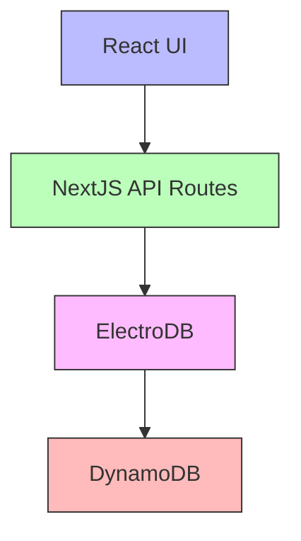
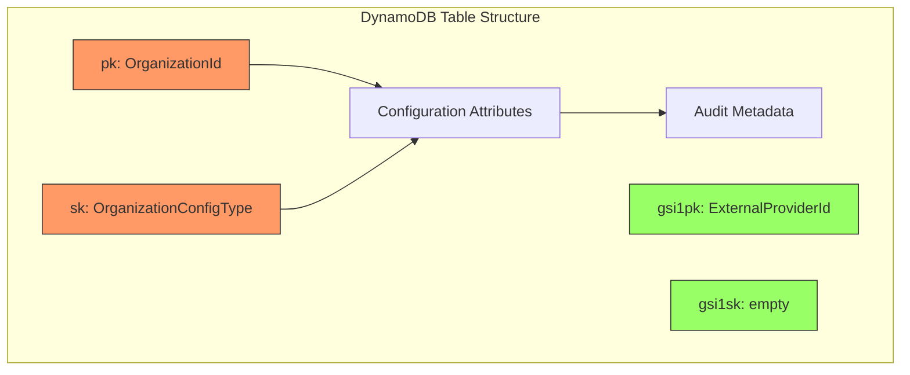
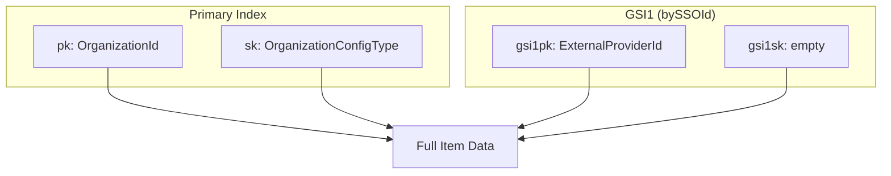
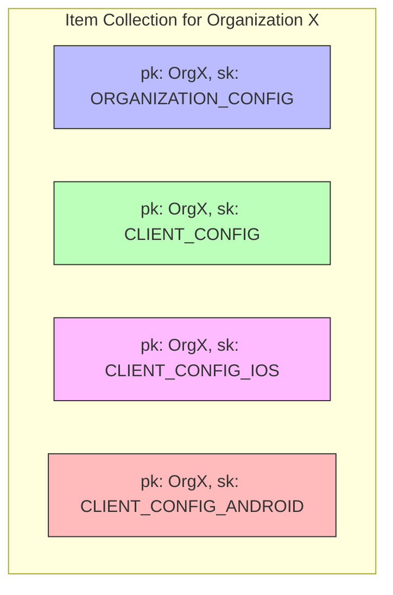
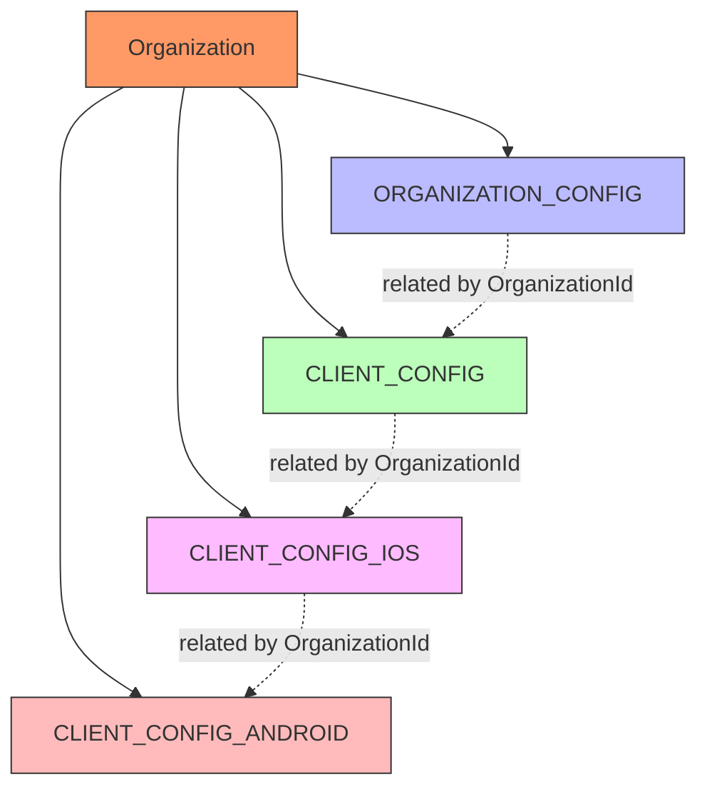

# Data Model: Organization Configuration Management Tool

## Introduction

The data model for the Organization Configuration Management Tool is designed to efficiently store and retrieve configuration settings for multiple organizations (tenants) within a multi-tenant system. The model follows DynamoDB best practices with a single-table design pattern and uses ElectroDB as an Object-Relational Mapping (ORM) layer to provide type safety and simplified queries.

The data model is structured to support the following key requirements:

1. Store different types of configuration settings for each organization
2. Support efficient retrieval of all configuration types for a specific organization
3. Enable targeted updates to specific configuration fields
4. Provide a consistent structure for configuration data
5. Support the creation of new organizations with default configurations

This document provides a comprehensive overview of the data model architecture, structure, access patterns, and implementation details.

## Architecture Context

This data model is part of the broader system architecture for the Organization Configuration Management Tool. The tool serves as an internal administrative interface for managing organization configurations within a multi-tenant system.

### System Overview

The Organization Configuration Management Tool is an internal administrative interface built using NextJS and React. It allows authorized users to view and edit configuration settings for different organizations within a multi-tenant system. The tool connects to an existing DynamoDB table that stores organization configuration data.

The system components relevant to the data model include:

- **React UI Components**: Form-based interfaces for viewing and editing configurations
- **NextJS API Routes**: Server-side endpoints for data operations
- **ElectroDB**: ORM layer that provides entity modeling and query capabilities
- **DynamoDB**: Underlying NoSQL database for data persistence

### Data Flow Summary



The data flow for configuration management follows these steps:

1. Users interact with the React UI to view, edit, or create organization configurations
2. The UI makes requests to NextJS API routes for data operations
3. API routes use ElectroDB to execute queries and updates against DynamoDB
4. DynamoDB stores and retrieves the configuration data
5. Results flow back through the stack to the UI

## DynamoDB Schema Design

### Table Structure

The organization configuration data is stored in a single DynamoDB table with the following structure:

| Attribute | Type | Description |
|-----------|------|-------------|
| pk | String | Partition key composed of OrganizationId |
| sk | String | Sort key composed of OrganizationConfigType |
| gsi1pk | String | GSI partition key composed of ExternalProviderId |
| gsi1sk | String | GSI sort key (empty) |
| [attributes] | Various | Configuration fields specific to each type |
| __createdAt | String | Timestamp of record creation |
| __updatedAt | String | Timestamp of last update |
| __updatedBy | String | User who last updated the record |

The table name is configured via the `ORGANIZATION_CONFIGURATION_TABLE_NAME` environment variable.



### Key Design

The table uses a composite key structure to efficiently organize and retrieve organization configuration data:

- **Partition Key (pk)**: The OrganizationId serves as the partition key, ensuring that all configuration records for a single organization are stored in the same partition, enabling efficient retrieval of all configurations for an organization.

- **Sort Key (sk)**: The OrganizationConfigType serves as the sort key, allowing for efficient retrieval of specific configuration types for an organization.

This key design supports the following query patterns:

1. Get all configuration types for a specific organization
2. Get a specific configuration type for an organization

### Indexes

In addition to the primary key, the table has one Global Secondary Index (GSI):

- **GSI1 (bySSOId)**:
  - Partition Key: gsi1pk (ExternalProviderId)
  - Sort Key: gsi1sk (empty)
  
This GSI enables lookups by ExternalProviderId, which can be useful for finding organizations by their external SSO provider ID.



### Item Collections

An organization's configuration data is organized into "item collections" based on the partition key (OrganizationId). Each organization typically has four configuration records (one for each OrganizationConfigType) stored in the same item collection:

1. ORGANIZATION_CONFIG: Core organization details
2. CLIENT_CONFIG: General client configuration settings
3. CLIENT_CONFIG_IOS: iOS-specific configuration
4. CLIENT_CONFIG_ANDROID: Android-specific configuration

This design ensures that all related configuration data for an organization can be efficiently retrieved with a single query operation.



## Data Structures

### Configuration Types

The OrganizationConfigType enum defines the different types of configuration that can exist for an organization:

```typescript
enum OrganizationConfigType {
  /**
   * Core organization configuration settings including name, branding, BuyTabs, and Profile settings
   */
  ORGANIZATION_CONFIG = 'ORGANIZATION_CONFIG',
  
  /**
   * General client configuration settings applicable across all platforms
   * Includes analytics keys, privacy links, and shared client settings
   */
  CLIENT_CONFIG = 'CLIENT_CONFIG',
  
  /**
   * iOS-specific client configuration settings
   * Includes App Store links and iOS-specific features
   */
  CLIENT_CONFIG_IOS = 'CLIENT_CONFIG_IOS',
  
  /**
   * Android-specific client configuration settings
   * Includes Play Store links and Android-specific features
   */
  CLIENT_CONFIG_ANDROID = 'CLIENT_CONFIG_ANDROID'
}
```

Each configuration type corresponds to a different tab in the user interface and contains a specific set of configuration fields relevant to that category.

### Configuration Records

The configuration data is modeled using TypeScript interfaces that extend a common BaseConfigurationRecord:

```typescript
/**
 * Base interface for all configuration record types
 */
interface BaseConfigurationRecord {
  OrganizationId: string;
  OrganizationConfigType: OrganizationConfigType;
  __createdAt?: string;
  __updatedAt?: string;
  __updatedBy?: string;
}
```

Each specific configuration type extends this base interface with fields relevant to that type:

```typescript
/**
 * Organization configuration record
 */
interface OrganizationConfigRecord extends BaseConfigurationRecord {
  OrganizationConfigType: OrganizationConfigType.ORGANIZATION_CONFIG;
  Name?: string;
  TeamName?: string;
  Slug?: string;
  ShortName?: string;
  LogoUrl?: string;
  FanWebRootUrl?: string;
  BrandColor?: string;
  ExternalProviderId?: string;
  SocialLink?: string;
  DonateLink?: string;
  BuyTabs?: BuyTab[];
  Profile?: ProfileField[];
  CustomerServiceConfig?: CustomerServiceConfig;
}

/**
 * Client configuration record
 */
interface ClientConfigRecord extends BaseConfigurationRecord {
  OrganizationConfigType: OrganizationConfigType.CLIENT_CONFIG;
  PublicAmplitudeExperimentsKey?: string;
  PublicSegmentWriteKey?: string;
  Braze?: BrazeConfig;
  OrganizationCourtCash?: OrganizationCourtCashConfig;
  PrivacyPolicyLink?: string;
  TermsLink?: string;
}

/**
 * iOS client configuration record
 */
interface ClientConfigIOSRecord extends BaseConfigurationRecord {
  OrganizationConfigType: OrganizationConfigType.CLIENT_CONFIG_IOS;
  IosStoreLink?: string;
}

/**
 * Android client configuration record
 */
interface ClientConfigAndroidRecord extends BaseConfigurationRecord {
  OrganizationConfigType: OrganizationConfigType.CLIENT_CONFIG_ANDROID;
  AndroidStoreLink?: string;
}
```

A union type `ConfigurationRecord` is used to represent any valid configuration record:

```typescript
type ConfigurationRecord = 
  | OrganizationConfigRecord
  | ClientConfigRecord
  | ClientConfigIOSRecord
  | ClientConfigAndroidRecord;
```

### Complex Data Types

Several complex data types are used within the configuration records:

**BuyTab**:
```typescript
interface BuyTab {
  Label: string;
  Slug: string;
  Type: string;
  GenreCode?: string;
}
```

**ProfileField**:
```typescript
interface ProfileField {
  FieldName: OrganizationFieldName;
  IsEditable?: boolean;
  IsSSOUserEditable?: boolean;
  IsRequired?: boolean;
}
```

**CustomerServiceConfig**:
```typescript
interface CustomerServiceConfig {
  CustomerServicePhone?: string;
}
```

**BrazeConfig**:
```typescript
interface BrazeConfig {
  PublicKey?: string;
  BaseUrl?: string;
}
```

**OrganizationCourtCashConfig**:
```typescript
interface OrganizationCourtCashConfig {
  Label?: string;
  Enabled?: boolean;
}
```

### Field Mappings

The following table shows which fields are applicable to each OrganizationConfigType:

| Field | ORGANIZATION_CONFIG | CLIENT_CONFIG | CLIENT_CONFIG_IOS | CLIENT_CONFIG_ANDROID |
|-------|---------------------|---------------|-------------------|----------------------|
| OrganizationId | ✓ | ✓ | ✓ | ✓ |
| OrganizationConfigType | ✓ | ✓ | ✓ | ✓ |
| Name | ✓ | | | |
| TeamName | ✓ | | | |
| Slug | ✓ | | | |
| ShortName | ✓ | | | |
| LogoUrl | ✓ | | | |
| FanWebRootUrl | ✓ | | | |
| BrandColor | ✓ | | | |
| ExternalProviderId | ✓ | | | |
| SocialLink | ✓ | | | |
| DonateLink | ✓ | | | |
| BuyTabs | ✓ | | | |
| Profile | ✓ | | | |
| CustomerServiceConfig | ✓ | | | |
| PublicAmplitudeExperimentsKey | | ✓ | | |
| PublicSegmentWriteKey | | ✓ | | |
| Braze | | ✓ | | |
| OrganizationCourtCash | | ✓ | | |
| PrivacyPolicyLink | | ✓ | | |
| TermsLink | | ✓ | | |
| IosStoreLink | | | ✓ | |
| AndroidStoreLink | | | | ✓ |

## Entity Relationships

### Organization to Configuration

The data model has a one-to-many relationship between an organization and its configuration records. Each organization (identified by OrganizationId) has multiple configuration records (one for each OrganizationConfigType).

```mermaid
erDiagram
    ORGANIZATION ||--o{ ORGANIZATION_CONFIG : has
    ORGANIZATION ||--o{ CLIENT_CONFIG : has
    ORGANIZATION ||--o{ CLIENT_CONFIG_IOS : has
    ORGANIZATION ||--o{ CLIENT_CONFIG_ANDROID : has
    
    ORGANIZATION {
        string OrganizationId PK
        string Name
    }
    
    ORGANIZATION_CONFIG {
        string OrganizationId PK
        string OrganizationConfigType SK
        string Name
        string TeamName
        string Slug
        string ShortName
        string LogoUrl
        string FanWebRootUrl
        string BrandColor
        string ExternalProviderId
        list BuyTabs
        list Profile
        map CustomerServiceConfig
    }
    
    CLIENT_CONFIG {
        string OrganizationId PK
        string OrganizationConfigType SK
        string PublicAmplitudeExperimentsKey
        string PublicSegmentWriteKey
        map Braze
        map OrganizationCourtCash
        string PrivacyPolicyLink
        string TermsLink
    }
    
    CLIENT_CONFIG_IOS {
        string OrganizationId PK
        string OrganizationConfigType SK
        string IosStoreLink
    }
    
    CLIENT_CONFIG_ANDROID {
        string OrganizationId PK
        string OrganizationConfigType SK
        string AndroidStoreLink
    }
```

### Configuration Type Relationships

The different configuration types are related to each other through their shared OrganizationId. While each configuration type contains different fields, they collectively represent the complete configuration for an organization.



## Access Patterns

### Organization Listing

To retrieve a list of all organizations for display in the UI dropdown, we need to get all unique organization names. Since DynamoDB doesn't have a built-in DISTINCT operation, we retrieve all ORGANIZATION_CONFIG records and extract the unique organizations:

```typescript
async function getOrganizations() {
  // Query for all ORGANIZATION_CONFIG records
  const records = await OrganizationConfiguration.query
    .primary({
      OrganizationConfigType: OrganizationConfigType.ORGANIZATION_CONFIG
    })
    .go();
  
  // Extract unique organizations with their names
  return records.map(record => ({
    OrganizationId: record.OrganizationId,
    Name: record.Name || record.OrganizationId // Fall back to ID if name is not set
  }));
}
```

### Configuration Retrieval

To retrieve all configuration types for a specific organization:

```typescript
async function getOrganizationConfig(organizationId: string) {
  // Query for all configuration records for the organization
  const records = await OrganizationConfiguration.query
    .primary({ OrganizationId: organizationId })
    .go();
  
  // Return the configuration records
  return records;
}
```

To retrieve a specific configuration type for an organization:

```typescript
async function getConfigurationByType(
  organizationId: string, 
  configType: OrganizationConfigType
) {
  // Get a specific configuration record by its composite key
  const record = await OrganizationConfiguration.get({
    OrganizationId: organizationId,
    OrganizationConfigType: configType
  }).go();
  
  return record;
}
```

### Configuration Updates

To update specific fields in a configuration record:

```typescript
async function updateConfiguration(
  organizationId: string,
  configType: OrganizationConfigType,
  updates: Partial<ConfigurationRecord>
) {
  // Create update object with audit fields
  const updateData = {
    ...updates,
    __updatedAt: new Date().toISOString(),
    __updatedBy: 'admin' // Ideally, this would be the current user
  };
  
  // Update the configuration record
  const updatedRecord = await OrganizationConfiguration.update({
    OrganizationId: organizationId,
    OrganizationConfigType: configType
  })
  .set(updateData)
  .go();
  
  return updatedRecord;
}
```

### New Organization Creation

To create a new organization with all required configuration types:

```typescript
async function createOrganization(organizationId: string, name: string) {
  // Create timestamps for audit fields
  const timestamp = new Date().toISOString();
  
  // Create ORGANIZATION_CONFIG record
  const orgConfig = await OrganizationConfiguration.create({
    OrganizationId: organizationId,
    OrganizationConfigType: OrganizationConfigType.ORGANIZATION_CONFIG,
    Name: name,
    Profile: [
      {
        FieldName: OrganizationFieldName.EMAIL,
        IsEditable: false,
        IsSSOUserEditable: false,
        IsRequired: true
      },
      {
        FieldName: OrganizationFieldName.FIRST_NAME,
        IsEditable: true,
        ISSQUserEditable: true,
        IsRequired: true
      },
      {
        FieldName: OrganizationFieldName.LAST_NAME,
        IsEditable: true,
        ISSQUserEditable: true,
        IsRequired: true
      }
    ],
    BuyTabs: [
      {
        Label: 'General',
        Slug: 'general',
        Type: 'general'
      }
    ],
    CustomerServiceConfig: {
      CustomerServicePhone: ''
    },
    __createdAt: timestamp,
    __updatedAt: timestamp,
    __updatedBy: 'admin' // Ideally, this would be the current user
  }).go();
  
  // Create CLIENT_CONFIG record
  const clientConfig = await OrganizationConfiguration.create({
    OrganizationId: organizationId,
    OrganizationConfigType: OrganizationConfigType.CLIENT_CONFIG,
    OrganizationCourtCash: {
      Enabled: false
    },
    Braze: {
      PublicKey: '',
      BaseUrl: ''
    },
    PrivacyPolicyLink: '',
    TermsLink: '',
    __createdAt: timestamp,
    __updatedAt: timestamp,
    __updatedBy: 'admin'
  }).go();
  
  // Create CLIENT_CONFIG_IOS record
  const iosConfig = await OrganizationConfiguration.create({
    OrganizationId: organizationId,
    OrganizationConfigType: OrganizationConfigType.CLIENT_CONFIG_IOS,
    IosStoreLink: '',
    __createdAt: timestamp,
    __updatedAt: timestamp,
    __updatedBy: 'admin'
  }).go();
  
  // Create CLIENT_CONFIG_ANDROID record
  const androidConfig = await OrganizationConfiguration.create({
    OrganizationId: organizationId,
    OrganizationConfigType: OrganizationConfigType.CLIENT_CONFIG_ANDROID,
    AndroidStoreLink: '',
    __createdAt: timestamp,
    __updatedAt: timestamp,
    __updatedBy: 'admin'
  }).go();
  
  // Return all created configuration records
  return [orgConfig, clientConfig, iosConfig, androidConfig];
}
```

## ElectroDB Integration

### Entity Definition

ElectroDB is used to define the OrganizationConfiguration entity, which serves as an ORM layer for DynamoDB. The entity definition includes the table structure, attributes, and indexes:

```typescript
const OrganizationConfiguration = new Entity({
  model: {
    entity: 'OrganizationConfiguration',
    version: '1',
    service: 'OrganizationConfigurationService',
  },
  table: {
    name: env.ORGANIZATION_CONFIGURATION_TABLE_NAME,
    partitionKey: 'pk',
    sortKey: 'sk',
  },
  attributes: {
    // Primary key components
    OrganizationId: {
      type: 'string',
      required: true,
    },
    OrganizationConfigType: {
      type: 'string',
      required: true,
      enum: [
        OrganizationConfigType.ORGANIZATION_CONFIG,
        OrganizationConfigType.CLIENT_CONFIG,
        OrganizationConfigType.CLIENT_CONFIG_IOS,
        OrganizationConfigType.CLIENT_CONFIG_ANDROID,
      ],
    },
    
    // Configuration fields...
    
    // Audit fields
    __createdAt: {
      type: 'string',
    },
    __updatedAt: {
      type: 'string',
    },
    __updatedBy: {
      type: 'string',
    },
  },
  indexes: {
    // Primary index
    primary: {
      pk: {
        field: 'pk',
        composite: ['OrganizationId'],
      },
      sk: {
        field: 'sk',
        composite: ['OrganizationConfigType'],
      },
    },
    // GSI for looking up by ExternalProviderId
    gsi1: {
      collection: 'bySSOId',
      index: 'gsi1',
      pk: {
        field: 'gsi1pk',
        composite: ['ExternalProviderId'],
      },
      sk: {
        field: 'gsi1sk',
        composite: [],
      },
    },
  },
}, { client: documentClient });
```

### Query Methods

ElectroDB provides a variety of query methods for accessing and manipulating configuration data:

| Method | Purpose | Example |
|--------|---------|---------|
| `query.primary()` | Query the primary index | Get all configurations for an organization |
| `query.collection()` | Query a specific collection | Get configs filtered by ExternalProviderId |
| `get()` | Get an item by its key | Get a specific configuration record |
| `create()` | Create a new item | Create a new configuration record |
| `update()` | Update an existing item | Update configuration fields |
| `delete()` | Delete an item | Delete a configuration record |
| `scan()` | Scan the table | Get all configuration records |

### Type Safety

ElectroDB provides type safety for DynamoDB operations through its entity definition and TypeScript integration. This ensures that:

1. Key components (OrganizationId, OrganizationConfigType) are always present
2. Enum values are validated (OrganizationConfigType must be one of the defined values)
3. Attribute types are enforced (string, list, map, etc.)
4. Required attributes are validated

This type safety helps prevent runtime errors and ensures data consistency.

## Performance Considerations

### Query Optimization

To optimize DynamoDB queries for the configuration data:

1. **Use Direct Key Access**: When retrieving a specific configuration record, use the `get()` method with the exact composite key rather than querying.

```typescript
// Optimized: Direct key access
const config = await OrganizationConfiguration.get({
  OrganizationId: organizationId,
  OrganizationConfigType: configType
}).go();

// Less efficient: Query with filter
const configs = await OrganizationConfiguration.query
  .primary({ OrganizationId: organizationId })
  .filter(({ OrganizationConfigType }) => 
    OrganizationConfigType.eq(configType)
  )
  .go();
```

2. **Leverage Item Collections**: Retrieve all configuration types for an organization in a single query operation.

```typescript
// Efficient: Get all configs for an organization in one query
const configs = await OrganizationConfiguration.query
  .primary({ OrganizationId: organizationId })
  .go();
```

3. **Use GSI for Specific Access Patterns**: When looking up by ExternalProviderId, use the GSI rather than scanning.

```typescript
// Optimized: Use GSI for lookup by ExternalProviderId
const configs = await OrganizationConfiguration.query
  .bySSOId({ ExternalProviderId: providerId })
  .go();

// Less efficient: Scan with filter
const configs = await OrganizationConfiguration.scan
  .filter(({ ExternalProviderId }) => 
    ExternalProviderId.eq(providerId)
  )
  .go();
```

### Selective Attribute Retrieval

When retrieving data, fetch only the attributes that are needed to minimize data transfer and processing:

```typescript
// Fetch only organization names for dropdown
const organizations = await OrganizationConfiguration.query
  .primary({
    OrganizationConfigType: OrganizationConfigType.ORGANIZATION_CONFIG
  })
  .attributes(['OrganizationId', 'Name'])
  .go();
```

### Batch Operations

For operations involving multiple records, use batch operations to reduce the number of requests:

```typescript
// Batch get configuration records
const keys = [
  { OrganizationId: orgId, OrganizationConfigType: OrganizationConfigType.ORGANIZATION_CONFIG },
  { OrganizationId: orgId, OrganizationConfigType: OrganizationConfigType.CLIENT_CONFIG },
  { OrganizationId: orgId, OrganizationConfigType: OrganizationConfigType.CLIENT_CONFIG_IOS },
  { OrganizationId: orgId, OrganizationConfigType: OrganizationConfigType.CLIENT_CONFIG_ANDROID }
];

const configs = await OrganizationConfiguration.batchGet(keys).go();
```

For batch writes, consider using ElectroDB's transaction support:

```typescript
// Create all config types in a transaction
const transaction = [
  OrganizationConfiguration.create({
    OrganizationId: orgId,
    OrganizationConfigType: OrganizationConfigType.ORGANIZATION_CONFIG,
    // ...
  }),
  OrganizationConfiguration.create({
    OrganizationId: orgId,
    OrganizationConfigType: OrganizationConfigType.CLIENT_CONFIG,
    // ...
  }),
  // Additional records...
];

await OrganizationConfiguration.transact(transaction).go();
```

## Data Validation

### Zod Schemas

[Zod](https://github.com/colinhacks/zod) is used for runtime validation of configuration data in the application. Zod schemas are defined for each configuration type and provide type-safe validation:

```typescript
import { z } from 'zod';

// Schema for ORGANIZATION_CONFIG
const organizationConfigSchema = z.object({
  OrganizationId: z.string().min(1),
  OrganizationConfigType: z.literal(OrganizationConfigType.ORGANIZATION_CONFIG),
  Name: z.string().optional(),
  TeamName: z.string().optional(),
  Slug: z.string().optional(),
  ShortName: z.string().optional(),
  LogoUrl: z.string().url().optional(),
  FanWebRootUrl: z.string().url().optional(),
  BrandColor: z.string().optional(),
  ExternalProviderId: z.string().optional(),
  SocialLink: z.string().optional(),
  DonateLink: z.string().optional(),
  BuyTabs: z.array(
    z.object({
      Label: z.string(),
      Slug: z.string(),
      Type: z.string(),
      GenreCode: z.string().optional()
    })
  ).optional(),
  Profile: z.array(
    z.object({
      FieldName: z.enum([
        OrganizationFieldName.EMAIL,
        OrganizationFieldName.FIRST_NAME,
        OrganizationFieldName.LAST_NAME,
        OrganizationFieldName.BIRTHDAY,
        OrganizationFieldName.PHONE_NUMBER
      ]),
      IsEditable: z.boolean().optional(),
      IsSSOUserEditable: z.boolean().optional(),
      IsRequired: z.boolean().optional()
    })
  ).optional(),
  CustomerServiceConfig: z.object({
    CustomerServicePhone: z.string().optional()
  }).optional()
});

// Validate data against schema
function validateOrganizationConfig(data: unknown) {
  return organizationConfigSchema.parse(data);
}
```

These Zod schemas are used in API routes to validate incoming data before storing it in DynamoDB.

### ElectroDB Validation

ElectroDB provides built-in validation based on the entity definition:

1. Type validation for attributes
2. Enum validation for OrganizationConfigType
3. Required field validation

However, ElectroDB's validation is primarily focused on ensuring that the data conforms to the expected structure rather than enforcing business rules.

### Business Rules

Additional business rule validations are implemented on top of Zod and ElectroDB validation:

1. OrganizationId uniqueness: Before creating a new organization, check if the ID already exists
2. URL format validation: Ensure URLs are properly formatted
3. Required fields based on context: Some fields may be conditionally required

```typescript
async function validateOrganizationExists(organizationId: string): Promise<boolean> {
  try {
    const existing = await OrganizationConfiguration.query
      .primary({ OrganizationId: organizationId })
      .go();
    
    return existing.length > 0;
  } catch (error) {
    console.error('Error checking organization existence:', error);
    throw error;
  }
}
```

## Data Evolution Strategy

### Versioning

The ElectroDB entity includes a version property in its model definition:

```typescript
model: {
  entity: 'OrganizationConfiguration',
  version: '1',
  service: 'OrganizationConfigurationService',
}
```

This version number serves as a reference point for the schema definition and can be used to track schema changes over time.

### Backward Compatibility

To maintain backward compatibility during schema evolution:

1. **Add Fields as Optional**: When adding new fields to the schema, make them optional to avoid breaking existing records.

2. **Schema Documentation**: Maintain documentation of schema changes to track the evolution of the data model.

3. **Code Handling**: Ensure application code can handle both old and new schema versions during transition periods.

### Migration Procedures

When schema changes require data migration:

1. **Read-Migrate-Write Pattern**:
   - Read data using the old schema
   - Migrate data to the new schema
   - Write data using the new schema

2. **Batch Processing**:
   - Process records in batches to avoid overwhelming the database
   - Use AWS Lambda for large-scale migrations

3. **Versioning Flags**:
   - Add a schema version flag to records to track migration status
   - Update the application to handle multiple schema versions during the migration period

## Appendix: Schema Reference

### OrganizationConfiguration Entity

The OrganizationConfiguration entity defines the structure and behavior of the organization configuration data in DynamoDB. The entity includes attributes, indexes, and key composition rules.

**Model Definition**:
```typescript
model: {
  entity: 'OrganizationConfiguration',
  version: '1',
  service: 'OrganizationConfigurationService',
}
```

**Table Configuration**:
```typescript
table: {
  name: env.ORGANIZATION_CONFIGURATION_TABLE_NAME,
  partitionKey: 'pk',
  sortKey: 'sk',
}
```

**Key Attributes**:
```typescript
// Primary key components
OrganizationId: {
  type: 'string',
  required: true,
},
OrganizationConfigType: {
  type: 'string',
  required: true,
  enum: [
    OrganizationConfigType.ORGANIZATION_CONFIG,
    OrganizationConfigType.CLIENT_CONFIG,
    OrganizationConfigType.CLIENT_CONFIG_IOS,
    OrganizationConfigType.CLIENT_CONFIG_ANDROID,
  ],
},
```

**Indexes**:
```typescript
indexes: {
  // Primary index
  primary: {
    pk: {
      field: 'pk',
      composite: ['OrganizationId'],
    },
    sk: {
      field: 'sk',
      composite: ['OrganizationConfigType'],
    },
  },
  // GSI for looking up by ExternalProviderId
  gsi1: {
    collection: 'bySSOId',
    index: 'gsi1',
    pk: {
      field: 'gsi1pk',
      composite: ['ExternalProviderId'],
    },
    sk: {
      field: 'gsi1sk',
      composite: [],
    },
  },
}
```

### Configuration Record Types

The application defines several configuration record types to represent different aspects of organization configuration:

**BaseConfigurationRecord**:
```typescript
interface BaseConfigurationRecord {
  OrganizationId: string;
  OrganizationConfigType: OrganizationConfigType;
  __createdAt?: string;
  __updatedAt?: string;
  __updatedBy?: string;
}
```

**OrganizationConfigRecord**:
```typescript
interface OrganizationConfigRecord extends BaseConfigurationRecord {
  OrganizationConfigType: OrganizationConfigType.ORGANIZATION_CONFIG;
  Name?: string;
  TeamName?: string;
  Slug?: string;
  ShortName?: string;
  LogoUrl?: string;
  FanWebRootUrl?: string;
  BrandColor?: string;
  ExternalProviderId?: string;
  SocialLink?: string;
  DonateLink?: string;
  BuyTabs?: BuyTab[];
  Profile?: ProfileField[];
  CustomerServiceConfig?: CustomerServiceConfig;
}
```

**ClientConfigRecord**:
```typescript
interface ClientConfigRecord extends BaseConfigurationRecord {
  OrganizationConfigType: OrganizationConfigType.CLIENT_CONFIG;
  PublicAmplitudeExperimentsKey?: string;
  PublicSegmentWriteKey?: string;
  Braze?: BrazeConfig;
  OrganizationCourtCash?: OrganizationCourtCashConfig;
  PrivacyPolicyLink?: string;
  TermsLink?: string;
}
```

**ClientConfigIOSRecord**:
```typescript
interface ClientConfigIOSRecord extends BaseConfigurationRecord {
  OrganizationConfigType: OrganizationConfigType.CLIENT_CONFIG_IOS;
  IosStoreLink?: string;
}
```

**ClientConfigAndroidRecord**:
```typescript
interface ClientConfigAndroidRecord extends BaseConfigurationRecord {
  OrganizationConfigType: OrganizationConfigType.CLIENT_CONFIG_ANDROID;
  AndroidStoreLink?: string;
}
```

### Enums and Constants

The data model uses several enums to provide type safety and consistency:

**OrganizationConfigType**:
```typescript
enum OrganizationConfigType {
  ORGANIZATION_CONFIG = 'ORGANIZATION_CONFIG',
  CLIENT_CONFIG = 'CLIENT_CONFIG',
  CLIENT_CONFIG_IOS = 'CLIENT_CONFIG_IOS',
  CLIENT_CONFIG_ANDROID = 'CLIENT_CONFIG_ANDROID'
}
```

**OrganizationFieldName**:
```typescript
enum OrganizationFieldName {
  EMAIL = 'EMAIL',
  FIRST_NAME = 'FIRST_NAME',
  LAST_NAME = 'LAST_NAME',
  BIRTHDAY = 'BIRTHDAY',
  PHONE_NUMBER = 'PHONE_NUMBER'
}
```