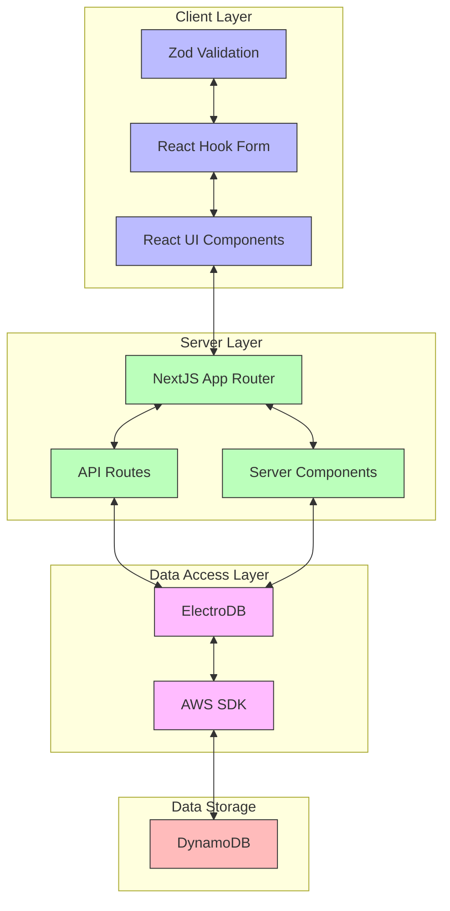
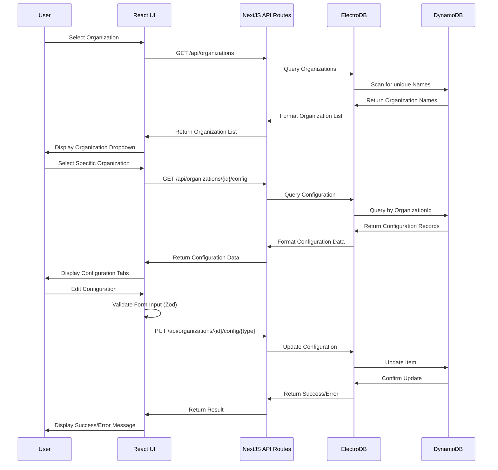
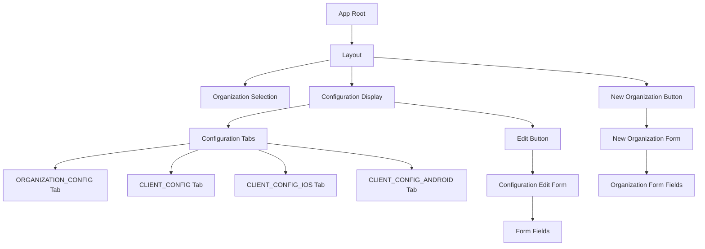
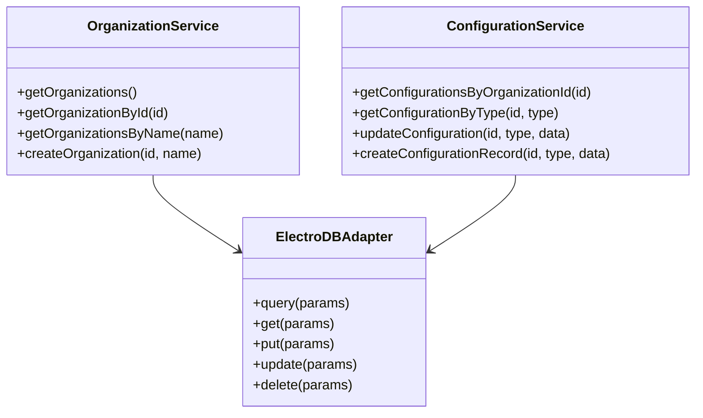
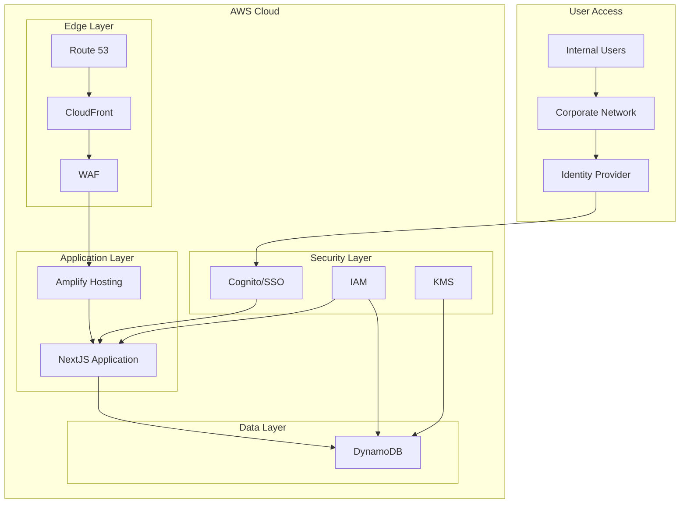
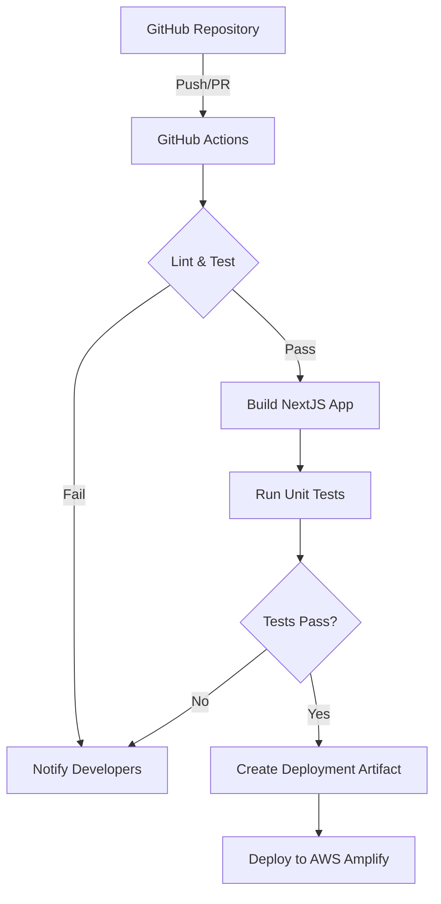
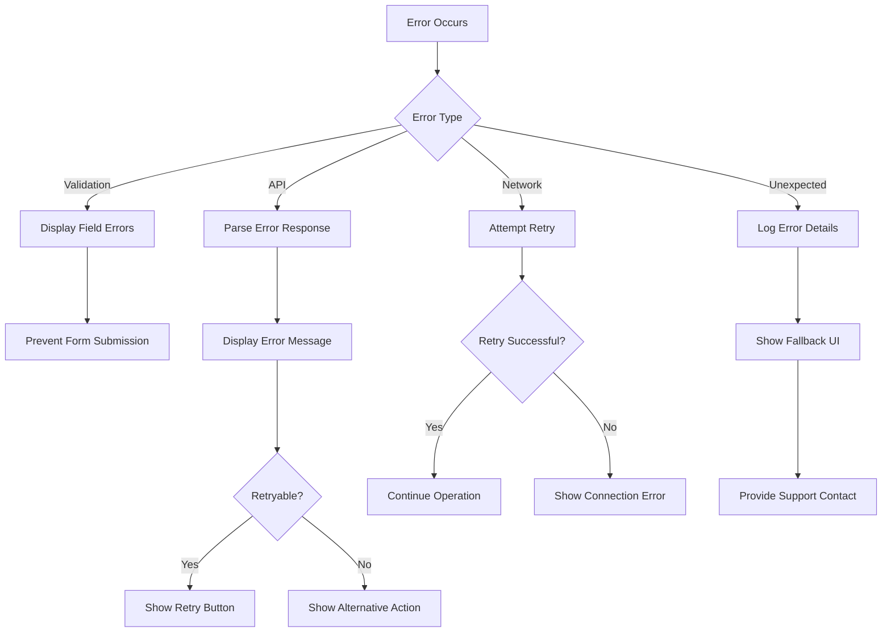

# Architecture Overview: Organization Configuration Management Tool

## 1. Introduction

### 1.1 Purpose of This Document

This document provides a comprehensive high-level overview of the architecture for the Organization Configuration Management Tool. It serves as a guide for developers, architects, and stakeholders to understand the system's design, components, data flow, and key architectural decisions.

The document covers:
- System components and their interactions
- Data flow through the system
- Technology stack and justifications
- Key architectural decisions
- Deployment architecture
- Cross-cutting concerns such as security and monitoring

### 1.2 System Overview

The Organization Configuration Management Tool is an internal administrative interface for managing organization configurations within a multi-tenant system. It enables authorized users to create, view, and edit configuration settings for different organizations (tenants) within the system.

The application addresses the following business needs:
- Streamlined organization setup and configuration
- Reduction in configuration errors through validation
- Improved visibility into organization settings
- Efficient management of organization-specific parameters

The tool follows a modern web application architecture utilizing NextJS for both frontend and backend components, React for the user interface, and DynamoDB for data persistence.

### 1.3 Key Business Requirements

| Business Requirement | Architecture Response |
|----------------------|------------------------|
| Intuitive configuration management | Form-based UI with validation and organized by configuration type |
| Support for multiple organization configuration types | Tab-based interface and type-specific forms for different configuration categories |
| Error reduction through validation | Client and server-side validation using Zod schemas |
| Efficient organization setup | Organization creation workflow with default configurations |
| Visibility into configuration settings | Comprehensive view of all configuration types and settings |

## 2. System Architecture

### 2.1 High-Level Architecture Diagram

The system follows a layered architecture pattern with clear separation of concerns:

1. **Client Layer**: Responsible for user interface, form management, and client-side validation
2. **Server Layer**: Handles routing, API endpoints, and server-side rendering
3. **Data Access Layer**: Abstracts database operations and provides type-safe data access
4. **Data Storage**: Stores organization configuration data persistently

### 2.2 Key Components

| Component | Description | Responsibility |
|-----------|-------------|----------------|
| React UI Components | User interface components | Provide interactive interface for managing configurations |
| React Hook Form | Form state management | Handle form input, validation, and submission |
| Zod Validation | Schema validation | Validate form input against defined schemas |
| NextJS App Router | Routing and rendering | Handle page routing and server-side rendering |
| API Routes | Backend endpoints | Process data operations and interface with data layer |
| ElectroDB | ORM for DynamoDB | Provide structured access to DynamoDB data |
| DynamoDB | NoSQL database | Store organization configuration data |

### 2.3 Component Interactions

The system follows these interaction patterns:

1. **UI to API**: React components make API calls to fetch and update data
2. **Form Validation**: Client-side validation using Zod schemas before submission
3. **API to Database**: API routes use ElectroDB to interact with DynamoDB
4. **Data Flow**: Bidirectional flow between UI, API, and database layers

### 2.4 Data Flow

The primary data flows in the system are:

1. **Organization Selection**: Fetching and displaying organizations
2. **Configuration Display**: Retrieving configuration records for a selected organization
3. **Configuration Editing**: Updating configuration settings with validation
4. **Organization Creation**: Creating new organizations with default configurations

## 3. Technology Stack

### 3.1 Frontend Technologies

| Technology | Version | Purpose | Justification |
|------------|---------|---------|---------------|
| React | 18.x | UI Library | Component-based architecture for building the user interface |
| NextJS | 14.x | Full-stack Framework | Server-side rendering, API routes, and unified development experience |
| TypeScript | 5.x | Programming Language | Strong typing for improved code quality and developer experience |
| React Hook Form | 7.x | Form Management | Efficient form handling with minimal re-renders |
| Zod | 3.x | Validation | Type-safe schema validation for forms and API inputs |
| TailwindCSS | 3.x | Styling | Utility-first CSS framework for rapid UI development |
| Shadcn UI | Latest | UI Component Library | High-quality, accessible UI components |

React and NextJS were chosen as the core frontend technologies due to:
- Component-based architecture for reusability and maintainability
- Built-in API routes for backend functionality
- Server-side rendering for improved performance
- Comprehensive ecosystem and community support

### 3.2 Backend Technologies

| Technology | Version | Purpose | Justification |
|------------|---------|---------|---------------|
| NextJS API Routes | 14.x | Backend API | Integrated backend functionality within the NextJS framework |
| TypeScript | 5.x | Programming Language | Type safety and improved developer experience |
| ElectroDB | 2.x | ORM for DynamoDB | Type-safe access to DynamoDB with simplified query patterns |
| AWS SDK | 3.x | AWS Services Access | Interaction with AWS services including DynamoDB |

NextJS API routes were chosen for the backend to:
- Simplify the architecture by avoiding a separate backend service
- Leverage the same TypeScript codebase for frontend and backend
- Provide a unified deployment model

### 3.3 Database

| Technology | Version | Purpose | Justification |
|------------|---------|---------|---------------|
| Amazon DynamoDB | Latest | Primary Database | NoSQL database for flexible schema, high availability, and scalability |

DynamoDB was selected as the database because:
- It's already used to store organization configuration data
- Single-table design fits well with the entity structure
- Managed AWS service reduces operational overhead
- Scales automatically based on demand

### 3.4 Infrastructure

| Technology | Version | Purpose | Justification |
|------------|---------|---------|---------------|
| AWS Amplify | Latest | Hosting & Deployment | Simplified deployment and hosting for NextJS applications |
| AWS IAM | Latest | Security | Role-based access control for AWS resources |
| AWS CloudFront | Latest | Content Delivery | Edge caching and fast content delivery |

AWS services were chosen for infrastructure to:
- Maintain consistency with the existing AWS environment
- Leverage managed services to reduce operational complexity
- Benefit from built-in scaling and security features

## 4. Key Architectural Decisions

### 4.1 Application Architecture

**Decision**: Monolithic NextJS Application with App Router

**Alternatives Considered**:
- Microservices architecture
- Separate frontend and backend services
- Traditional server-rendered application

**Rationale**:
- Simplified development and deployment workflow
- Unified codebase for frontend and backend
- Appropriate scale for an internal administrative tool
- Efficient resource utilization
- Reduced operational complexity

### 4.2 Data Storage

**Decision**: DynamoDB with Single-Table Design and ElectroDB ORM

**Alternatives Considered**:
- Relational database (PostgreSQL, MySQL)
- Multiple DynamoDB tables
- Document database (MongoDB)

**Rationale**:
- Reuse of existing DynamoDB infrastructure
- Single-table design simplifies access patterns
- ElectroDB provides type safety and simplified queries
- Flexible schema accommodates different configuration types
- Auto-scaling capabilities for varying workloads

For detailed information on the data model, please refer to [Data Model Documentation](./data-model.md).

### 4.3 Security Approach

**Decision**: Leverage Existing Authentication with Role-Based Authorization

**Alternatives Considered**:
- Custom authentication system
- Token-based authentication with JWT
- OAuth 2.0 integration

**Rationale**:
- Simplify security implementation by using existing organizational authentication
- Role-based permissions align with administrative use cases
- Appropriate security level for an internal tool
- Reduced development and maintenance effort

For detailed information on the security architecture, please refer to [Security Documentation](./security.md).

### 4.4 UI Architecture

**Decision**: Component-Based UI with Form Abstraction

**Alternatives Considered**:
- Traditional page-based UI
- Custom form implementation
- State management library (Redux, MobX)

**Rationale**:
- Components improve reusability and maintainability
- React Hook Form simplifies complex form handling
- Zod provides robust validation with TypeScript integration
- Tab-based interface organizes different configuration types
- Reduced boilerplate compared to Redux or other state management libraries

## 5. Component Details

### 5.1 Frontend Components

The UI is organized into these key components:

1. **Organization Selector**: Dropdown for selecting organizations
2. **Configuration Tabs**: Tabs for different configuration types
3. **Configuration Display**: Read-only view of configuration data
4. **Configuration Edit Form**: Form for editing configuration data
5. **New Organization Form**: Form for creating new organizations

Each component is designed for reusability and follows a clear hierarchy of responsibilities.

### 5.2 API Layer

The API layer consists of these key endpoints:

| Endpoint | Method | Purpose | Data Flow |
|----------|--------|---------|-----------|
| `/api/organizations` | GET | List organizations | Retrieves unique organization names and IDs |
| `/api/organizations` | POST | Create organization | Creates a new organization with default configs |
| `/api/organizations/{id}/config` | GET | Get configs | Retrieves all configuration types for an organization |
| `/api/organizations/{id}/config/{type}` | GET | Get specific config | Gets a specific configuration type |
| `/api/organizations/{id}/config/{type}` | PUT | Update config | Updates a specific configuration type |

API routes follow RESTful conventions and include:
- Input validation using Zod schemas
- Authentication and authorization checks
- Consistent error handling
- Type-safe request and response handling

### 5.3 Data Access Layer

The data access layer abstracts interactions with DynamoDB using ElectroDB:

The data access layer provides:
- Abstraction over DynamoDB operations
- Type-safe entity definitions and queries
- Centralized data access logic
- Consistent error handling and data transformation

### 5.4 External Integrations

The system has minimal external integrations:

| Integration | Purpose | Integration Method |
|-------------|---------|-------------------|
| DynamoDB | Data persistence | AWS SDK via ElectroDB |
| Authentication System | User authentication | Assumed to be handled externally |

## 6. Deployment Architecture

### 6.1 Environment Overview

The deployment architecture uses AWS services:
- **AWS Amplify**: Hosting and deployment of the NextJS application
- **AWS CloudFront**: Content delivery and edge caching
- **AWS DynamoDB**: Data storage for organization configurations
- **AWS IAM**: Security and access control
- **AWS WAF**: Web application firewall protection

### 6.2 CI/CD Pipeline

The CI/CD pipeline includes:
- Automated testing and linting
- Deployment to AWS Amplify
- Environment-specific configurations
- Automated notifications for failures

### 6.3 Scaling Considerations

The application is designed to scale with minimal configuration:

| Component | Scaling Approach | Implementation |
|-----------|------------------|----------------|
| Frontend | Horizontal scaling | AWS Amplify automatic scaling |
| API Routes | Function scaling | Serverless functions in AWS Amplify |
| Database | Auto-scaling | DynamoDB on-demand capacity |

For this internal tool, the scaling requirements are modest, but the architecture supports growth if needed.

## 7. Cross-Cutting Concerns

### 7.1 Security

Security is implemented through multiple layers:

| Security Aspect | Implementation | Description |
|-----------------|----------------|-------------|
| Authentication | External system integration | Leverages existing organizational authentication |
| Authorization | Role-based access control | Admin and Viewer roles with appropriate permissions |
| Data Protection | Encryption at rest and in transit | HTTPS and DynamoDB encryption |
| Input Validation | Zod schemas | Validates all user inputs before processing |

For detailed information on security implementation, refer to [Security Documentation](./security.md).

### 7.2 Error Handling

The system implements a comprehensive error handling strategy:

Key error handling features include:
- Client-side validation feedback
- Consistent error messages
- Graceful degradation
- Detailed error logging
- User-friendly error displays

### 7.3 Monitoring and Logging

The monitoring and logging architecture includes:

| Component | Monitoring Approach | Implementation |
|-----------|---------------------|----------------|
| Client-Side Performance | Web Vitals | Tracking page load and interaction metrics |
| API Performance | Request timing | Measuring and logging API response times |
| Errors | Error logging | Capturing and reporting application errors |
| User Activity | Audit logging | Tracking configuration changes |

### 7.4 Performance Considerations

Performance optimizations include:

| Aspect | Optimization Technique | Implementation |
|--------|------------------------|----------------|
| Data Fetching | Selective attribute retrieval | Fetching only required DynamoDB attributes |
| Rendering | Component memoization | React.memo for expensive components |
| Form Handling | Efficient validation | Validation strategies to minimize re-renders |
| API Calls | Request batching | Combining related data requests |

## 8. Future Considerations

### 8.1 Scalability

Future scalability enhancements could include:

- Implementing caching for frequently accessed data
- Adding read replicas for DynamoDB if read volume increases
- Implementing server-side pagination for large data sets

### 8.2 Extensibility

The system is designed for extensibility in these areas:

- Supporting additional configuration types
- Adding new configuration fields
- Enhancing validation rules
- Supporting additional integration points

### 8.3 Maintenance Strategy

The maintenance strategy includes:

- Regular dependency updates
- Automated testing to prevent regressions
- Documentation updates for system changes
- Monitoring for performance degradation
- Periodic security reviews

## 9. Conclusion

The Organization Configuration Management Tool follows a modern, maintainable architecture that balances simplicity with robust functionality. The NextJS monolithic approach provides a unified development and deployment experience, while ElectroDB and DynamoDB offer a flexible and scalable data layer.

The system is designed to meet the needs of internal administrators managing organization configurations, with a focus on usability, reliability, and maintainability. The architecture supports future growth and enhancement while minimizing operational complexity.

For more detailed information, please refer to:
- [Data Model Documentation](./data-model.md) for database schema details
- [Security Documentation](./security.md) for security implementation details