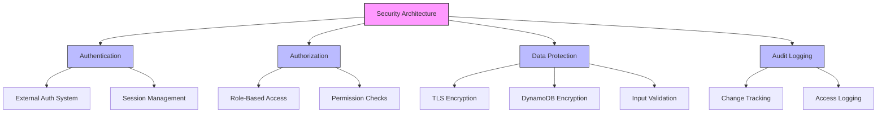
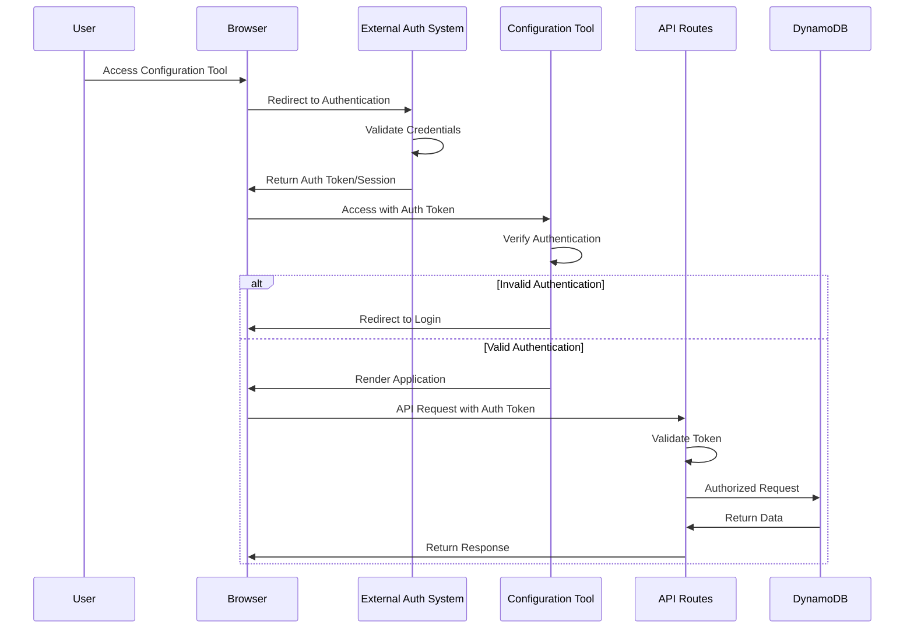
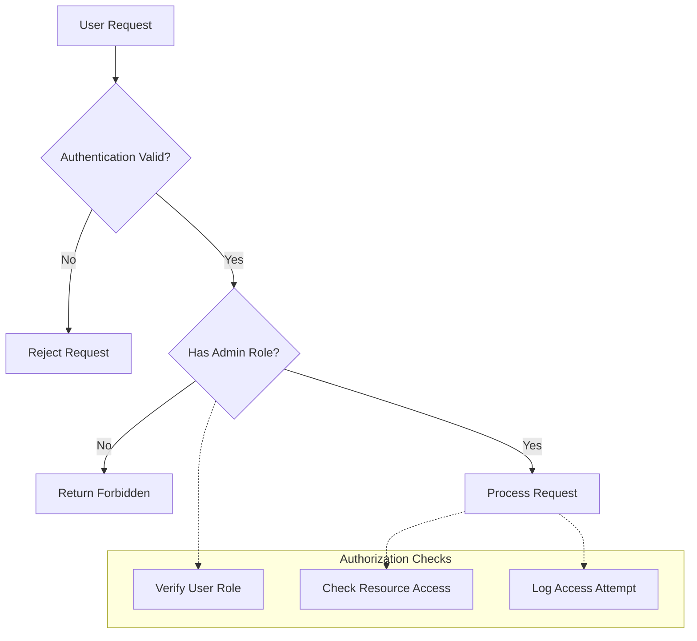
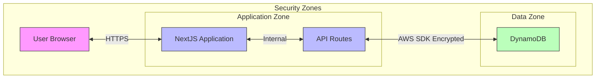

# Security Architecture: Organization Configuration Management Tool

## Introduction

This document outlines the security architecture for the Organization Configuration Management Tool. As an internal administrative tool for managing organization configurations, the security approach focuses on appropriate authentication, authorization, data protection, and compliance with organizational security policies. The security architecture follows a defense-in-depth approach while remaining appropriate for the risk level of the application.

## Security Architecture Overview

The security architecture for the Organization Configuration Management Tool is designed with the following key principles:

- **Defense in Depth**: Multiple layers of security controls
- **Least Privilege**: Access limited to what is necessary
- **Secure by Default**: Security built into the design
- **Data Protection**: Appropriate safeguards for configuration data
- **Auditability**: Tracking of configuration changes



## Authentication Framework

The authentication framework for this internal tool relies on the organization's existing authentication infrastructure rather than implementing a custom solution.



### Authentication Implementation

The application implements authentication through the following components:

- **NextJS Middleware**: Validates authentication on all API requests
- **Token Validation**: Verifies JWT tokens or session cookies
- **Development Mode**: Simplified authentication for development environments
- **Error Handling**: Standardized authentication error responses

```typescript
// src/backend/middleware/auth.ts
export const withAuth = (handler: NextApiHandler): NextApiHandler => {
  return async (req: NextApiRequest, res: NextApiResponse) => {
    const token = extractTokenFromRequest(req);
    
    if (!validateAuthToken(token)) {
      const error = createAuthenticationError('Authentication required');
      return res.status(HttpStatusCode.UNAUTHORIZED).json({ error: error.message });
    }
    
    // Attach user info to request
    (req as AuthenticatedRequest).user = getUserFromToken(token!);
    
    return handler(req, res);
  };
};
```

### Session Management

Session management is handled through the following approaches:

| Aspect | Implementation | Description |
|--------|----------------|-------------|
| Session Storage | HTTP-only Cookies | Sessions stored in secure, HTTP-only cookies |
| Session Duration | 8 hours | Sessions expire after 8 hours of inactivity |
| Session Validation | Server-side | All API requests validate session before processing |
| Token Refresh | Automatic | Transparently refreshes tokens before expiration |

### Authentication Flow

The authentication flow follows these steps:

1. User accesses the application and is redirected to the organization's authentication system
2. After successful authentication, the user receives an authentication token or session cookie
3. The application validates the token/session on each request using middleware
4. If validation fails, the user is redirected to re-authenticate
5. If validation succeeds, the request proceeds with the authenticated user context

## Authorization System

The authorization model for this internal tool is relatively simple, as it's designed for administrative users who need access to organization configurations.



### Role-Based Access Control

The application implements a simple role-based access control model:

| Role | Permissions | Description |
|------|-------------|-------------|
| Admin | Full Access | Can view and edit all organization configurations |
| Viewer | Read-only | Can view but not modify configurations |

```typescript
// src/backend/middleware/auth.ts
export const withPermission = (requiredRoles: string[], handler: NextApiHandler): NextApiHandler => {
  return withAuth(async (req: AuthenticatedRequest, res: NextApiResponse) => {
    const userRoles = req.user.roles || [];
    const hasPermission = requiredRoles.some(role => userRoles.includes(role));
    
    if (!hasPermission) {
      const error = createAuthorizationError('Insufficient permissions', requiredRoles);
      return res.status(HttpStatusCode.FORBIDDEN).json({ error: error.message });
    }
    
    return handler(req, res);
  });
};
```

### Permission Enforcement

Permissions are enforced at multiple levels:

- **API Route Level**: Using the withPermission middleware to check roles
- **UI Level**: Hiding or disabling features based on user permissions
- **Service Level**: Additional permission checks in service methods
- **Infrastructure Level**: IAM policies restricting access to AWS resources

### Audit Logging

All significant actions are logged for audit purposes:

| Event Type | Data Captured | Retention |
|------------|--------------|-----------|
| Configuration View | User, Organization, Timestamp | 90 days |
| Configuration Edit | User, Organization, Changes, Timestamp | 1 year |
| New Organization | User, Organization Details, Timestamp | 1 year |

## Data Protection

The configuration data managed by this tool is not highly sensitive but still requires appropriate protection measures.

### Encryption Standards

The following encryption standards are implemented:

| Data Type | Encryption Method | Implementation |
|-----------|-------------------|----------------|
| Data in Transit | TLS 1.2+ | HTTPS for all communications |
| Data at Rest | AWS DynamoDB Encryption | Server-side encryption with AWS-managed keys |

### Secure Communication

All communication between components uses secure channels:



### Input Validation

All user inputs are validated to prevent injection attacks and data corruption:

- **Zod Schemas**: Type-safe validation schemas for all input data
- **Client-Side Validation**: Immediate feedback for user errors
- **Server-Side Validation**: Prevent invalid data from reaching the database
- **Sanitization**: Prevent injection attacks in string inputs

```typescript
// src/backend/validation/schemas/organization.ts
export const organizationSchema = z.object({
  OrganizationId: z.string()
    .min(1, "Organization ID is required")
    .refine(isValidOrganizationId, {
      message: "Organization ID contains invalid characters"
    }),
  Name: z.string().min(1, "Name is required")
});
```

### Data Integrity

Data integrity is maintained through several mechanisms:

- **Schema Validation**: Ensure data conforms to expected structure
- **Transaction Support**: Use DynamoDB transactions for multi-item operations
- **Audit Fields**: Track creation and modification timestamps
- **User Attribution**: Record the user who made each change

## API Security

The API routes implement the following security measures:

### API Authentication

All API routes are protected by authentication middleware:

- **Route Protection**: NextJS middleware verifies authentication before processing requests
- **Token Validation**: Validate JWT tokens or session cookies
- **Error Handling**: Return appropriate 401/403 responses for authentication failures

### Request Validation

All API requests are validated before processing:

- **Schema Validation**: Validate request body against Zod schemas
- **Parameter Validation**: Validate URL parameters and query strings
- **Type Safety**: Leverage TypeScript for type checking

```typescript
// src/web/app/api/organizations/route.ts
export async function POST(request: NextRequest) {
  try {
    const body = await request.json();
    
    // Validate request body
    const result = organizationSchema.safeParse(body);
    if (!result.success) {
      return NextResponse.json(
        { error: 'Invalid request data', details: result.error.format() },
        { status: 400 }
      );
    }
    
    const { organizationId, name } = result.data;
    // Process the validated data
    // ...
  } catch (err) {
    // Error handling
  }
}
```

### Error Handling

Secure error handling practices are implemented:

- **Standardized Responses**: Consistent error response format
- **Information Hiding**: Prevent exposure of sensitive details in errors
- **Logging**: Log detailed errors for troubleshooting without exposing to clients

### Rate Limiting

Basic rate limiting is implemented to prevent abuse:

| Aspect | Implementation | Description |
|--------|----------------|-------------|
| Limit Type | Request-based | Limits based on requests per minute |
| Scope | Per-user | Rate limits applied per authenticated user |
| Response | 429 Too Many Requests | Returns standard error with retry-after header |

## Infrastructure Security

The infrastructure security is implemented through AWS services and follows AWS security best practices.

### AWS IAM Security

IAM roles and policies follow the principle of least privilege:

- **Service Roles**: Specific roles for Amplify, Lambda, and other services
- **Resource Restrictions**: Policies limited to specific resources
- **Action Limitations**: Only necessary actions are permitted
- **Condition Constraints**: Additional conditions to restrict access

```typescript
// infrastructure/cdk/lib/iam-stack.ts
private createDynamoDBAccessPolicy(tableName: string): PolicyStatement {
  return new PolicyStatement({
    effect: Effect.ALLOW,
    actions: [
      'dynamodb:GetItem',
      'dynamodb:PutItem',
      'dynamodb:UpdateItem',
      'dynamodb:DeleteItem',
      'dynamodb:Query',
      'dynamodb:Scan'
    ],
    resources: [
      `arn:aws:dynamodb:${this.region}:${this.account}:table/${tableName}`,
      `arn:aws:dynamodb:${this.region}:${this.account}:table/${tableName}/index/*`
    ]
  });
}
```

### Network Security

Network security measures include:

- **CloudFront Distribution**: Edge caching and WAF protection
- **HTTPS Enforcement**: All traffic encrypted in transit
- **Security Headers**: Content Security Policy, X-XSS-Protection, etc.
- **Private Subnets**: Database resources in private subnets where applicable

### Monitoring and Alerting

Security monitoring is implemented through:

- **CloudWatch Alarms**: Alerts for suspicious activity
- **CloudTrail**: Logging of AWS API calls
- **Access Logging**: Logging of application access attempts
- **Automated Notifications**: Alerts for security events

#### Security Alert Thresholds

The following security alert thresholds are configured for monitoring:

| Metric | Warning Threshold | Critical Threshold | Evaluation Period |
|--------|-------------------|-------------------|-------------------|
| Authentication Failures | >5 failures in 5 minutes | >10 failures in 5 minutes | 5 minutes |
| API Error Rate | 2% | 5% | 5 minutes |
| Unauthorized Access Attempts | Any | >3 attempts | 5 minutes |
| Configuration Changes | N/A | Outside business hours | Immediate |

## Security Controls Matrix

The following matrix outlines the security controls implemented in the application:

| Security Control | Implementation | Verification Method | Responsibility |
|------------------|----------------|---------------------|----------------|
| Authentication | External system | Session validation | Platform Team |
| Authorization | Role-based checks | Permission validation | Application |
| Data Encryption | TLS + AWS encryption | Configuration audit | Infrastructure |
| Input Validation | Zod schemas | Automated testing | Development |
| Audit Logging | Request logging | Log review | Operations |
| Error Handling | Secure error messages | Code review | Development |
| CSRF Protection | Anti-forgery tokens | Security testing | Development |
| Content Security | CSP headers | Security headers check | Infrastructure |
| Dependency Security | npm audit | Automated scanning | DevOps |
| IAM Security | Least privilege policies | Policy review | Infrastructure |

## Compliance Considerations

As an internal administrative tool, this application has limited compliance requirements. However, it should still adhere to organizational security policies.

| Requirement | Implementation | Verification |
|-------------|----------------|-------------|
| Access Control | Role-based permissions | Access review |
| Audit Logging | Change tracking | Log retention |
| Secure Development | Code reviews | Security testing |
| Data Protection | Encryption in transit and at rest | Configuration audit |

### Data Retention

The application follows these data retention principles:

- **Configuration Data**: Retained indefinitely as reference data
- **Audit Information**: `__createdAt`, `__updatedAt`, and `__updatedBy` fields retained indefinitely
- **No Personal Data**: The configuration tool does not store end-user personal data

### Privacy Considerations

The configuration data does not contain personal information but may contain organization-specific settings that require protection:

- **Access Restriction**: Limited to authorized internal users
- **No Export Functionality**: Data cannot be exported through the UI
- **Minimal Data Collection**: Only configuration data is stored, no usage or personal data

## Security Implementation Notes

The security architecture for this internal configuration tool follows a defense-in-depth approach while remaining appropriate for the risk level of the application:

- **Authentication**: Relies on existing organizational authentication infrastructure
- **Authorization**: Simple role-based model appropriate for an internal admin tool
- **Data Protection**: Standard encryption for data in transit and at rest
- **Audit**: Basic logging of configuration changes with user attribution

### NextJS and React Security Features

The application leverages NextJS and React security features:

- **XSS Protection**: React's automatic output encoding
- **CSRF Protection**: NextJS built-in anti-forgery tokens
- **Content Security Policy**: Restrictive CSP headers
- **Secure Headers**: HTTP security headers via NextJS config

### Development Practices

Secure development practices include:

- **Code Reviews**: Security-focused code reviews for all changes
- **Dependency Scanning**: Regular scanning of dependencies for vulnerabilities
- **Security Testing**: Basic security testing as part of the CI/CD pipeline
- **Developer Training**: Security awareness for developers

## Security Roadmap

Future security enhancements to consider:

- **Enhanced Monitoring**: More comprehensive security monitoring and alerting
- **Automated Security Testing**: Integration of security testing tools in the CI/CD pipeline
- **Configuration Versioning**: Implement versioning for configuration changes
- **Advanced Authentication**: Support for multi-factor authentication if required

## References

- [AWS Security Best Practices](https://aws.amazon.com/architecture/security-identity-compliance/)
- [NextJS Security Documentation](https://nextjs.org/docs/advanced-features/security-headers)
- [React Security Best Practices](https://reactjs.org/docs/security.html)
- [OWASP Top Ten](https://owasp.org/www-project-top-ten/)
- Architecture Overview (See project documentation for high-level architecture information)
- [Data Model Documentation](./data-model.md)