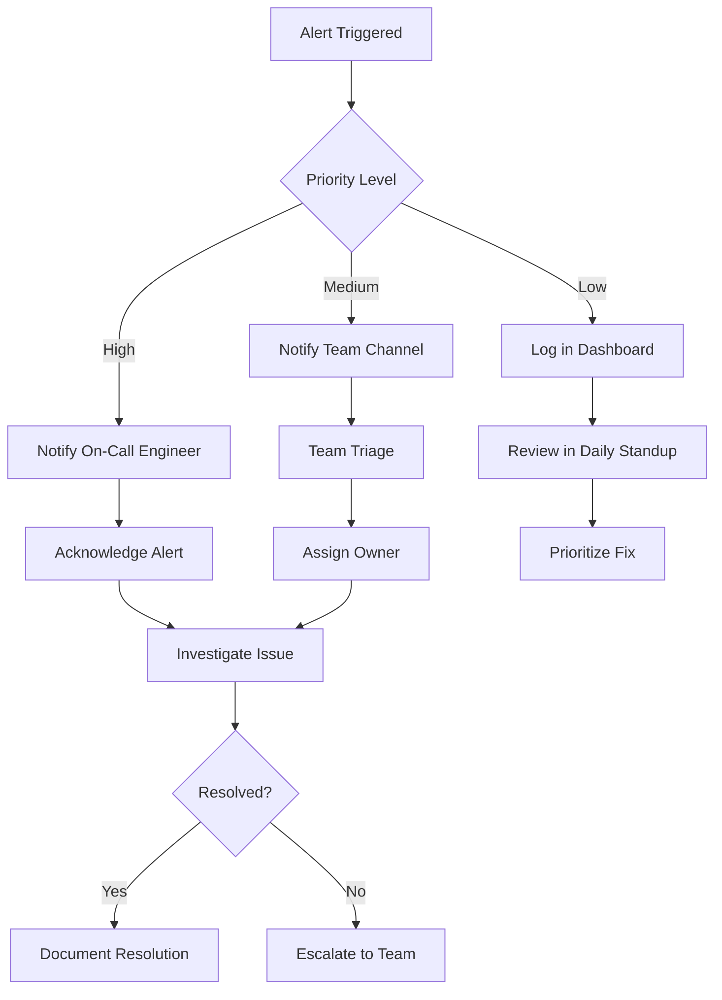

# Alerting System: Organization Configuration Management Tool

## Introduction

This document describes the alerting system for the Organization Configuration Management Tool. The alerting system monitors key metrics and triggers notifications when thresholds are exceeded, enabling timely response to potential issues. The alerts are implemented using AWS CloudWatch Alarms and AWS SNS for notifications.

## Alert Configuration

The alerting system is configured through the AWS CDK infrastructure code in the `infrastructure/cdk/lib/monitoring-stack.ts` file. This ensures that alerts are consistently deployed across environments and can be version-controlled alongside the application code.

### Implementation Approach

Alerts are implemented using the following AWS services:
- **CloudWatch Alarms**: Monitor metrics and trigger when thresholds are exceeded
- **SNS Topics**: Receive alarm notifications and distribute to subscribers
- **Email Notifications**: Primary notification channel for alerts
- **Slack Integration**: Optional secondary notification channel

### Alert Deployment

Alerts are deployed as part of the monitoring infrastructure stack. The deployment process includes:

1. Creating CloudWatch metrics for monitored resources
2. Defining alarm thresholds based on environment requirements
3. Creating CloudWatch alarms with appropriate evaluation periods
4. Configuring SNS topics and subscriptions for notifications
5. Setting up actions for alarm state changes

## Alert Categories

Alerts are organized into the following categories based on the affected component:

### DynamoDB Alerts

Alerts related to the DynamoDB table storing organization configuration data:

| Alert Name | Description | Warning Threshold | Critical Threshold | Evaluation Period | Actions |
|------------|-------------|-------------------|-------------------|------------------|---------|
| DynamoDB Throttling | Monitors for throttled read/write requests | Any throttling event | >5 events in 5 minutes | 5 minutes | Email, Slack notification |
| DynamoDB Error Rate | Monitors for system errors in DynamoDB operations | >1% error rate | >5% error rate | 5 minutes | Email, Slack notification |
| DynamoDB Latency | Monitors for high latency in DynamoDB operations | >50ms p95 | >100ms p95 | 5 minutes | Email notification |
| DynamoDB Capacity | Monitors for high capacity utilization | >70% of provisioned capacity | >90% of provisioned capacity | 15 minutes | Email notification |

### Amplify Alerts

Alerts related to the AWS Amplify hosting for the NextJS application:

| Alert Name | Description | Warning Threshold | Critical Threshold | Evaluation Period | Actions |
|------------|-------------|-------------------|-------------------|------------------|---------|
| Amplify Build Failure | Monitors for build failures in the CI/CD pipeline | Any build failure | N/A | Immediate | Email, Slack notification |
| Amplify Deployment Failure | Monitors for deployment failures | Any deployment failure | N/A | Immediate | Email, Slack notification |

### CloudFront Alerts

Alerts related to the CloudFront distribution for content delivery:

| Alert Name | Description | Warning Threshold | Critical Threshold | Evaluation Period | Actions |
|------------|-------------|-------------------|-------------------|------------------|---------|
| CloudFront Error Rate | Monitors for 5xx errors in CloudFront | >1% error rate | >2% error rate | 5 minutes | Email, Slack notification |
| CloudFront Cache Hit Ratio | Monitors for low cache hit ratio | <80% cache hits | <60% cache hits | 30 minutes | Email notification |
| CloudFront Latency | Monitors for high origin latency | >500ms p95 | >1s p95 | 15 minutes | Email notification |

### API Alerts

Alerts related to the API endpoints:

| Alert Name | Description | Warning Threshold | Critical Threshold | Evaluation Period | Actions |
|------------|-------------|-------------------|-------------------|------------------|---------|
| API Error Rate | Monitors for API request errors | >2% error rate | >5% error rate | 5 minutes | Email, Slack notification |
| API Latency | Monitors for high API response times | >500ms p95 | >1s p95 | 5 minutes | Email, Slack notification |
| API Availability | Monitors for API availability issues | <99% availability | <95% availability | 5 minutes | Email, Slack notification |

### Application Alerts

Alerts related to the application functionality:

| Alert Name | Description | Warning Threshold | Critical Threshold | Evaluation Period | Actions |
|------------|-------------|-------------------|-------------------|------------------|---------|
| Page Load Time | Monitors for slow page loading | >3s p95 | >5s p95 | 15 minutes | Email notification |
| Client-Side Errors | Monitors for JavaScript errors | >2% of sessions with errors | >5% of sessions with errors | 15 minutes | Email notification |

## Alert Thresholds

Alert thresholds are defined based on the criticality of the metric and the expected performance of the system. Thresholds may vary by environment, with production typically having stricter thresholds than development or testing environments.

### Threshold Definitions

Each alert has two threshold levels:
- **Warning Threshold**: Indicates a potential issue that should be investigated but may not require immediate action
- **Critical Threshold**: Indicates a serious issue that requires immediate attention

### Environment-Specific Thresholds

Thresholds are adjusted based on the environment:

| Environment | Threshold Adjustment | Notification Recipients |
|-------------|----------------------|-------------------------|
| Development | More lenient thresholds (typically 1.5x production values) | Development team only |
| Testing | Moderate thresholds (typically 1.2x production values) | Development team and QA |
| Production | Strict thresholds based on SLOs | Development team, operations, and support |

### Threshold Review Process

Alert thresholds are reviewed regularly to ensure they remain appropriate:
- Quarterly review of all alert thresholds
- Adjustment based on observed performance patterns
- Tuning to reduce false positives while maintaining effective monitoring
- Documentation of threshold changes in the monitoring system

## Notification Channels

Alerts are delivered through multiple channels to ensure timely notification of relevant stakeholders.

### Email Notifications

Primary notification channel for all alerts:
- Configured through SNS email subscriptions
- Includes alert details, metric values, and links to CloudWatch
- Sent to role-based distribution lists based on alert severity
- Configurable per environment in the infrastructure code

```typescript
// Example of email subscription configuration in MonitoringStack
const alarmTopic = new sns.Topic(this, 'AlarmTopic', {
  topicName: `${props.environment}-OrganizationConfig-Alarms`,
  displayName: `${props.environment} Organization Config Alarms`,
});

// Add email subscriptions
props.alarmEmailAddresses.forEach(email => {
  alarmTopic.addSubscription(new subscriptions.EmailSubscription(email));
});
```

### Slack Notifications

Secondary notification channel for high-priority alerts:
- Configured through AWS Chatbot integration with SNS
- Includes alert details, metric values, and direct links to CloudWatch
- Posted to dedicated Slack channels based on environment and component
- Supports interactive actions for acknowledging and resolving alerts

### AWS Console

All alerts are visible in the AWS CloudWatch console:
- Provides detailed metric data and alarm history
- Allows manual testing and acknowledgment of alarms
- Accessible to authorized AWS users
- Includes links to related resources and documentation

## Alert Routing and Escalation

Alerts are routed to appropriate teams based on severity and component, with escalation procedures for unresolved issues.



### Initial Alert Routing

Alerts are initially routed based on priority:

| Priority | Determination Criteria | Initial Recipients | Response Time |
|----------|------------------------|-------------------|---------------|
| High | Critical thresholds exceeded, service impacting | On-call engineer | 15 minutes |
| Medium | Warning thresholds exceeded, potential impact | Development team channel | 1 hour |
| Low | Informational, trending toward warning | Logged for review | Next business day |

### Escalation Procedures

If alerts are not acknowledged or resolved within the expected timeframe, they are escalated according to the following procedure:
- **Level 1**: Initial alert to on-call engineer or team channel
- **Level 2**: If not acknowledged within 15 minutes (high priority) or 1 hour (medium priority), escalate to secondary on-call engineer
- **Level 3**: If not resolved within 1 hour (high priority) or 4 hours (medium priority), escalate to engineering manager
- **Level 4**: If not resolved within 2 hours (high priority) or 8 hours (medium priority), escalate to director level

### On-Call Rotation

The on-call rotation is managed as follows:
- Weekly rotation schedule with primary and secondary on-call engineers
- Handoff process includes review of current alerts and ongoing issues
- On-call schedule published in team calendar and Slack channel
- Escalation contacts updated with each rotation change

## Response Procedures

Standard procedures for responding to alerts ensure consistent and effective incident management.

### Alert Acknowledgment

When an alert is received, the following steps should be taken:
1. Acknowledge the alert in the notification system
2. Post in the incident channel that you are investigating
3. Access the CloudWatch console to view detailed metrics
4. Determine if the alert is a false positive or requires action
5. Update the incident status with initial assessment

### Investigation Process

Follow these steps to investigate the root cause of an alert:
1. Review the metric data in CloudWatch to understand the pattern and magnitude
2. Check related metrics for correlated issues
3. Review recent deployments or changes that might have caused the issue
4. Check application logs for error messages or unusual patterns
5. Verify the impact on users and system functionality
6. Identify potential root causes based on the evidence

### Remediation Actions

Based on the investigation, take appropriate remediation actions:
1. For deployment-related issues, consider rolling back to a previous version
2. For capacity issues, scale resources as needed
3. For code-related issues, implement a hotfix if possible
4. For external dependency issues, implement fallback mechanisms
5. For security incidents, follow the security incident response procedure
6. Document all actions taken in the incident log

### Resolution and Follow-up

After resolving the immediate issue:
1. Verify that metrics have returned to normal levels
2. Update the incident status to resolved
3. Notify stakeholders of the resolution
4. Schedule a post-mortem for significant incidents
5. Create tickets for any follow-up work needed
6. Update runbooks or documentation based on lessons learned

## Runbooks

Runbooks provide step-by-step procedures for addressing specific types of alerts.

### DynamoDB Throttling Runbook

Steps to address DynamoDB throttling alerts:
1. **Verify the Alert**: Check CloudWatch metrics to confirm throttling events
2. **Assess Impact**: Determine if throttling is affecting application functionality
3. **Check Usage Patterns**: Review recent usage patterns for unusual spikes
4. **Identify Hot Keys**: Check for potential hot keys causing uneven distribution
5. **Short-term Mitigation**: If using provisioned capacity, increase read/write capacity units
6. **Long-term Solution**: Consider implementing caching, optimizing queries, or implementing backoff strategies
7. **Verification**: Confirm throttling events have stopped and application is functioning normally

### API Error Rate Runbook

Steps to address high API error rate alerts:
1. **Verify the Alert**: Check CloudWatch metrics to confirm error rate increase
2. **Review Logs**: Examine application logs to identify specific error types and patterns
3. **Check Recent Deployments**: Determine if a recent deployment might be causing the errors
4. **Test API Endpoints**: Manually test affected endpoints to reproduce errors
5. **Check Dependencies**: Verify that all dependencies (DynamoDB, etc.) are functioning correctly
6. **Implement Fix**: Deploy a fix for the identified issue or roll back to a previous version
7. **Verification**: Confirm error rates have returned to normal levels

### Amplify Build Failure Runbook

Steps to address Amplify build failure alerts:
1. **Verify the Alert**: Check the Amplify console for build failure details
2. **Review Build Logs**: Examine build logs to identify the specific failure reason
3. **Check Recent Code Changes**: Review recent commits that might have caused the build failure
4. **Common Issues**: Check for common issues like missing dependencies, TypeScript errors, or test failures
5. **Local Reproduction**: Try to reproduce the build failure locally
6. **Implement Fix**: Push a fix for the identified issue or revert the problematic commit
7. **Verification**: Trigger a new build and confirm it succeeds

### CloudFront Error Rate Runbook

Steps to address high CloudFront error rate alerts:
1. **Verify the Alert**: Check CloudWatch metrics to confirm error rate increase
2. **Identify Error Types**: Determine if errors are 4xx (client) or 5xx (server) errors
3. **Check Origin Health**: Verify that the Amplify application is functioning correctly
4. **Review CloudFront Logs**: Examine logs to identify patterns in the errors
5. **Check Configuration**: Verify CloudFront distribution settings and behaviors
6. **Implement Fix**: Address the root cause based on findings
7. **Verification**: Confirm error rates have returned to normal levels

### Page Load Time Runbook

Steps to address slow page load time alerts:
1. **Verify the Alert**: Check CloudWatch metrics to confirm page load time increase
2. **Analyze Web Vitals**: Review detailed Web Vitals metrics to identify specific issues
3. **Check API Performance**: Verify if API response times are contributing to the issue
4. **Review Recent Deployments**: Determine if recent changes might have affected performance
5. **Check Resource Loading**: Analyze network waterfall to identify slow-loading resources
6. **Implement Optimizations**: Address identified performance bottlenecks
7. **Verification**: Confirm page load times have returned to acceptable levels

## False Positive Management

Strategies for managing and reducing false positive alerts:

### Identifying False Positives

Common patterns that indicate false positive alerts:
- Brief spikes that self-resolve quickly
- Alerts during known maintenance windows
- Alerts that don't correlate with actual user impact
- Recurring alerts at specific times without actual issues
- Alerts triggered by test or development activities

### Tuning Alert Thresholds

Process for adjusting alert thresholds to reduce false positives:
1. Collect data on alert frequency and accuracy
2. Identify alerts with high false positive rates
3. Analyze historical metric data to determine appropriate thresholds
4. Adjust thresholds based on analysis
5. Monitor the effectiveness of the new thresholds
6. Document threshold changes and rationale

### Implementing Alert Dampening

Techniques to reduce noise from transient issues:
- Require multiple evaluation periods before triggering alerts
- Implement 'M out of N' evaluation logic (e.g., 3 out of 5 data points must exceed threshold)
- Add cooldown periods after an alert resolves
- Group related alerts to prevent alert storms
- Implement different thresholds for different times of day or days of week

```typescript
// Example of alert dampening in CloudWatch Alarm configuration
new cloudwatch.Alarm(this, 'ApiErrorRateAlarm', {
  metric: apiErrorRate,
  threshold: 5,
  evaluationPeriods: 3,  // Must exceed threshold for 3 consecutive periods
  datapointsToAlarm: 2,  // Only 2 out of 3 periods need to exceed threshold
  comparisonOperator: cloudwatch.ComparisonOperator.GREATER_THAN_THRESHOLD,
  treatMissingData: cloudwatch.TreatMissingData.NOT_BREACHING,
  alarmDescription: 'Alert when API error rate exceeds 5% for 2 out of 3 evaluation periods',
});
```

## Alert Testing and Validation

Procedures for testing and validating the alerting system:

### Regular Alert Testing

Schedule and process for testing alerts:
- Monthly test of critical alerts in non-production environments
- Quarterly end-to-end test of the full alerting pipeline
- Testing after significant changes to monitoring infrastructure
- Validation of alert routing and escalation procedures

### Test Procedure

Steps for conducting alert tests:
1. Notify stakeholders before conducting tests
2. Use CloudWatch's 'Set Alarm State' feature for controlled testing
3. Alternatively, create test conditions that trigger actual alerts
4. Verify that notifications are received through all configured channels
5. Validate that escalation procedures work as expected
6. Document test results and any issues identified
7. Return alarms to normal state after testing

### Validation Metrics

Metrics to track for alert system effectiveness:
- Alert delivery time (time from trigger to notification)
- False positive rate (alerts without actual issues)
- False negative rate (issues without alerts)
- Mean time to acknowledge (MTTA)
- Mean time to resolve (MTTR)
- Alert noise ratio (actionable vs. non-actionable alerts)

## Alert Maintenance

Procedures for maintaining the alerting system over time:

### Regular Review

Schedule for reviewing and updating alerts:
- Quarterly review of all alert definitions and thresholds
- Monthly review of alert frequency and effectiveness
- Review after significant application changes or new features
- Annual comprehensive review of the entire alerting strategy

### Adding New Alerts

Process for adding new alerts to the system:
1. Identify the metric to be monitored
2. Determine appropriate thresholds based on expected behavior
3. Define evaluation periods and alarm conditions
4. Configure notification actions and routing
5. Document the new alert in this documentation
6. Test the alert in a non-production environment
7. Deploy to production after validation

```typescript
// Example of adding a new alert in the MonitoringStack
private createNewCustomAlert(): cloudwatch.Alarm {
  // Define the metric
  const customMetric = new cloudwatch.Metric({
    namespace: 'OrganizationConfigTool',
    metricName: 'CustomMetricName',
    statistic: 'Average',
    period: Duration.minutes(5),
  });

  // Create the alarm
  const alarm = new cloudwatch.Alarm(this, 'CustomMetricAlarm', {
    metric: customMetric,
    threshold: 10,
    evaluationPeriods: 3,
    alarmDescription: 'Alert when custom metric exceeds threshold',
    comparisonOperator: cloudwatch.ComparisonOperator.GREATER_THAN_THRESHOLD,
    treatMissingData: cloudwatch.TreatMissingData.NOT_BREACHING,
  });

  // Add alarm actions
  alarm.addAlarmAction(new cloudwatch.SnsAction(this.alarmTopic));
  
  return alarm;
}
```

### Removing or Modifying Alerts

Process for removing or modifying existing alerts:
1. Document the reason for removal or modification
2. Get approval from relevant stakeholders
3. Update the alert configuration in the infrastructure code
4. Test the changes in a non-production environment
5. Deploy to production after validation
6. Update this documentation to reflect the changes
7. Monitor for any unexpected consequences

## Integration with Incident Management

How the alerting system integrates with the broader incident management process:

### Incident Creation

Process for creating incidents from alerts:
- High-priority alerts automatically create incidents in the incident management system
- Medium-priority alerts create incidents after acknowledgment if determined to be actual issues
- Low-priority alerts are reviewed during regular checks and may be escalated to incidents
- Incident records include alert details, metrics, and initial assessment

### Incident Tracking

How alerts are tracked through the incident lifecycle:
- Alerts are linked to incident records for traceability
- Alert status is updated as the incident progresses
- Resolution of the incident includes verification that the alert condition is cleared
- Post-incident reviews include analysis of alert effectiveness

### Post-Mortem Process

Process for conducting post-mortems after significant incidents:
1. Schedule post-mortem meeting within 48 hours of incident resolution
2. Document the incident timeline, including alert triggering and response
3. Identify root causes and contributing factors
4. Evaluate the effectiveness of alerts in detecting the issue
5. Determine preventive measures and improvements
6. Assign action items with owners and deadlines
7. Share findings with the broader team

## Reference

Additional resources and references:
- [AWS CloudWatch Alarms Documentation](https://docs.aws.amazon.com/AmazonCloudWatch/latest/monitoring/AlarmThatSendsEmail.html)
- [AWS SNS Documentation](https://docs.aws.amazon.com/sns/latest/dg/welcome.html)
- [Monitoring Dashboard Documentation](./dashboards.md)
- [Infrastructure Monitoring Stack](../../infrastructure/cdk/lib/monitoring-stack.ts)
- [Architecture Overview](../architecture/high-level-overview.md)