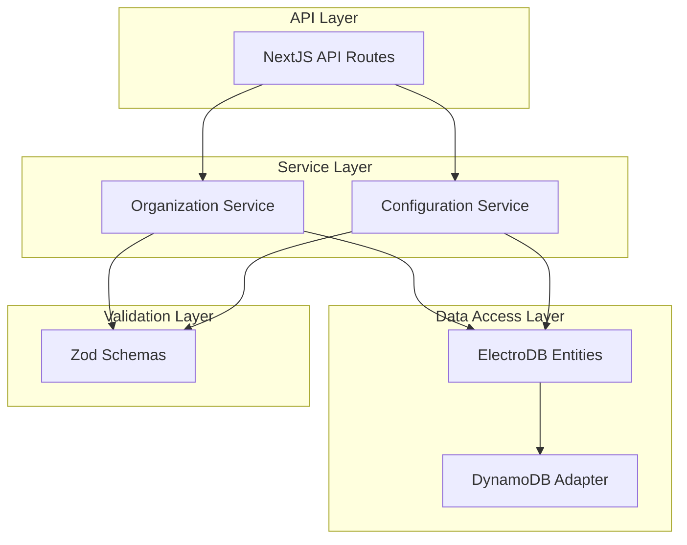

# Organization Configuration Management Tool - Backend

Backend services and API routes for the internal Organization Configuration Management Tool. This module provides the server-side functionality for managing organization configurations in a multi-tenant application.

## Architecture Overview

The backend is built using NextJS API routes with TypeScript and integrates with DynamoDB through ElectroDB for data persistence. It follows a layered architecture with clear separation between API routes, services, data access, and validation layers.



## Key Components

### API Routes

NextJS API routes that handle HTTP requests for organization and configuration management. Located in `src/web/app/api/`.

- Responsible for request parsing, validation, and response formatting
- Implements REST-style endpoints for CRUD operations
- Leverages NextJS middleware for error handling and logging

### Services

Business logic layer that implements core functionality for managing organizations and configurations. Located in `src/backend/services/`.

- `OrganizationService`: Manages organization operations
- `ConfigurationService`: Handles configuration operations by type
- Abstracts database operations from API routes
- Implements business rules and validation

### Data Access

ElectroDB entities and adapters for interacting with DynamoDB. Located in `src/backend/data/`.

- `OrganizationConfigurationEntity`: ElectroDB entity for organization configurations
- `DynamoDBAdapter`: Handles connection and operation with DynamoDB
- Provides type-safe queries and updates

### Validation

Zod schemas for validating input data. Located in `src/backend/validation/`.

- Type-safe validation for all API inputs
- Schema definitions for different configuration types
- Integration with TypeScript for compile-time type checking

### Models

Type definitions and interfaces for domain entities. Located in `src/backend/models/`.

- TypeScript interfaces for all domain objects
- Enums for configuration types and field names
- Type utilities for complex data structures

### Utilities

Helper functions for error handling, logging, and formatting. Located in `src/backend/utils/`.

- Error handling utilities with standardized error codes
- Logging helpers for consistent log formatting
- Data transformation utilities

## API Endpoints

### GET /api/organizations

Retrieves a list of all organizations with their IDs and names.

**Response:**
```json
{
  "organizations": [
    { "OrganizationId": "org1", "Name": "Organization 1" },
    { "OrganizationId": "org2", "Name": "Organization 2" }
  ]
}
```

### POST /api/organizations

Creates a new organization with default configurations for all types.

**Request:**
```json
{
  "OrganizationId": "new-org",
  "Name": "New Organization"
}
```

**Response:**
```json
{
  "success": true,
  "organization": {
    "OrganizationId": "new-org",
    "Name": "New Organization"
  }
}
```

### GET /api/organizations/{id}/config

Retrieves all configuration types for a specific organization.

**Response:**
```json
{
  "configs": [
    {
      "OrganizationId": "org1",
      "OrganizationConfigType": "ORGANIZATION_CONFIG",
      "Name": "Organization 1",
      // Other fields...
    },
    {
      "OrganizationId": "org1",
      "OrganizationConfigType": "CLIENT_CONFIG",
      // Fields specific to CLIENT_CONFIG...
    },
    // Other config types...
  ]
}
```

### GET /api/organizations/{id}/config/{type}

Retrieves a specific configuration type for an organization.

**Response:**
```json
{
  "config": {
    "OrganizationId": "org1",
    "OrganizationConfigType": "ORGANIZATION_CONFIG",
    "Name": "Organization 1",
    // Other fields specific to this config type...
  }
}
```

### PUT /api/organizations/{id}/config/{type}

Updates a specific configuration type for an organization.

**Request:**
```json
{
  "Name": "Updated Name",
  "BrandColor": "#FF5733"
  // Only include fields that need to be updated
}
```

**Response:**
```json
{
  "success": true,
  "config": {
    "OrganizationId": "org1",
    "OrganizationConfigType": "ORGANIZATION_CONFIG",
    "Name": "Updated Name",
    "BrandColor": "#FF5733",
    // All fields including unchanged ones...
  }
}
```

### GET /api/health

Health check endpoint to verify API availability.

**Response:**
```json
{
  "status": "ok",
  "timestamp": "2023-05-01T12:00:00Z"
}
```

### GET /api/health/db

Health check endpoint to verify database connectivity.

**Response:**
```json
{
  "status": "ok",
  "database": "connected",
  "timestamp": "2023-05-01T12:00:00Z"
}
```

## Data Model

### Organization

Represents a tenant in the multi-tenant application with OrganizationId and Name properties.

```typescript
interface Organization {
  OrganizationId: string;
  Name: string;
}
```

### Configuration Types

Four configuration types are supported:

```typescript
enum OrganizationConfigType {
  ORGANIZATION_CONFIG = "ORGANIZATION_CONFIG",
  CLIENT_CONFIG = "CLIENT_CONFIG",
  CLIENT_CONFIG_IOS = "CLIENT_CONFIG_IOS",
  CLIENT_CONFIG_ANDROID = "CLIENT_CONFIG_ANDROID"
}
```

### Configuration Record

Stores configuration settings for an organization of a specific type. Different fields are applicable to different configuration types.

```typescript
interface ConfigurationRecord {
  OrganizationId: string;
  OrganizationConfigType: OrganizationConfigType;
  Name?: string;
  TeamName?: string;
  Slug?: string;
  ShortName?: string;
  LogoUrl?: string;
  FanWebRootUrl?: string;
  BrandColor?: string;
  ExternalProviderId?: string;
  IosStoreLink?: string;
  AndroidStoreLink?: string;
  SocialLink?: string;
  DonateLink?: string;
  PrivacyPolicyLink?: string;
  TermsLink?: string;
  BuyTabs?: BuyTab[];
  Profile?: ProfileField[];
  CustomerServiceConfig?: CustomerServiceConfig;
  PublicAmplitudeExperimentsKey?: string;
  PublicSegmentWriteKey?: string;
  Braze?: BrazeConfig;
  OrganizationCourtCash?: OrganizationCourtCashConfig;
  __createdAt?: string;
  __updatedAt?: string;
  __updatedBy?: string;
}
```

### Complex Data Structures

BuyTabs, Profile, CustomerServiceConfig, Braze, and OrganizationCourtCash are complex nested structures within configuration records.

```typescript
interface BuyTab {
  Label: string;
  Slug: string;
  Type: string;
  GenreCode?: string;
}

interface ProfileField {
  FieldName: OrganizationFieldName;
  IsEditable?: boolean;
  IsSSOUserEditable?: boolean;
  IsRequired?: boolean;
}

enum OrganizationFieldName {
  EMAIL = "EMAIL",
  FIRST_NAME = "FIRST_NAME",
  LAST_NAME = "LAST_NAME",
  BIRTHDAY = "BIRTHDAY",
  PHONE_NUMBER = "PHONE_NUMBER"
}

interface CustomerServiceConfig {
  CustomerServicePhone?: string;
}

interface BrazeConfig {
  PublicKey?: string;
  BaseUrl?: string;
}

interface OrganizationCourtCashConfig {
  Label?: string;
  Enabled?: boolean;
}
```

## Setup and Development

### Prerequisites

- Node.js 18+
- npm or yarn
- AWS credentials for DynamoDB access

### Environment Variables

Create a `.env.local` file in the project root with the following variables:

```
ORGANIZATION_CONFIGURATION_TABLE_NAME=your_dynamodb_table_name
AWS_REGION=us-east-1
DYNAMODB_LOCAL_ENDPOINT=http://localhost:8000  # Optional, for local development
```

### Installation

1. Clone the repository
2. Navigate to the project root
3. Run `npm install` or `yarn install`
4. Configure environment variables

### Local Development

1. Run `npm run dev` or `yarn dev` to start the NextJS development server
2. API endpoints will be available at http://localhost:3000/api/
3. For local DynamoDB, set DYNAMODB_LOCAL_ENDPOINT and ensure the local instance is running

```bash
# Install DynamoDB Local (if needed)
npm install -g dynamodb-local

# Start DynamoDB Local
dynamodb-local -port 8000

# In a new terminal, start the dev server
npm run dev
```

### Testing

1. Run `npm test` or `yarn test` to execute unit tests
2. Run `npm run test:coverage` or `yarn test:coverage` for test coverage report

```bash
# Run all tests
npm test

# Run tests with coverage report
npm run test:coverage

# Run specific test file
npm test -- src/backend/__tests__/services/OrganizationService.test.ts
```

## Error Handling

The backend implements a standardized error handling approach using the AppError class and AppErrorCode enum. API responses for errors include a consistent structure with error code, message, and optional details.

```typescript
// Example error response
{
  "error": "INVALID_INPUT",
  "message": "Invalid organization configuration",
  "details": {
    "Name": "Required field is missing"
  }
}
```

Error codes include:
- `INVALID_INPUT`: Validation failed for input data
- `NOT_FOUND`: Requested resource was not found
- `DUPLICATE_RESOURCE`: Resource already exists (e.g., OrganizationId)
- `DATABASE_ERROR`: Error occurred during database operation
- `INTERNAL_ERROR`: Unexpected internal error

## Validation

Input validation is performed using Zod schemas. Each configuration type has its own validation schema that enforces data structure and business rules.

Example validation schema for ORGANIZATION_CONFIG:

```typescript
const organizationConfigSchema = z.object({
  OrganizationId: z.string().min(1, "Organization ID is required"),
  OrganizationConfigType: z.literal(OrganizationConfigType.ORGANIZATION_CONFIG),
  Name: z.string().optional(),
  TeamName: z.string().optional(),
  Slug: z.string().optional(),
  ShortName: z.string().optional(),
  LogoUrl: z.string().url().optional(),
  // Additional fields...
  BuyTabs: z.array(
    z.object({
      Label: z.string(),
      Slug: z.string(),
      Type: z.string(),
      GenreCode: z.string().optional()
    })
  ).optional(),
  // Additional complex fields...
});
```

Validation is applied at both API route and service layers to ensure data integrity.

## DynamoDB Integration

The application connects to DynamoDB using the AWS SDK v3 and ElectroDB as an ORM layer. The table uses a composite key structure with OrganizationId as the partition key and OrganizationConfigType as the sort key.

```typescript
// ElectroDB entity configuration
export const OrganizationConfigurationEntity = new Entity({
  model: {
    entity: "OrganizationConfiguration",
    version: "1",
    service: "OrganizationConfigurationService",
  },
  attributes: {
    OrganizationId: {
      type: "string",
      required: true,
    },
    OrganizationConfigType: {
      type: "string",
      required: true,
    },
    // Additional attributes...
  },
  indexes: {
    primary: {
      pk: {
        field: "pk",
        composite: ["OrganizationId"],
      },
      sk: {
        field: "sk",
        composite: ["OrganizationConfigType"],
      },
    },
    bySSOId: {
      index: "gsi1",
      pk: {
        field: "gsi1pk",
        composite: ["ExternalProviderId"],
      },
      sk: {
        field: "gsi1sk",
        composite: [],
      },
    },
  },
}, { table: process.env.ORGANIZATION_CONFIGURATION_TABLE_NAME });
```

## Contributing

1. Follow the established code structure and patterns
2. Write unit tests for new functionality
3. Ensure proper error handling and validation
4. Update documentation for API changes
5. Run linting and tests before submitting changes

```bash
# Run linting
npm run lint

# Run type checking
npm run typecheck

# Run tests
npm test

# Format code
npm run format
```

## License

This project is proprietary and confidential. Unauthorized copying, distribution, or use is strictly prohibited.